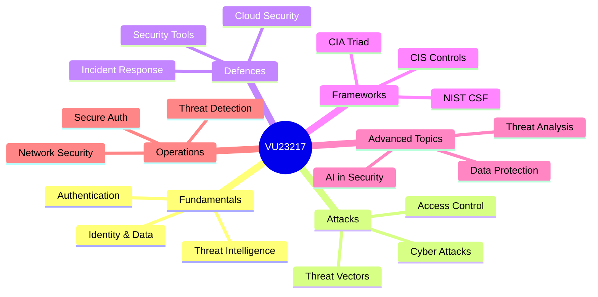

# :material-shield-lock: Cyber Security Essentials

**VU23217** &nbsp;|&nbsp; VET Certificate Course &nbsp;|&nbsp; 18 Sessions across 6 Weeks

*Build practical skills to identify threats, apply security controls, and protect systems in real-world environments.*

---

## :material-information-outline: About This Course

!!! info "Course Overview"
    **Cyber Security Essentials (VU23217)** is a TAFE VET unit that introduces students to the principles and practice of cybersecurity. No prior security experience is required — only curiosity and a willingness to engage with real-world scenarios.

This course is designed for **VET students** pursuing careers in IT, networking, or digital business. By the end of the 6 weeks you will be able to:

- :white_check_mark: Identify and explain common cyber threats and attack vectors
- :white_check_mark: Apply access control, authentication, and data-protection principles
- :white_check_mark: Use industry-standard security tools and frameworks (NIST CSF, CIS Controls)
- :white_check_mark: Analyse incidents and recommend appropriate responses
- :white_check_mark: Understand the legal and ethical responsibilities of security practitioners

---

## :material-map: Course Structure

---

## :material-calendar-month: Week-by-Week Schedule

| Week | Sessions | Topics |
|------|----------|--------|
| **Week 1** | 1 · 2 · 3 | Fundamentals, Identity & Data Protection · Threat Intelligence & Org Security · Auth Attacks & Threat Vectors |
| **Week 2** | 4 · 5 · 6 | Cyber Attacks & Attack Identification · Personal Data Protection · Access Control & Privacy |
| **Week 3** | 7 · 8 · 9 | Security Tools, Platforms & Network Defence · Cloud Security · Incident Response |
| **Week 4** | 10 · 11 · 12 | CIA Triad & Secure Coding · Data Protection & Privacy Law · AI in Cybersecurity |
| **Week 5** | 13 · 14 · 15 | NIST Cybersecurity Framework · CIS Controls · Advanced Threat Analysis |
| **Week 6** | 16 · 17 · 18 | Network Security Fundamentals · Secure Authentication Protocols · Threat Detection & Response |

---

## :material-view-grid: Quick Navigation

-   :material-shield-account: **Session 1**

    ---
    Fundamentals, Identity & Data Protection

    [:octicons-arrow-right-24: Go to session](sections/session_1.md)

-   :material-bug: **Session 2**

    ---
    Threat Intelligence & Organisational Security

    [:octicons-arrow-right-24: Go to session](sections/session_2.md)

-   :material-lock-alert: **Session 3**

    ---
    Authentication Attacks & Threat Vectors

    [:octicons-arrow-right-24: Go to session](sections/session_3.md)

-   :material-sword-cross: **Session 4**

    ---
    Cyber Attacks & Attack Identification

    [:octicons-arrow-right-24: Go to session](sections/session_4.md)

-   :material-account-lock: **Session 5**

    ---
    Personal Data Protection

    [:octicons-arrow-right-24: Go to session](sections/session_5.md)

-   :material-key-variant: **Session 6**

    ---
    Access Control & Privacy

    [:octicons-arrow-right-24: Go to session](sections/session_6.md)

-   :material-tools: **Session 7**

    ---
    Security Tools, Platforms & Network Defence

    [:octicons-arrow-right-24: Go to session](sections/session_7.md)

-   :material-cloud-lock: **Session 8**

    ---
    Cloud Security

    [:octicons-arrow-right-24: Go to session](sections/session_8.md)

-   :material-alert-circle: **Session 9**

    ---
    Incident Response

    [:octicons-arrow-right-24: Go to session](sections/session_9.md)

-   :material-shield-half-full: **Session 10**

    ---
    CIA Triad & Secure Coding

    [:octicons-arrow-right-24: Go to session](sections/session_10.md)

-   :material-file-lock: **Session 11**

    ---
    Data Protection & Privacy Law

    [:octicons-arrow-right-24: Go to session](sections/session_11.md)

-   :material-robot: **Session 12**

    ---
    AI in Cybersecurity

    [:octicons-arrow-right-24: Go to session](sections/session_12.md)

-   :material-flag: **Session 13**

    ---
    NIST Cybersecurity Framework

    [:octicons-arrow-right-24: Go to session](sections/session_13.md)

-   :material-format-list-checks: **Session 14**

    ---
    CIS Controls

    [:octicons-arrow-right-24: Go to session](sections/session_14.md)

-   :material-magnify-scan: **Session 15**

    ---
    Advanced Threat Analysis

    [:octicons-arrow-right-24: Go to session](sections/session_15.md)

-   :material-lan: **Session 16**

    ---
    Network Security Fundamentals

    [:octicons-arrow-right-24: Go to session](sections/session_16.md)

-   :material-two-factor-authentication: **Session 17**

    ---
    Secure Authentication Protocols

    [:octicons-arrow-right-24: Go to session](sections/session_17.md)

-   :material-radar: **Session 18**

    ---
    Threat Detection & Response

    [:octicons-arrow-right-24: Go to session](sections/session_18.md)

---

## :material-link-variant: Key Resources

!!! tip "Recommended External Resources"
    These platforms and frameworks are referenced throughout the course. Bookmark them!

-   :material-gamepad-variant: **TryHackMe**

    ---
    Hands-on labs and guided learning paths for cybersecurity beginners and professionals alike.

    [:octicons-link-external-24: tryhackme.com](https://tryhackme.com){ target="_blank" }

-   :material-shield-check: **ACSC – Australian Cyber Security Centre**

    ---
    Australian government guidance on cyber threats, incident reporting, and best-practice defences.

    [:octicons-link-external-24: cyber.gov.au](https://www.cyber.gov.au){ target="_blank" }

-   :material-chart-gantt: **NIST Cybersecurity Framework**

    ---
    The de-facto global standard for managing and reducing cybersecurity risk in organisations.

    [:octicons-link-external-24: nist.gov/cyberframework](https://www.nist.gov/cyberframework){ target="_blank" }

-   :material-format-list-numbered: **CIS Controls**

    ---
    A prioritised set of actions that collectively form a defence-in-depth approach to cyber threats.

    [:octicons-link-external-24: cisecurity.org](https://www.cisecurity.org){ target="_blank" }

# Build timestamp: Fri 01 May 2026 11:07:01 AWST
