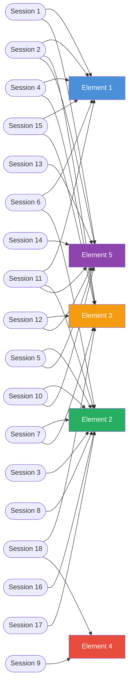

# Learning Activity Plan — VU23217

## Unit of Competency

| Field | Detail |
|-------|--------|
| **Unit Code** | VU23217 |
| **Unit Title** | Apply Cyber Security Techniques |
| **Qualification** | Certificate III / Diploma in Information Technology |
| **Training Package** | VU (Victorian Department of Education) |
| **Duration** | 6 weeks — 18 sessions (approximately 36 hours) |
| **Delivery Mode** | Face-to-face / blended |

---

## Unit Description

This unit describes the skills and knowledge required to apply fundamental cyber security techniques to protect information systems, identify threats, implement controls, and respond to security incidents in a professional workplace context.

It applies to individuals who work in IT support, networking, or general technology roles and need to implement cyber security practices as part of their job function.

---

## Elements and Performance Criteria

### Element 1 — Identify Cyber Security Requirements

| Performance Criteria | Sessions | Assessment |
|----------------------|----------|------------|
| 1.1 Identify organisational data assets and their value | [Session 1](sections/session_1.md), [Session 11](sections/session_11.md) | AT1 Portfolio |
| 1.2 Identify potential threats to information assets | [Session 2](sections/session_2.md), [Session 4](sections/session_4.md) | AT1 Portfolio |
| 1.3 Assess the risk and impact of identified threats | [Session 2](sections/session_2.md), [Session 15](sections/session_15.md) | AT1 Portfolio |
| 1.4 Identify relevant legislation and compliance requirements | [Session 5](sections/session_5.md), [Session 11](sections/session_11.md) | AT1 Portfolio |
| 1.5 Identify the organisation's security policies and procedures | [Session 1](sections/session_1.md), [Session 6](sections/session_6.md) | AT1 Portfolio |

### Element 2 — Implement Cyber Security Controls

| Performance Criteria | Sessions | Assessment |
|----------------------|----------|------------|
| 2.1 Apply access control principles to protect information assets | [Session 3](sections/session_3.md), [Session 6](sections/session_6.md) | AT2 Practical |
| 2.2 Implement authentication and authorisation mechanisms | [Session 3](sections/session_3.md), [Session 17](sections/session_17.md) | AT2 Practical |
| 2.3 Configure network security controls | [Session 5](sections/session_5.md), [Session 7](sections/session_7.md), [Session 16](sections/session_16.md) | AT2 Practical |
| 2.4 Apply encryption to protect data in transit and at rest | [Session 10](sections/session_10.md), [Session 11](sections/session_11.md) | AT2 Practical |
| 2.5 Implement security hardening techniques on systems and devices | [Session 7](sections/session_7.md), [Session 10](sections/session_10.md) | AT2 Practical |

### Element 3 — Monitor and Detect Security Events

| Performance Criteria | Sessions | Assessment |
|----------------------|----------|------------|
| 3.1 Configure and use security monitoring tools | [Session 7](sections/session_7.md), [Session 18](sections/session_18.md) | AT2 Practical |
| 3.2 Identify indicators of compromise (IoCs) | [Session 2](sections/session_2.md), [Session 4](sections/session_4.md) | AT1 Portfolio |
| 3.3 Analyse security logs and alerts for anomalies | [Session 7](sections/session_7.md), [Session 15](sections/session_15.md) | AT2 Practical |
| 3.4 Classify and prioritise security events by severity | [Session 9](sections/session_9.md), [Session 18](sections/session_18.md) | AT2 Practical |

### Element 4 — Respond to Security Incidents

| Performance Criteria | Sessions | Assessment |
|----------------------|----------|------------|
| 4.1 Follow the organisation's incident response plan | [Session 9](sections/session_9.md) | AT2 Practical |
| 4.2 Contain and eradicate identified threats | [Session 9](sections/session_9.md), [Session 18](sections/session_18.md) | AT2 Practical |
| 4.3 Preserve evidence and maintain chain of custody | [Session 18](sections/session_18.md) | AT2 Practical |
| 4.4 Document and report security incidents | [Session 9](sections/session_9.md), [Session 18](sections/session_18.md) | AT1 Portfolio |
| 4.5 Participate in post-incident review activities | [Session 9](sections/session_9.md) | AT1 Portfolio |

### Element 5 — Apply Security Frameworks and Standards

| Performance Criteria | Sessions | Assessment |
|----------------------|----------|------------|
| 5.1 Apply the CIA Triad to security decision-making | [Session 1](sections/session_1.md), [Session 10](sections/session_10.md) | AT1 Portfolio |
| 5.2 Use an industry security framework to assess security posture | [Session 13](sections/session_13.md), [Session 14](sections/session_14.md) | AT1 Portfolio |
| 5.3 Identify relevant controls from CIS Controls or NIST CSF | [Session 13](sections/session_13.md), [Session 14](sections/session_14.md) | AT1 Portfolio |
| 5.4 Apply the Australian Privacy Principles to data handling | [Session 5](sections/session_5.md), [Session 11](sections/session_11.md) | AT1 Portfolio |
| 5.5 Use threat intelligence to inform security decisions | [Session 2](sections/session_2.md), [Session 12](sections/session_12.md) | AT1 Portfolio |

---

## Session-to-Element Coverage Map

---

## Assessment Summary

| Assessment Task | Type | Weighting | Sessions Covered |
|-----------------|------|-----------|-----------------|
| **AT1 — Portfolio** | Written evidence portfolio | 50% | Sessions 1–6, 10–15 |
| **AT2 — Practical Demonstration** | Hands-on skills assessment | 50% | Sessions 3, 7–9, 16–18 |

### AT1 — Portfolio Requirements
Students must compile evidence demonstrating:

- Identification of at least 3 data assets and associated threats
- A risk register with at least 5 identified risks (likelihood × impact)
- Explanation of relevant legislation (Privacy Act 1988, NDB Scheme)
- Application of a security framework (NIST CSF or CIS Controls IG1)
- Threat intelligence report using MITRE ATT&CK

### AT2 — Practical Demonstration Requirements
Students must demonstrate:

- Configure access controls on a system (RBAC or DAC)
- Configure and test MFA on an account
- Review and interpret security logs/SIEM alerts
- Execute a tabletop incident response exercise
- Document findings in a professional incident report

---

## Required Skills and Knowledge

### Knowledge Evidence
Students must be able to explain:

- The CIA Triad and how it applies to real-world security decisions
- Types of cyber threats (malware, phishing, DoS, social engineering, APTs)
- Australian Privacy Act 1988 and the Notifiable Data Breaches scheme
- Access control models: DAC, MAC, RBAC, ABAC
- NIST Cybersecurity Framework 2.0 functions
- CIS Controls v8 Implementation Groups
- Incident Response lifecycle (NIST SP 800-61)
- Authentication protocols: MFA, SSO, SAML, OAuth 2.0, FIDO2

### Performance Evidence
Students must demonstrate:

- Identifying and classifying data assets
- Implementing security controls on a test system
- Monitoring and interpreting security events
- Responding to a simulated security incident
- Documenting security findings professionally

---

## TryHackMe Integration

This course uses [TryHackMe](https://tryhackme.com) for hands-on practical skill development. The following rooms align with unit content:

| Session(s) | TryHackMe Room | Element |
|------------|----------------|---------|
| 1–2 | [Pre-Security Learning Path](https://tryhackme.com/path/outline/presecurity) | E1 |
| 3, 17 | [Cyber Defence Frameworks](https://tryhackme.com/module/cyber-defence-frameworks) | E2 |
| 4–5 | [Phishing](https://tryhackme.com/module/phishing) | E1, E3 |
| 7–8 | [Network Fundamentals](https://tryhackme.com/module/network-fundamentals) | E2 |
| 9, 18 | [SOC Level 1](https://tryhackme.com/path/outline/soclevel1) | E3, E4 |
| 13–14 | [Security Engineer](https://tryhackme.com/path/outline/security-engineer-training) | E5 |

---

## References and Resources

- [ACSC — Australian Cyber Security Centre](https://www.cyber.gov.au)
- [NIST Cybersecurity Framework 2.0](https://www.nist.gov/cyberframework)
- [CIS Controls v8](https://www.cisecurity.org/controls/v8)
- [OAIC — Office of the Australian Information Commissioner](https://www.oaic.gov.au)
- [MITRE ATT&CK Framework](https://attack.mitre.org)
- [training.gov.au — VU23217](https://training.gov.au/Training/Details/VU23217)
