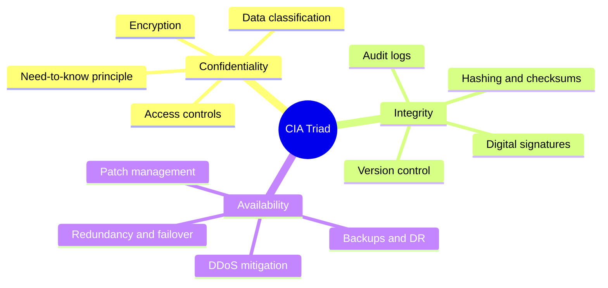
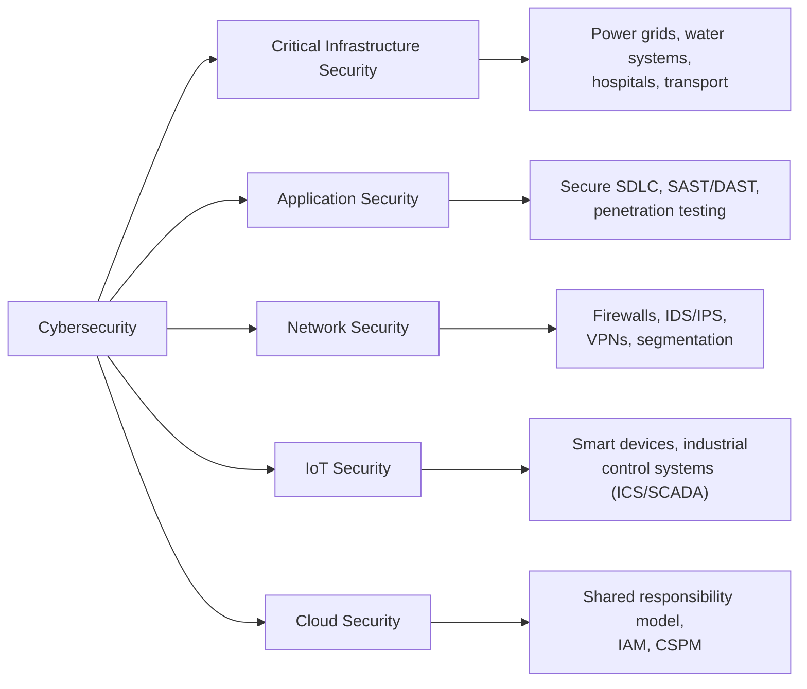
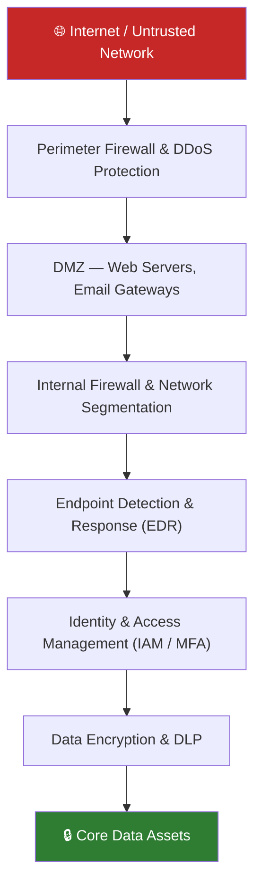

# Session 1: Fundamentals of Cybersecurity

**Week 1 — VU23217 Cyber Security Essentials**

## Learning Objectives

By the end of this session you will be able to:

- Define cybersecurity using the UK National Cyber Security Strategy definition and explain why it matters
- Distinguish between personal data and organisational data, and explain why each must be protected
- Describe the CIA Triad and apply it to real-world scenarios
- Identify the five major domains of cybersecurity
- Recognise common cyber threats including ransomware, phishing, and advanced persistent threats
- Understand the range of roles available in the cybersecurity profession
- Explain the "no absolute security" principle and the concept of defence-in-depth

---

## Presentation Materials

[:material-presentation: View Slides — Session 1 (Week 1)](../slides-original/slide_51968830_1.md){ .md-button .md-button--primary }
[:material-presentation: View Slides — Extended Material](../slides-original/slide_64967299_1.md){ .md-button }
[:material-presentation: View Slides — Supporting Content](../slides-original/slide_55371423_1.md){ .md-button }

---

## 1. What Is Cybersecurity?

The UK National Cyber Security Strategy offers one of the most widely adopted definitions:

> **Cybersecurity** is the protection of information systems (hardware, software, and infrastructure), the data on them, and the services they provide, from unauthorised access, harm, or misuse — including harm caused intentionally by the operator or accidentally by users.

This definition is deliberately broad. It encompasses:

- **Hardware** — physical devices (servers, routers, workstations, IoT sensors)
- **Software** — operating systems, applications, firmware
- **Infrastructure** — networks, data centres, cloud environments
- **Data** — stored, in transit, or being processed
- **Services** — anything a system delivers to users

In Australia, the **Australian Signals Directorate (ASD)** is the national technical authority for cybersecurity. The ASD publishes guidance such as the *Essential Eight* — a prioritised set of mitigation strategies that organisations can adopt to protect themselves against the most prevalent threats. The ASD works alongside the Australian Cyber Security Centre (ACSC) to produce threat reports, advisories, and incident response guidance.

!!! info "Why cybersecurity matters in Australia"
    Australia experienced over 76,000 cybercrime reports in a single financial year (ASD Annual Cyber Threat Report). The average cost of a cybercrime to a small business was estimated at over $46,000. Cybersecurity is no longer an IT concern alone — it is a board-level business risk.

---

## 2. There Is No Such Thing As Absolute Security

One of the foundational principles every cybersecurity professional must internalise is:

> **"There is no such thing as absolute security."**

Given enough time, tools, skills, and motivation, a determined adversary can break through any security measure. This is not a counsel of despair — it is a design principle. It means:

1. Security is about **raising the cost** of an attack, not making attack impossible
2. We assume breach will occur eventually, so we layer defences (**defence-in-depth**)
3. Detection, response, and recovery are just as important as prevention

**Defence-in-depth** draws from military strategy: if one layer of defence fails, the next layer limits the damage. In practice this means combining firewalls, endpoint protection, access controls, encryption, monitoring, and user training — no single control is sufficient on its own.

!!! warning "Security vs. usability tension"
    Every additional security control introduces friction for users. Security professionals must balance protection with productivity. An overly restrictive system gets bypassed by frustrated users, creating new vulnerabilities.

---

## 3. Online Identity and Personal Data

### What Is Personal Data?

**Personal data** is any data that can identify an individual, directly or indirectly. Under Australian privacy law (Privacy Act 1988) and frameworks such as the EU GDPR, examples include:

| Data Type | Examples |
|-----------|----------|
| Direct identifiers | Full name, date of birth, passport number, Tax File Number |
| Contact information | Home address, email address, phone number |
| Digital identifiers | IP address, device identifiers, cookies, login credentials |
| Biometric data | Fingerprints, facial recognition templates, voice prints |
| Sensitive categories | Health records, financial information, religious beliefs, ethnicity |
| Derived data | Photos, location history, behavioural profiles |

### Why Personal Data Is a Target

Personal data has direct economic value. Stolen identities are sold on dark web marketplaces. Attackers use personal data to:

- **Commit identity theft** — open credit accounts, claim benefits, file fraudulent tax returns
- **Enable targeted phishing** — craft convincing emails using real personal details (spear-phishing)
- **Extort victims** — threaten to release sensitive personal information
- **Bypass authentication** — answer security questions, SIM-swap phone numbers

!!! example "Identity theft impact"
    A threat actor purchases a database of 50,000 leaked credentials from a previous breach. They attempt those username/password combinations against banking sites (credential stuffing). Even a 1% success rate yields 500 compromised accounts. Victims may not discover the breach for months.

### Digital Footprint Awareness

Every online action leaves a trace. Your **digital footprint** includes active contributions (social media posts, forum comments) and passive data collection (browsing history, app usage, location data). Organisations and individuals should regularly audit what personal data they are exposing and to whom.

---

## 4. Organisational Data

### Types of Organisational Data

**Organisational data** refers to information that belongs to or identifies the organisation, as distinct from personal data about individuals. It typically falls into four categories:

| Category | Description | Examples |
|----------|-------------|---------|
| **Trade secrets / IP** | Proprietary processes, formulas, source code | Algorithm designs, manufacturing processes |
| **Financial data** | Accounts, forecasts, transaction records | Balance sheets, merger plans, pricing strategies |
| **Operational data** | Systems configs, network diagrams, procedures | Infrastructure maps, business continuity plans |
| **Customer / partner data** | Third-party information entrusted to the organisation | Client databases, supplier contracts |

### Data Classification

Most organisations apply a classification scheme to govern how data is handled:

1. **Public** — safe to share externally (marketing materials, press releases)
2. **Internal** — for staff only, not harmful if accidentally leaked
3. **Confidential** — restricted to specific roles, significant harm if disclosed
4. **Highly Confidential / Secret** — severe harm if disclosed; strict need-to-know

Data classification drives access controls, encryption requirements, retention policies, and disposal procedures.

!!! tip "Classification in practice"
    Employees should receive clear training on how to classify documents and emails. Misclassifying sensitive data as "internal" is one of the most common causes of data leakage via accidental sharing or misconfigured cloud storage buckets.

---

## 5. The CIA Triad

The **CIA Triad** is the cornerstone model of information security. Every security control, policy, and decision can be evaluated against its effect on these three properties:

### Confidentiality

Ensuring that information is accessible only to those authorised to access it. Techniques include encryption (AES-256 for data at rest, TLS for data in transit), strict access controls, and the **principle of least privilege** — users receive only the minimum access required to perform their job.

### Integrity

Ensuring that data has not been altered or destroyed in an unauthorised manner. Cryptographic **hashing** (SHA-256, SHA-3) produces a fixed-length fingerprint of data; any modification changes the hash. **Digital signatures** combine hashing with asymmetric cryptography to verify both integrity and origin.

### Availability

Ensuring that authorised users can access information and systems when needed. Threats to availability include Distributed Denial of Service (DDoS) attacks, ransomware, hardware failure, and natural disasters. Mitigations include redundant systems, load balancing, regular backups, and tested disaster recovery plans.

!!! note "CIA in conflict"
    The three properties can conflict. Adding strong encryption (confidentiality) can slow system performance (availability). Strict access controls (confidentiality) can frustrate legitimate users. Security professionals must constantly balance these tensions.

---

## 6. The Five Domains of Cybersecurity

Cybersecurity is not a single discipline — it spans five recognised domains:

| Domain | Focus | Key Controls |
|--------|-------|-------------|
| **Critical Infrastructure** | Protecting systems essential to society | Physical security, redundancy, incident response |
| **Application Security** | Securing software throughout its lifecycle | Code review, penetration testing, WAF |
| **Network Security** | Protecting data in transit and network devices | Firewalls, IDS/IPS, network segmentation |
| **IoT Security** | Securing internet-connected devices | Firmware updates, device authentication, network isolation |
| **Cloud Security** | Securing cloud-hosted resources and services | IAM, encryption, misconfiguration detection |

---

## 7. Common Cyber Threats

### Ransomware

Ransomware is malware that encrypts a victim's files and demands payment (typically cryptocurrency) for the decryption key. Modern ransomware groups use a **double extortion** model — they exfiltrate data before encrypting it, threatening to publish it publicly if the ransom is not paid.

Notable examples: WannaCry (2017) exploited the EternalBlue vulnerability and spread globally within hours; REvil and LockBit operate as Ransomware-as-a-Service (RaaS) platforms.

### Zero-Day Exploits

A **zero-day** vulnerability is a flaw in software that is unknown to the vendor and therefore has no available patch. The term refers to the fact that developers have had "zero days" to fix it. Zero-days are highly valuable: nation-state actors and sophisticated criminal groups exploit them before detection.

### Phishing

**Phishing** uses deceptive communications (usually email) to trick recipients into revealing credentials, clicking malicious links, or opening infected attachments. Variants include:

- **Spear-phishing** — targeted at a specific individual using personalised details
- **Whaling** — targeted at senior executives
- **Smishing** — delivered via SMS
- **Vishing** — conducted via voice calls

### Social Engineering

Social engineering manipulates human psychology rather than exploiting technical vulnerabilities. Attackers exploit trust, authority, urgency, and fear. A technically perfect security system can be bypassed if an attacker convinces an employee to hand over their credentials.

### Advanced Persistent Threats (APTs)

**APTs** are sophisticated, long-term attacks — often conducted by nation-states or well-funded criminal groups. Characteristics include:

- Extended dwell time (months or years inside a network before detection)
- Use of legitimate tools and "living off the land" techniques to avoid detection
- Specific, high-value targets (government, defence, critical infrastructure)
- Multi-stage intrusion: reconnaissance → initial access → lateral movement → exfiltration

!!! danger "APT dwell time"
    The global average time to detect a breach is around 200 days (IBM Cost of a Data Breach Report). APTs specifically attempt to remain undetected for as long as possible to maximise data exfiltration.

---

## 8. Cybersecurity Roles and Careers

The cybersecurity workforce is diverse. Major roles include:

| Role | Responsibilities | Key Skills |
|------|-----------------|-----------|
| **CISO** (Chief Information Security Officer) | Sets security strategy, manages risk at board level | Leadership, risk management, governance |
| **Security Analyst** | Monitors alerts, investigates incidents, triage | SIEM tools, log analysis, threat hunting |
| **Penetration Tester** | Ethically attacks systems to find vulnerabilities | Kali Linux, Metasploit, scripting, report writing |
| **Incident Responder** | Contains, eradicates, and recovers from breaches | Digital forensics, malware analysis, crisis management |
| **GRC Analyst** (Governance, Risk & Compliance) | Ensures regulatory compliance, manages policies | ISO 27001, NIST, Essential Eight, risk frameworks |
| **Security Engineer** | Designs and builds secure systems and tooling | Cloud platforms, network architecture, automation |
| **SOC Analyst** | Real-time monitoring in a Security Operations Centre | SIEM, EDR, playbooks, shift work |

!!! tip "Career pathways"
    Many cybersecurity professionals begin in IT helpdesk or network administration roles and move into security. Certifications such as CompTIA Security+, CEH, OSCP, and CISSP are widely recognised. The ASD's [Cyber Skills Framework](https://www.cyber.gov.au/) provides guidance on Australian career pathways.

---

## 9. Defence-in-Depth: A Layered Security Model

Since no single control is foolproof, security professionals implement multiple overlapping layers of defence. If an attacker breaches the perimeter firewall, endpoint protection, network segmentation, and user behaviour analytics each provide additional opportunities to detect and stop the attack.

Each layer addresses a different attack vector. An attacker must defeat every layer to reach the core data assets. The time and effort required at each layer creates opportunities for detection.

---

## Key Takeaways

- Cybersecurity protects hardware, software, infrastructure, data, and services from unauthorised access, harm, or misuse
- The ASD is Australia's national technical authority for cybersecurity, providing guidance through the ACSC
- Personal data includes any information that can identify an individual — directly or indirectly
- Organisational data must be classified and protected according to its sensitivity
- The **CIA Triad** — Confidentiality, Integrity, Availability — is the foundational framework for all security decisions
- The five cybersecurity domains are: Critical Infrastructure, Application, Network, IoT, and Cloud Security
- Common threats include ransomware, phishing, zero-days, social engineering, and APTs
- **No absolute security** exists; defence-in-depth layers multiple controls to raise the cost of attack

---

## Review Questions

1. The UK National Cyber Security Strategy defines cybersecurity as protecting information systems "from unauthorised access, harm, or misuse — including harm caused intentionally by the operator or accidentally by users." Why does this definition explicitly include harm caused by the operator?

2. A company's HR system stores employee tax file numbers. Using the CIA Triad, identify one specific threat to each of the three properties (Confidentiality, Integrity, and Availability) and describe an appropriate control for each.

3. Explain the difference between a zero-day exploit and a known vulnerability. Why are zero-day exploits particularly dangerous, and what general defensive strategies can reduce the risk they pose?

4. Social engineering attacks target human psychology rather than technical systems. Describe three psychological principles that attackers exploit, and explain how security awareness training can address each one.

5. A small business owner says: "We're too small to be a target, so we don't need to invest in cybersecurity." How would you respond to this argument using evidence from the session material?

---

## Discussion Points

- The "no absolute security" principle suggests we should design systems assuming breach is inevitable. How does this change the way we think about security investment and incident response?
- Personal data protection laws (like the Australian Privacy Act) impose legal obligations on organisations. Is legal compliance the same as being secure? What are the gaps?
- As more critical infrastructure (power grids, hospitals, water treatment) connects to the internet, the stakes of cybersecurity failures increase dramatically. Who bears responsibility when critical infrastructure is attacked — operators, vendors, or governments?