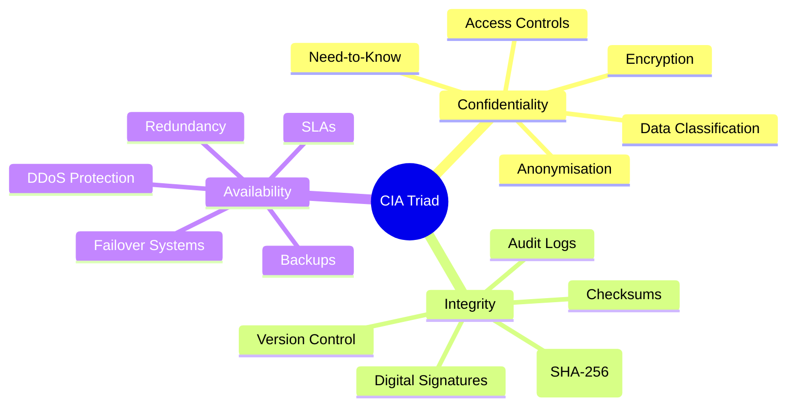
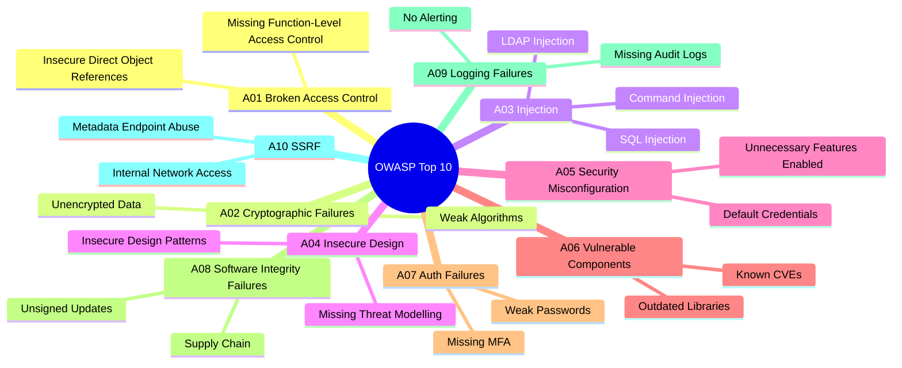
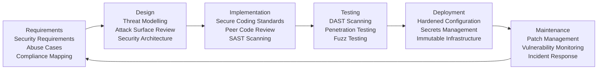

# Session 10: The CIA Triad and Secure Coding

## Learning Objectives

Upon completion of this session, you will be able to:

- Explain the CIA Triad — Confidentiality, Integrity, and Availability — and why each pillar matters
- Describe how the Parkerian Hexad extends the CIA Triad
- Apply CIA Triad principles to real-world scenarios including healthcare, banking, and supply chains
- Identify secure coding practices that protect confidentiality, integrity, and availability
- Summarise the OWASP Top 10 and relate each category to the CIA Triad
- Explain the Secure Development Lifecycle (SDL) and the role of SAST/DAST tooling

---

## Presentation Materials

[:material-presentation: View Slides — CIA Session 10](../slides-original/slide_53978134_1.md){ .md-button .md-button--primary }
[:material-presentation: View Slides — Security Essentials Session 10](../slides-original/slide_55371411_1.md){ .md-button .md-button--primary }
[:material-presentation: View Slides — Security Essentials (Alt)](../slides-original/slide_67398384_1.md){ .md-button .md-button--primary }
[:material-presentation: View Slides — CIA Session 10 (Alt)](../slides-original/slide_67399034_1.md){ .md-button .md-button--primary }

---

## 10.1 The CIA Triad

The **CIA Triad** is the foundational model of information security. Every security control, policy, and technical measure can be mapped back to protecting one or more of its three pillars: **Confidentiality**, **Integrity**, and **Availability**.

### 10.1.1 Confidentiality

**Confidentiality** ensures that information is accessible only to those who are authorised to access it. A breach of confidentiality occurs when data is disclosed to an unauthorised party — whether through a targeted attack, misconfiguration, or insider threat.

Key mechanisms for enforcing confidentiality:

| Mechanism | Description |
|---|---|
| **Encryption** | Transforms readable data into ciphertext. AES-256 for data at rest; TLS 1.3 for data in transit |
| **Access Controls** | Role-Based Access Control (RBAC), Attribute-Based Access Control (ABAC) |
| **Data Classification** | Assigning sensitivity labels — Public, Internal, Confidential, Restricted |
| **Need-to-Know** | Users only access data required for their specific role |
| **Anonymisation & Pseudonymisation** | Removing or replacing personal identifiers to limit exposure |

!!! note "Real-World Example: Healthcare Data Breach"
    In 2022, a major Australian pathology provider suffered a ransomware attack exposing the pathology results of millions of patients. The attack violated confidentiality because unencrypted patient data was exfiltrated before encryption. Had data-at-rest encryption and strict access controls been in place, the impact would have been significantly reduced.

### 10.1.2 Integrity

**Integrity** ensures that data is accurate, complete, and has not been altered in an unauthorised manner. This applies both to data stored in systems and to data transmitted across networks.

**Hashing algorithms** are the primary tool for verifying integrity:

| Algorithm | Output Size | Status |
|---|---|---|
| **MD5** | 128-bit | Deprecated — vulnerable to collisions |
| **SHA-1** | 160-bit | Deprecated — broken for certificates |
| **SHA-256** | 256-bit | Current standard — widely used |
| **SHA-3** | Variable | Modern alternative — Keccak-based |

**Digital signatures** combine hashing with asymmetric cryptography to provide both integrity and authenticity. When you download software and verify its GPG signature, you are confirming that the file has not been tampered with and that it came from the expected publisher.

Other integrity controls include:

- **Audit logs** — immutable records of who changed what and when
- **Checksums** — used to verify file integrity after transfer
- **Version control** — Git commit hashes create an immutable record of code changes
- **Database constraints** — referential integrity enforced at the database level

!!! note "Real-World Example: Supply Chain Tampering"
    The SolarWinds attack (2020) involved attackers inserting malicious code into the software build pipeline, compromising the integrity of a legitimate software update. Thousands of organisations installed the trojanised update. Integrity controls such as code signing, reproducible builds, and SBOM (Software Bill of Materials) verification would have aided detection.

### 10.1.3 Availability

**Availability** ensures that systems, applications, and data are accessible when needed by authorised users. Availability failures range from minor service degradation to complete outages.

Threats to availability include:

- **Distributed Denial-of-Service (DDoS)** attacks — overwhelming systems with traffic
- **Ransomware** — encrypting data and making it inaccessible
- **Hardware failures** — disk, power, network
- **Misconfiguration** — accidental deletion, firewall rules blocking legitimate traffic
- **Natural disasters** — affecting physical infrastructure

Availability controls:

| Control | Description |
|---|---|
| **Redundancy** | Duplicate components — RAID storage, redundant power supplies, multi-path networking |
| **Failover** | Automatic switching to a backup system when the primary fails |
| **Load Balancing** | Distributing traffic across multiple servers |
| **DDoS Mitigation** | CDN-based scrubbing, rate limiting, anycast routing |
| **Backups** | Regular, tested backups following the 3-2-1 rule (3 copies, 2 media, 1 offsite) |
| **SLAs** | Service Level Agreements defining acceptable uptime (e.g., 99.9% = ~8.7 hours downtime/year) |

!!! note "Real-World Example: Banking System Availability"
    In 2024, a major Australian bank experienced a prolonged outage during a peak trading period. Customers were unable to access internet banking or ATMs for several hours. The incident highlighted the operational and reputational costs of availability failures, and triggered regulatory scrutiny from APRA under CPS 234.

---

## 10.2 Extending the CIA Triad — The Parkerian Hexad

The **Parkerian Hexad**, proposed by Donn B. Parker, extends the CIA Triad with three additional properties that address limitations of the original model:

| Property | Definition |
|---|---|
| **Confidentiality** | Data is accessible only to authorised parties |
| **Integrity** | Data is accurate and unaltered |
| **Availability** | Data and systems are accessible when needed |
| **Possession / Control** | The holder of data can control it, regardless of confidentiality |
| **Authenticity** | Data origin can be verified — the sender is who they claim to be |
| **Utility** | Data is in a usable form for the intended purpose |

**Possession** addresses scenarios like ransomware: even if an attacker cannot *read* your encrypted data (confidentiality maintained), they now *possess* it and can threaten to publish it.

**Utility** addresses scenarios like encryption key loss: even if you still *have* your encrypted data (possession maintained), it is useless without the key.

---

## 10.3 Secure Coding Practices

Secure coding is the practice of writing software in a way that prevents security vulnerabilities from being introduced during development. The most exploited vulnerabilities in production systems — SQL injection, cross-site scripting, insecure deserialization — are all preventable through disciplined coding practices.

### 10.3.1 Input Validation and Sanitisation

Never trust user input. All data entering an application — from web forms, APIs, file uploads, environment variables — must be validated against expected formats before use.

- **Allowlisting** (preferred): Only accept known-good input patterns
- **Denylisting** (less preferred): Reject known-bad patterns — easily bypassed
- **Sanitisation**: Strip or encode dangerous characters before processing

### 10.3.2 Parameterised Queries

SQL injection remains one of the most common and damaging web vulnerabilities. It occurs when user input is concatenated directly into SQL queries, allowing attackers to manipulate query logic.

The defence is **parameterised queries** (also called prepared statements), where the SQL structure is defined separately from the data values. The database driver handles escaping, making injection impossible.

### 10.3.3 Error Handling — Never Expose Stack Traces

Error messages shown to end users must never reveal internal system details — stack traces, database schema, server paths, or library versions. This information assists attackers in fingerprinting the system.

- Log detailed errors **server-side** for developers
- Show generic, user-friendly messages **client-side**
- Use structured logging to capture context without exposure

### 10.3.4 Principle of Least Privilege in Code

Applications should run with the minimum permissions required to perform their function:

- Web applications should not run as `root` or `Administrator`
- Database accounts used by applications should only have `SELECT`, `INSERT`, `UPDATE` on required tables — not `DROP TABLE` or `CREATE USER`
- File system access should be restricted to application directories only

### 10.3.5 Dependency Management

Modern applications rely heavily on third-party libraries. Each dependency is a potential attack surface.

- Regularly update dependencies to receive security patches
- Use tools like `npm audit`, `pip-audit`, `Dependabot`, or `Snyk` to check for known CVEs
- Maintain a **Software Bill of Materials (SBOM)** listing all components and versions
- Pin dependency versions in production to prevent unexpected updates

### 10.3.6 Secrets Management

Hardcoding credentials, API keys, or passwords in source code is a critical vulnerability — especially when code is stored in version control systems.

- Use **environment variables** or secrets management tools (AWS Secrets Manager, HashiCorp Vault, Azure Key Vault)
- Add `.env` files and credential files to `.gitignore`
- Scan repositories for accidentally committed secrets using tools like `truffleHog` or `git-secrets`
- Rotate compromised credentials immediately

!!! warning "Common Mistake"
    It is not sufficient to delete a committed secret and push a new commit. The secret remains in Git history and can be retrieved. You must treat any secret that has ever been committed as compromised and rotate it immediately.

---

## 10.4 OWASP Top 10

The **Open Worldwide Application Security Project (OWASP)** publishes the Top 10 — a regularly updated list of the most critical web application security risks. It is the industry standard reference for application security teams.

| Rank | Category | Description |
|---|---|---|
| A01 | **Broken Access Control** | Users can act outside their intended permissions |
| A02 | **Cryptographic Failures** | Sensitive data exposed due to weak or missing encryption |
| A03 | **Injection** | SQL, command, LDAP injection via untrusted data |
| A04 | **Insecure Design** | Missing or ineffective security controls in architecture |
| A05 | **Security Misconfiguration** | Default settings, unnecessary features, missing hardening |
| A06 | **Vulnerable and Outdated Components** | Using libraries with known CVEs |
| A07 | **Identification and Authentication Failures** | Weak credential policies, missing MFA |
| A08 | **Software and Data Integrity Failures** | Unsigned updates, insecure CI/CD pipelines |
| A09 | **Security Logging and Monitoring Failures** | Insufficient logging, no alerting on attacks |
| A10 | **Server-Side Request Forgery (SSRF)** | Server fetches attacker-controlled URLs |

---

## 10.5 Secure Development Lifecycle (SDL)

The **Secure Development Lifecycle (SDL)** integrates security activities into every phase of the software development process, rather than treating security as a final-stage audit.

| Phase | Key Security Activities |
|---|---|
| **Requirements** | Define security requirements, identify compliance obligations (Privacy Act, PCI DSS), write abuse cases |
| **Design** | Threat modelling (STRIDE), define trust boundaries, select security controls |
| **Implementation** | Apply secure coding standards, conduct peer code review, run SAST tools |
| **Testing** | Dynamic testing (DAST), penetration testing, fuzz testing, dependency scanning |
| **Deployment** | Hardened server configuration, secrets injected via vault, infrastructure as code |
| **Maintenance** | Monitor CVE feeds, apply patches, conduct post-incident reviews |

### 10.5.1 SAST and DAST Tools

**Static Application Security Testing (SAST)** analyses source code without executing it, identifying vulnerabilities early in development. Examples: SonarQube, Semgrep, Checkmarx.

**Dynamic Application Security Testing (DAST)** tests a running application by sending malicious inputs and observing responses. Examples: OWASP ZAP, Burp Suite, Nikto.

| Attribute | SAST | DAST |
|---|---|---|
| **When run** | During development / CI pipeline | Against deployed application |
| **What it finds** | Code-level flaws, hardcoded secrets | Runtime vulnerabilities, misconfigurations |
| **False positive rate** | Higher | Lower |
| **Language dependency** | Yes | No |

---

## Key Takeaways

- The CIA Triad — Confidentiality, Integrity, Availability — is the foundational framework of information security
- The Parkerian Hexad adds Possession/Control, Authenticity, and Utility to address gaps
- Secure coding practices directly protect CIA properties: input validation protects integrity; encryption protects confidentiality; redundant design protects availability
- The OWASP Top 10 is the essential reference for application security; injection and broken access control are persistently the most exploited categories
- The SDL embeds security throughout the development process — it is far cheaper to fix vulnerabilities during design and development than after deployment

---

## Review Questions

1. A hospital's patient records database is accessible without authentication from within the hospital network. Which CIA property is most directly violated, and what two controls would most effectively address this?

2. A developer discovers that the SHA-1 checksum of a downloaded software package does not match the value published on the vendor's website. What does this indicate, and what should the developer do?

3. Explain the difference between parameterised queries and input sanitisation. In what scenario would sanitisation alone be insufficient to prevent SQL injection?

4. A web application's error page displays a full Java stack trace including class names and database table names when an exception occurs. How does this violate the CIA Triad, and what should be done?

5. Using the SDL framework, identify at which phase each of the following activities occurs: (a) threat modelling, (b) DAST scanning, (c) defining abuse cases, (d) applying security patches post-deployment.

---

## Discussion Points

- How does the principle of least privilege apply differently in a cloud-native microservices architecture compared to a traditional monolithic application?
- A startup argues that implementing the full SDL would slow development too much. How would you make the business case for SDL adoption without blocking delivery velocity?
- The OWASP Top 10 has changed between the 2017 and 2021 editions. What do the changes tell us about how the threat landscape is evolving?
