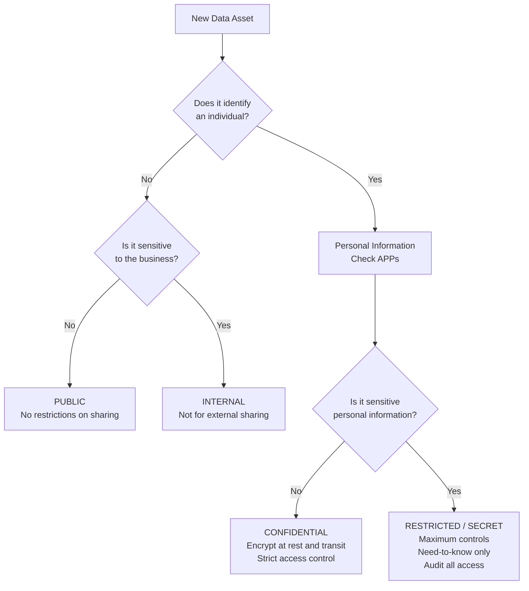
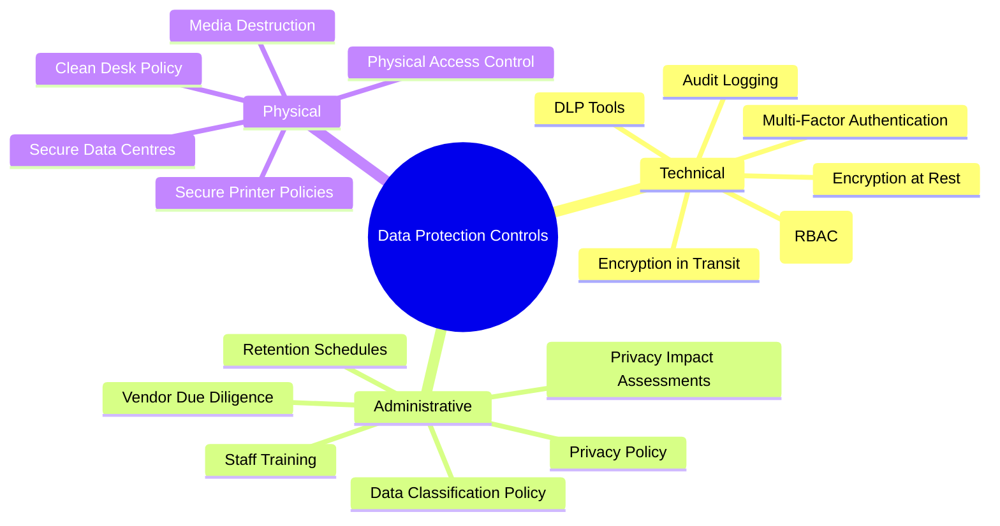
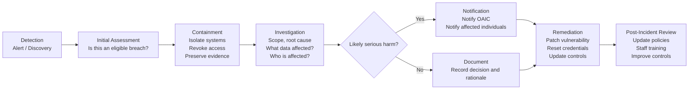

# Session 11: Data Protection and Privacy Law

## Learning Objectives

Upon completion of this session, you will be able to:

- Define data protection and explain why it is both a legal and ethical obligation
- Describe the key provisions of the Australian Privacy Act 1988 and who it applies to
- Summarise all 13 Australian Privacy Principles (APPs)
- Explain the Notifiable Data Breaches (NDB) scheme — obligations, timelines, and penalties
- Classify data using a four-tier sensitivity model
- Describe technical controls for data protection: encryption, DLP, and access controls
- Compare the Australian Privacy Act with the EU General Data Protection Regulation (GDPR)
- Outline a data breach response process

---

## Presentation Materials

[:material-presentation: View Slides — Data Protection Session 11](../slides-original/slide_54253389_1.md){ .md-button .md-button--primary }
[:material-presentation: View Slides — Security Essentials 11](../slides-original/slide_55371409_1.md){ .md-button .md-button--primary }
[:material-presentation: View Slides — Data Protection (Alt 1)](../slides-original/slide_74678335_1.md){ .md-button .md-button--primary }
[:material-presentation: View Slides — Data Protection (Alt 2)](../slides-original/slide_74741181_1.md){ .md-button .md-button--primary }
[:material-presentation: View Slides — Data Protection (Alt 3)](../slides-original/slide_75195848_1.md){ .md-button .md-button--primary }

---

## 11.1 What is Data Protection?

**Data protection** refers to the processes, policies, and controls used to safeguard personal and sensitive information from unauthorised access, use, disclosure, modification, or destruction.

Data protection has two dimensions:

- **Legal**: Organisations have statutory obligations to protect personal information. In Australia, this is primarily governed by the *Privacy Act 1988* (Cth). Failure to comply carries significant financial penalties and reputational damage.
- **Ethical**: Beyond legal compliance, organisations hold a duty of care to individuals whose data they collect. People trust organisations with their most sensitive information — their health, finances, and identity. Breaching that trust causes real harm.

The volume of data collected by organisations has grown enormously with digital transformation. More data means greater responsibility.

!!! note "Why Data Protection Matters"
    The Optus data breach (2022) exposed the personal information of approximately 9.8 million Australians, including passport and licence numbers. The Medibank breach (2022) exposed the health claims data of 9.7 million customers, including sensitive medical information. Both incidents triggered legislative reform, with Australia's maximum civil penalty for serious privacy breaches increasing to $50 million.

---

## 11.2 The Australian Privacy Act 1988

The *Privacy Act 1988* (Cth) is the primary Australian legislation governing the handling of personal information. It was significantly reformed by the *Privacy Amendment (Notifiable Data Breaches) Act 2017* and is currently undergoing further reform following the 2022 Privacy Act Review.

**Key definitions:**

- **Personal information**: Information or an opinion about an identified individual, or an individual who is reasonably identifiable
- **Sensitive information**: A subset of personal information with heightened protection — includes health, biometric, racial or ethnic origin, political opinions, religious beliefs, sexual orientation, and criminal record information

**Who the Act applies to:**

- Australian Government agencies
- Private sector organisations with an annual turnover exceeding **$3 million**
- Health service providers (regardless of turnover)
- Organisations that trade in personal information
- Some small businesses in specific circumstances

**Key exemptions:**

- Small businesses with turnover under $3 million (with exceptions)
- Employee records held for employment purposes
- Some media organisations acting in the public interest

---

## 11.3 The 13 Australian Privacy Principles (APPs)

The APPs are contained in Schedule 1 of the Privacy Act and set out the standards for how organisations must handle personal information.

| APP | Title | Summary |
|---|---|---|
| **APP 1** | Open and transparent management | Organisations must have a clearly expressed, up-to-date privacy policy |
| **APP 2** | Anonymity and pseudonymity | Individuals must have the option to deal anonymously where practicable |
| **APP 3** | Collection of solicited personal information | Only collect personal information that is reasonably necessary |
| **APP 4** | Dealing with unsolicited personal information | Unsolicited information must be destroyed if it could not have been collected under APP 3 |
| **APP 5** | Notification of collection | Individuals must be notified of collection at or before the time of collection |
| **APP 6** | Use or disclosure of personal information | Use only for the primary purpose collected, or with consent for secondary purposes |
| **APP 7** | Direct marketing | Strict requirements on use of personal information for direct marketing |
| **APP 8** | Cross-border disclosure | Before disclosing overseas, take reasonable steps to ensure similar protection |
| **APP 9** | Adoption of government identifiers | Prohibits adopting government identifiers (e.g. Tax File Numbers) as own identifiers |
| **APP 10** | Quality of personal information | Reasonable steps to ensure accuracy, completeness, and currency |
| **APP 11** | Security of personal information | Protect from misuse, interference, loss, unauthorised access, modification, disclosure |
| **APP 12** | Access to personal information | Individuals have the right to access their personal information on request |
| **APP 13** | Correction of personal information | Individuals have the right to request correction of inaccurate personal information |

---

## 11.4 Notifiable Data Breaches (NDB) Scheme

The **NDB Scheme** (Part IIIC of the Privacy Act) came into effect on **22 February 2018**. It requires organisations covered by the Privacy Act to notify affected individuals and the Office of the Australian Information Commissioner (OAIC) when a data breach is likely to result in **serious harm**.

**What constitutes an eligible data breach?**

1. There is unauthorised access to, or unauthorised disclosure of, personal information, **or** a loss of personal information
2. The breach is **likely to result in serious harm** to one or more individuals
3. The organisation has been **unable to prevent the likely risk of harm** through remedial action

**Notification obligations:**

- Notify affected individuals as soon as practicable
- Notify the OAIC at the same time, or as soon as practicable
- The notification must describe the breach, the information involved, what steps have been taken, and what individuals should do to protect themselves

!!! warning "Timeline Expectations"
    While the Privacy Act does not specify an exact timeframe, the OAIC guidance and international benchmarks (GDPR requires 72 hours) indicate organisations should notify within **30 days** of becoming aware that a breach has occurred or is suspected. The proposed Privacy Act reforms would introduce a stricter **72-hour notification** timeframe.

**Penalties for non-compliance:**

Since 2022, the maximum civil penalty for serious or repeated privacy interference is the **greater of**: $50 million; three times the value of the benefit obtained; or 30% of the entity's adjusted turnover during the breach period.

---

## 11.5 Data Classification

Data classification enables organisations to apply proportionate security controls based on data sensitivity. A four-tier model is commonly used in Australian government and enterprise contexts.

| Classification | Examples | Controls Required |
|---|---|---|
| **Public** | Marketing materials, published reports | No special controls |
| **Internal** | Internal procedures, staff directories | Basic access control |
| **Confidential** | Customer PII, financial records, contracts | Encryption, RBAC, access logging |
| **Restricted / Secret** | Health records, credentials, legal privilege | Encryption, MFA, need-to-know, audit trail |

---

## 11.6 Data Lifecycle Management

Personal information must be managed throughout its entire lifecycle — from collection through to destruction.

| Phase | Description | Key Requirements |
|---|---|---|
| **Collection** | Gathering data from individuals or third parties | Only collect what is necessary; notify individuals (APP 3, APP 5) |
| **Storage** | Retaining data in systems | Encrypt at rest; implement access controls; APP 11 |
| **Use** | Processing data for business purposes | Use only for the primary purpose; limit secondary use (APP 6) |
| **Disclosure** | Sharing with third parties | Ensure recipients provide equivalent protection; APP 8 |
| **Archival** | Long-term retention for compliance or reference | Apply retention schedules; restrict access to archived data |
| **Destruction** | Secure deletion or physical destruction | Ensure data is irrecoverable; maintain destruction records |

**Records retention** must balance two competing pressures:
- **Legal requirements** to retain records for specific periods (e.g., tax records: 5 years; health records: 7 years for adults)
- **Privacy obligations** to destroy data when it is no longer needed

A **legal hold** is placed on records when litigation or regulatory investigation is anticipated — normal destruction schedules are suspended.

---

## 11.7 Technical Controls for Data Protection

### 11.7.1 Encryption

Encryption is the most fundamental technical control for data protection.

- **Data at rest**: Full-disk encryption (BitLocker, FileVault, LUKS) and database-level encryption (Transparent Data Encryption in SQL Server/Oracle)
- **Data in transit**: TLS 1.2 or 1.3 for all network communications; HTTPS for web applications; SFTP/SCP for file transfers
- **End-to-end encryption**: Ensures data is only readable by the sender and recipient — cannot be decrypted even by the service provider

### 11.7.2 Data Loss Prevention (DLP)

**DLP tools** monitor, detect, and block the unauthorised movement of sensitive data. They operate by inspecting data content against policy rules.

DLP deployment modes:

| Mode | Description |
|---|---|
| **Network DLP** | Monitors traffic leaving the network — email, web uploads, FTP |
| **Endpoint DLP** | Agent on workstations — controls USB drives, print, clipboard, screenshots |
| **Cloud DLP** | Monitors data in cloud storage services (Microsoft Purview, Google DLP) |
| **Discovery DLP** | Scans repositories to locate sensitive data that should not be stored there |

Common DLP policies:
- Block emails containing credit card numbers from leaving the corporate domain
- Prevent upload of files containing TFNs or Medicare numbers to consumer cloud storage
- Alert when large volumes of customer records are downloaded by a single user

### 11.7.3 Access Controls for Data Protection

---

## 11.8 GDPR Context for Australian Organisations

Australian organisations with customers or operations in the European Union may be subject to the **General Data Protection Regulation (GDPR)** — regardless of where the organisation is based.

Key GDPR requirements that differ from or exceed the APPs:

| Area | Australian APPs | EU GDPR |
|---|---|---|
| **Legal basis for processing** | Not explicitly required | Must identify a lawful basis (consent, contract, legitimate interest, etc.) |
| **Right to erasure ("right to be forgotten")** | Not explicitly included | Individuals can request deletion of their data |
| **Data portability** | Not included | Individuals can request their data in a portable format |
| **Breach notification timeline** | No fixed period (reform may introduce 72 hrs) | **72 hours** to notify supervisory authority |
| **Data Protection Officer (DPO)** | Not required | Required for large-scale processing of sensitive data |
| **Penalties** | Up to $50 million | Up to €20 million or **4% of global annual turnover** |
| **Privacy by design** | Encouraged | **Mandatory** — must be built into systems from the start |

---

## 11.9 Data Breach Response

A structured breach response process minimises harm to affected individuals and reduces regulatory and reputational consequences.

**Immediate containment** actions may include:
- Disconnecting affected systems from the network
- Revoking compromised credentials
- Disabling affected service accounts
- Engaging the incident response team and legal counsel

**Notification** content must include:
- Description of the breach
- The kinds of personal information involved
- Recommended steps individuals should take to protect themselves
- Contact details for the organisation's privacy contact

---

## 11.10 Records Management and Secure Disposal

**Retention schedules** specify how long each category of record must be kept:

- Employment records: 7 years after end of employment
- Financial records: 5 years (Tax Act)
- Health records: 7 years from last service (adults); until age 25 (children)
- CCTV footage: Typically 30 days unless incident is recorded

**Secure disposal methods:**

| Data Type | Acceptable Disposal Method |
|---|---|
| Paper records | Cross-cut shredding (DIN 66399 Level P-4 or higher); secure shredding services |
| Magnetic media (HDD) | Degaussing + physical destruction; NIST 800-88 compliant wiping |
| Solid-state storage (SSD, USB) | Cryptographic erasure or physical destruction (chip-level) |
| Cloud data | Confirmed deletion with certificate from cloud provider; validate via audit log |

---

## Key Takeaways

- The Privacy Act 1988 governs the handling of personal information in Australia, with the 13 APPs setting specific obligations across the data lifecycle
- The NDB Scheme requires notification to the OAIC and affected individuals when a breach is likely to cause serious harm — proposed reforms will require notification within 72 hours
- Data classification (Public → Internal → Confidential → Restricted) enables proportionate security controls
- Encryption, DLP, and access controls are the three pillars of technical data protection
- Australian organisations with EU customers must also comply with GDPR, which has stricter requirements and higher penalties than the APPs
- Secure data disposal is a legal obligation — data must be irrecoverably destroyed when no longer needed

---

## Review Questions

1. An Australian e-commerce company has an annual turnover of $2.5 million and collects customers' health information as part of a wellness service. Does the Privacy Act 1988 apply to this company? Justify your answer with reference to the specific provisions.

2. A company discovers that a former employee has exported a database of 50,000 customer records including email addresses and dates of birth before resigning. Walk through the NDB Scheme assessment: is this an eligible data breach, and what must the organisation do?

3. An organisation stores customer payment card data in a database that is not encrypted. Under which Australian Privacy Principle is this most likely a breach, and what is the specific obligation?

4. Describe two scenarios where GDPR would apply to an Australian-based organisation, and identify two GDPR requirements that exceed current APP obligations.

5. A company's retention schedule says employee performance reviews should be destroyed after 3 years. The company learns it is the subject of an employment tribunal claim. What should it do, and why?

---

## Discussion Points

- The Privacy Act 1988 currently exempts small businesses with turnover under $3 million. The 2022 Privacy Act Review recommended removing this exemption. What are the arguments for and against this change?
- A company collects detailed location and behavioural data through a "free" mobile app. The privacy policy discloses this, and users click "I Agree." Does this satisfy the spirit of the APPs? What ethical concerns arise?
- How should an organisation balance the competing obligations to retain records for legal purposes and destroy personal information when it is no longer needed?
