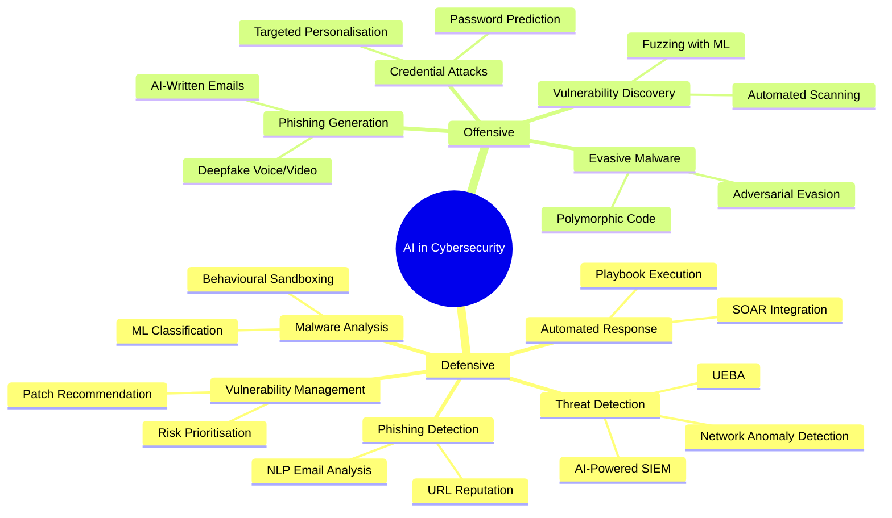
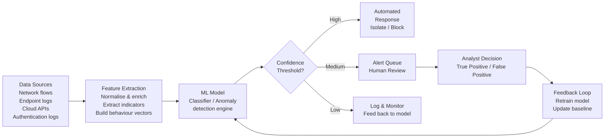
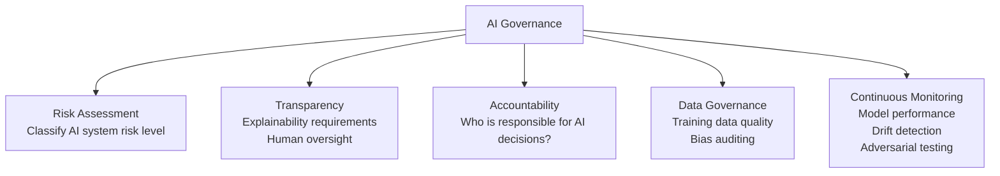

# Session 12: AI in Cybersecurity

## Learning Objectives

Upon completion of this session, you will be able to:

- Explain why AI and machine learning are transforming both offensive and defensive cybersecurity
- Describe supervised and unsupervised learning approaches relevant to security applications
- Identify key defensive AI use cases: threat detection, UEBA, SOAR, malware classification, phishing detection
- Explain how attackers leverage AI for phishing, vulnerability scanning, and evasive malware
- Evaluate the limitations of AI-based security tools — false positives, adversarial attacks, explainability
- Discuss ethical considerations and future trends in AI-driven security

---

## Presentation Materials

[:material-presentation: View Slides — Simplilearn: AI in CyberSecurity](../slides-original/slide_55108722_1.md){ .md-button .md-button--primary }

---

## 12.1 Introduction — Why AI is Transforming Cybersecurity

Modern organisations face a threat landscape that no human team can monitor manually. Security operations centres (SOCs) process millions of events per day; the average enterprise runs hundreds of applications; attackers operate at machine speed.

**Artificial Intelligence (AI)** and **Machine Learning (ML)** are reshaping both sides of this contest:

- **Defenders** use AI to detect threats at scale, automate responses, and prioritise the endless stream of vulnerability alerts
- **Attackers** use AI to craft more convincing phishing messages, automate vulnerability discovery, and create malware that evades signature-based detection

The asymmetry is stark: attackers need to succeed once; defenders must succeed every time. AI shifts this dynamic by enabling defenders to operate at a scale and speed previously impossible.

!!! note "Key Statistic"
    IBM's 2023 Cost of a Data Breach report found that organisations using AI and automation in security had a mean cost of breach **$1.76 million lower** than those without, and identified breaches **108 days faster**.

---

## 12.2 AI/ML Fundamentals for Security

Understanding how AI is applied to security requires a basic grasp of the underlying approaches.

### 12.2.1 Supervised Learning

In **supervised learning**, an algorithm is trained on a labelled dataset — examples of known malicious and benign behaviour. The model learns to classify new, unseen inputs.

Security applications:
- Malware classification (trained on samples labelled "malware" / "benign")
- Spam and phishing email detection
- Intrusion detection (trained on labelled network traffic)

### 12.2.2 Unsupervised Learning

In **unsupervised learning**, the algorithm identifies patterns in unlabelled data — no ground truth is provided. This is particularly valuable in security because unknown threats (zero-days) produce no labelled examples.

Security applications:
- **Anomaly detection**: Establish a baseline of normal behaviour; flag deviations
- **Clustering**: Group similar malware samples without predefined categories
- **User behaviour analysis**: Identify unusual account activity without labelled insider threat data

### 12.2.3 Reinforcement Learning

An agent learns by interacting with an environment and receiving feedback (rewards/penalties). Emerging security applications include autonomous penetration testing agents and adversarial ML research.

| Approach | Training Data | Best for |
|---|---|---|
| **Supervised** | Labelled examples | Known threat classification |
| **Unsupervised** | Unlabelled data | Anomaly detection, zero-day discovery |
| **Reinforcement** | Reward signals | Autonomous agents, adaptive responses |

---

## 12.3 Defensive AI Applications

### 12.3.1 User and Entity Behaviour Analytics (UEBA)

**UEBA** tools build a baseline model of normal behaviour for each user and entity (servers, applications) in an organisation. Deviations from the baseline trigger alerts.

Examples of anomalies UEBA can detect:
- A user downloading 10 GB of data at 2 a.m. on a Saturday (potential data exfiltration)
- An account logging in from Australia and then from the United States within 30 minutes (impossible travel)
- A service account suddenly running PowerShell commands it has never previously executed (lateral movement)
- A user accessing HR records outside their normal role (potential insider threat)

UEBA addresses a fundamental limitation of rule-based detection: attackers know the rules and can design attacks to stay below thresholds. ML-based baselines are dynamic and adapt to individual patterns.

### 12.3.2 Automated Incident Response — SOAR + AI

**Security Orchestration, Automation and Response (SOAR)** platforms integrate with security tools to automate response workflows. Combined with AI:

- **Triage**: AI classifies incoming alerts by severity, filtering false positives before human review
- **Enrichment**: Automatically gather context — IP reputation, related events, affected users
- **Containment**: Automatically isolate a compromised endpoint when confidence threshold is met
- **Notification**: Alert the appropriate team members and stakeholders
- **Ticketing**: Create and assign incident tickets in ITSM systems

This compresses Mean Time to Respond (MTTR) from hours to minutes.

### 12.3.3 AI Threat Detection Pipeline

### 12.3.4 ML-Based Malware Classification

Traditional antivirus relies on **signatures** — hashes or byte patterns of known malware. This fails against:
- Zero-day malware (no signature exists yet)
- Polymorphic malware (changes signature on each infection)
- Fileless malware (operates in memory, leaves no file on disk)

ML-based approaches use **behavioural features** instead:
- API calls made by the binary
- Network connections attempted
- Registry modifications
- File system access patterns
- Entropy analysis of binary sections (packed/encrypted code has high entropy)

Tools using this approach: **CrowdStrike Falcon**, **Cylance PROTECT**, **Microsoft Defender** (ML models built into Windows Defender).

### 12.3.5 Phishing Detection

AI models process incoming email to detect phishing using:
- **Natural Language Processing (NLP)**: Analyse tone, urgency language, grammatical patterns associated with phishing
- **URL analysis**: Inspect embedded links for typosquatting, recently registered domains, redirects
- **Sender reputation**: Compare sender's domain and IP against threat intelligence feeds
- **Visual similarity**: Detect spoofed login pages that visually resemble legitimate brands

### 12.3.6 Vulnerability Prioritisation

Security teams face thousands of CVEs (Common Vulnerabilities and Exposures) per year. Not all are equally exploitable or relevant.

AI-based **Vulnerability Intelligence** tools (e.g., Kenna Security, Tenable.io with Predictive Prioritisation) use ML to:
- Predict which CVEs are most likely to be exploited in the wild
- Score vulnerabilities in the context of the specific organisation's environment
- Recommend a prioritised patching order

This shifts teams from treating all "Critical" CVEs equally to focusing effort where real-world risk is highest.

### 12.3.7 AI-Powered SIEM

Traditional **Security Information and Event Management (SIEM)** systems apply rule-based correlation. AI-powered SIEMs (Microsoft Sentinel, Google Chronicle, Splunk UEBA) add:
- **Unsupervised anomaly detection** across all event streams
- **Natural language search** — analysts query data in plain English
- **Automated threat hunting** — the system proactively searches for indicators without a human-initiated query
- **Alert fatigue reduction** — ML grouping of related alerts into coherent incident stories

---

## 12.4 Offensive AI

### 12.4.1 AI-Generated Phishing

Large Language Models (LLMs) enable attackers to generate highly convincing, personalised spear-phishing emails at scale. Previous phishing was often identifiable by poor grammar or generic content; LLM-generated phishing is grammatically perfect and contextually relevant.

**Deepfake technology** extends this to voice and video:
- **Voice cloning**: Fraudsters clone a CEO's voice from LinkedIn videos and call the CFO requesting an urgent wire transfer ("Business Email Compromise" at scale)
- **Deepfake video**: Used in high-value fraud — a finance team in Hong Kong transferred $25 million USD in 2024 after a deepfake video call impersonating their CFO

### 12.4.2 Automated Vulnerability Scanning

AI can be used to:
- Automatically scan large IP ranges and web applications for vulnerabilities
- Prioritise and chain discovered vulnerabilities for maximum impact
- Adapt scanning behaviour to avoid detection by IDS/IPS systems

### 12.4.3 Adversarial Machine Learning

Attackers can deliberately craft inputs designed to **fool AI classifiers** — known as **adversarial examples**. By making small, carefully calculated modifications to a malicious file or network packet, an attacker can cause the AI model to classify it as benign.

This is particularly concerning for:
- Image recognition (autonomous vehicle safety)
- Malware classifiers (bypassing ML-based AV)
- Spam filters (generating emails the model classifies as legitimate)

### 12.4.4 AI-Powered Malware

Emerging research demonstrates malware that uses ML to:
- **Evade sandboxes**: Recognise when running in an analysis environment and behave benignly
- **Adapt** to target environment characteristics
- **Polymorphically mutate** its code using AI-generated variations

---

## 12.5 AI Cybersecurity Tools — Overview

| Tool | Category | AI Capability |
|---|---|---|
| **Darktrace** | Network Detection & Response | Unsupervised ML; Self-Learning AI models baseline of "normal" |
| **CrowdStrike Falcon** | Endpoint Detection & Response | ML-based malware prevention; behavioural analytics |
| **Microsoft Defender / Sentinel** | SIEM + EDR | Integrated ML, UEBA, NLP-based threat hunting |
| **Cylance (BlackBerry)** | Endpoint Protection | ML-only model — no signature updates required |
| **Darktrace HEAL** | Autonomous Response | AI-driven autonomous response recommendations |
| **Vectra AI** | Network Detection | AI-driven attack signal intelligence; reduces alert noise |

---

## 12.6 Limitations of AI in Security

AI is a powerful tool, but it has significant limitations that security professionals must understand.

| Limitation | Description |
|---|---|
| **False Positives** | Anomaly detection generates significant false positives, especially early in deployment when baselines are still forming. Alert fatigue can cause analysts to dismiss genuine threats |
| **False Negatives** | Adversarial inputs can cause AI to miss real threats. Sophisticated attackers study the AI's blind spots |
| **Explainability** | Deep learning models are "black boxes" — they produce a result but cannot easily explain *why*. This complicates incident investigation and regulatory compliance |
| **Data Quality** | AI models are only as good as the data they are trained on. Biased or incomplete training data leads to biased, incomplete detection |
| **Adversarial Attacks** | Attackers can deliberately manipulate inputs to fool the model (adversarial examples) |
| **Concept Drift** | Threat landscapes change; a model trained on historical data may not recognise new attack patterns without retraining |
| **High Operational Cost** | Collecting, labelling, and maintaining training data; tuning models; managing false positive workflows — all require significant resource investment |

---

## 12.7 Ethical Considerations

### Bias in AI Security Tools

AI security tools trained on historical data reflect historical patterns. If past security incidents disproportionately flagged certain user groups, those biases are encoded in the model. This can result in:
- Employees from certain demographics being more frequently subjected to enhanced monitoring
- Legitimate business activities being flagged as suspicious if they deviate from the dominant pattern

### Privacy Implications of Behavioural Analytics

UEBA tools require deep and continuous monitoring of employee behaviour — every file access, network connection, keystroke pattern, and application usage. This creates significant privacy tensions:

- Employees may have a reasonable expectation of privacy even on corporate systems
- Continuous monitoring can have chilling effects on legitimate activities
- Data collected for security purposes may be repurposed — for performance management, for example

Organisations should establish clear policies on what is monitored, why, and who can access behavioural data. In Australian workplaces, monitoring of employees may be subject to state-based workplace surveillance legislation.

### Autonomous AI Decision-Making

As AI systems move toward **autonomous response** — automatically blocking, isolating, or quarantining systems without human approval — the question of accountability becomes critical. Who is responsible when an AI-driven response incorrectly isolates a critical production system and causes an outage?

---

## 12.8 Future Trends

### LLM-Powered Security Tools

Large Language Models are being integrated into security workflows:
- **Security co-pilots**: Analysts can ask questions in natural language ("Show me all login failures from external IPs in the last 24 hours involving privileged accounts")
- **Automated log analysis**: LLMs summarise complex log sequences into human-readable incident narratives
- **Threat intelligence synthesis**: LLMs can read and summarise threat intelligence reports, CVE descriptions, and attack writeups

### Autonomous Threat Response

Next-generation SOAR systems will move from automated *playbook execution* (human defines the rules) to **AI-directed response** — the AI determines the appropriate response action based on context, not just predefined rules.

### AI Governance Frameworks

Regulatory frameworks for AI are emerging globally:
- **EU AI Act** (2024): Classifies AI systems by risk level; high-risk AI applications (including some security tools) require conformity assessment, transparency, and human oversight
- **NIST AI Risk Management Framework (AI RMF)**: Voluntary framework for managing AI risk, including security and privacy risks
- **Australian Government AI Ethics Principles**: Eight principles including transparency, fairness, privacy protection, and accountability

---

## Key Takeaways

- AI fundamentally changes the speed and scale at which both defenders and attackers can operate
- Defensive AI is most valuable in anomaly detection, alert triage, malware classification, and automating repeatable response workflows
- Attackers are using AI to generate convincing phishing content at scale, discover vulnerabilities automatically, and build malware that evades AI-based detection
- AI tools have real limitations — false positives, adversarial vulnerability, explainability gaps, and data quality issues — that mean human expertise remains essential
- Ethical use of AI in security requires attention to bias, employee privacy, and accountability for autonomous decisions
- Governance frameworks (EU AI Act, NIST AI RMF) are emerging to regulate AI systems in high-stakes domains

---

## Review Questions

1. A SOC team implements a UEBA tool that generates 500 alerts per day, of which analysts determine 490 are false positives. Identify two root causes that might explain this high false positive rate, and describe two steps to address each.

2. Explain the difference between a signature-based antivirus and an ML-based malware classifier. For what type of threat is each approach most effective, and why?

3. A financial institution's AI-based fraud detection system flags transactions from customers who recently travelled internationally at a significantly higher rate than other customers. What ethical concern does this raise, and how should the organisation respond?

4. Describe how an attacker could use AI to craft a more effective spear-phishing campaign targeting a specific executive. What defensive controls could detect or prevent this attack?

5. What is "concept drift" in the context of AI security tools, and why is it a significant operational challenge? What must a security team do to mitigate it?

---

## Discussion Points

- UEBA tools provide powerful threat detection by monitoring all user behaviour. How should an organisation balance security monitoring with employee privacy, and what governance structures should be in place?
- If an AI-powered SOAR system autonomously isolates a production server that turns out to be a false positive, causing significant business disruption, who bears responsibility — the security team, the vendor, or the AI system?
- As LLMs like GPT-4 become accessible to anyone, what new threats does this create for security teams, and how should organisations adapt their security awareness training in response?
