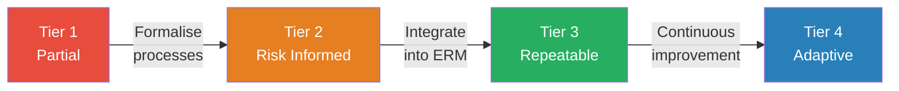
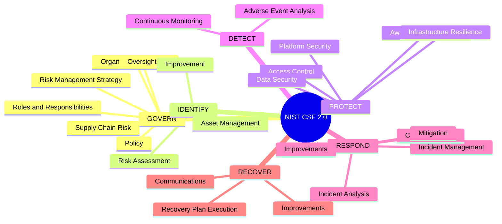

# Session 13: The NIST Cybersecurity Framework

## Learning Objectives

By the end of this session, you will be able to:

- Explain why cybersecurity frameworks exist and the benefits they provide to organisations
- Describe the history and development of the NIST Cybersecurity Framework (CSF)
- Articulate the purpose and key activities of each of the six CSF 2.0 Functions
- Distinguish between the four NIST CSF Implementation Tiers
- Apply the concept of Current State and Target State Profiles to gap analysis
- Compare NIST CSF with ISO 27001 and the Australian Essential Eight

## Presentation Materials

[:material-presentation: View Slides – NIST Part 1](../slides-original/slide_61256683_1.md){ .md-button .md-button--primary }
[:material-presentation: View Slides – NIST Part 2](../slides-original/slide_61980342_1.md){ .md-button .md-button--primary }

---

## Why Cybersecurity Frameworks Exist

Organisations face a bewildering variety of cyber threats — ransomware, supply-chain attacks, insider threats, and nation-state actors — alongside an equally complex landscape of regulatory obligations. Without a structured approach, security efforts can become ad hoc, inconsistent, and difficult to measure.

**Cybersecurity frameworks** provide a common language, a structured set of activities, and measurable outcomes that help organisations:

- **Understand** their current security posture
- **Prioritise** investments based on risk
- **Communicate** security requirements across technical and executive audiences
- **Demonstrate compliance** with legislation and standards
- **Benchmark** against industry peers and best practices

Frameworks are not prescriptive checklists — they are flexible reference structures that organisations adapt to their size, sector, and risk appetite.

---

## NIST and the CSF — History and Context

The **National Institute of Standards and Technology (NIST)** is a US federal agency within the Department of Commerce. NIST develops standards, guidelines, and best practices used across government and industry worldwide.

### Executive Order 13636 and CSF 1.0

In February 2013, US President Barack Obama signed **Executive Order 13636 — Improving Critical Infrastructure Cybersecurity**. The order directed NIST to work with the private sector to develop a voluntary framework for reducing cyber risks to critical infrastructure.

NIST published **CSF 1.0** in February 2014 after an extensive public consultation process. The framework was built on existing standards (ISO 27001, COBIT, NIST SP 800-53) and was deliberately technology-neutral and sector-agnostic.

**CSF 1.1** followed in April 2018, adding guidance on supply chain risk management, self-assessment, and authentication.

### CSF 2.0 — 2024 Update

NIST released **CSF 2.0** in February 2024 — the most significant revision since the framework's creation. Key changes included:

| Change | Detail |
|--------|--------|
| Broadened scope | Explicitly applicable beyond critical infrastructure to all organisations |
| New GOVERN Function | Added as a sixth function, elevating governance to first-class status |
| Enhanced supply chain guidance | Supply chain risk management (C-SCRM) strengthened throughout |
| Improved implementation resources | New online reference tool, quick-start guides, and community profiles |
| Stronger CSF Profiles guidance | Clearer guidance on creating and using profiles for gap analysis |

---

## The Six CSF 2.0 Functions

The NIST CSF 2.0 organises cybersecurity activities into six high-level **Functions**. Together they form a continuous cycle of risk management.

!!! note "GOVERN is Central"
    Unlike the other five functions, GOVERN underpins all of them. It sets the organisational context — the policies, roles, and risk strategy — within which all other cybersecurity activities take place.

---

## GOVERN (GV) — New in CSF 2.0

The GOVERN function addresses how an organisation establishes, communicates, and monitors its cybersecurity risk management strategy, expectations, and policy. It ensures cybersecurity is integrated into broader enterprise risk management.

### Key Categories

| Category | Description |
|----------|-------------|
| Organisational Context (GV.OC) | The organisation's mission, stakeholder expectations, legal and regulatory requirements, and risk tolerance are understood and inform the cybersecurity strategy |
| Risk Management Strategy (GV.RM) | Priorities, constraints, and risk appetite are established and used to support operational risk decisions |
| Roles, Responsibilities and Authorities (GV.RR) | Cybersecurity roles, responsibilities, and lines of authority are established, communicated, and understood |
| Policy (GV.PO) | Cybersecurity policy is established, communicated, and enforced |
| Oversight (GV.OV) | Results of organisational cybersecurity risk management activities are used to inform and adjust the risk management strategy |
| Cybersecurity Supply Chain Risk Management (GV.SC) | Policies, processes, and practices are established to manage supply chain cybersecurity risks |

---

## IDENTIFY (ID)

The IDENTIFY function helps the organisation understand its current cybersecurity risk to systems, assets, data, and capabilities. You cannot protect what you cannot see.

- **Asset Management (ID.AM)**: Maintain a comprehensive inventory of hardware, software, data, and services — including those in the cloud and supply chain
- **Risk Assessment (ID.RA)**: Identify, analyse, and prioritise cybersecurity risks to the organisation
- **Improvement (ID.IM)**: Identify improvements to the organisation's cybersecurity risk management processes, procedures, and activities

A solid IDENTIFY function answers the question: *What do we have, and what are the risks to it?*

---

## PROTECT (PR)

The PROTECT function develops and implements appropriate safeguards to ensure delivery of critical services. It limits the impact of a potential cybersecurity event.

- **Identity Management, Authentication and Access Control (PR.AA)**: Access to physical and logical assets is limited to authorised users, services, and hardware — using principles of least privilege and separation of duties
- **Awareness and Training (PR.AT)**: Personnel are provided with cybersecurity awareness education and trained to perform their roles
- **Data Security (PR.DS)**: Data is managed to protect confidentiality, integrity, and availability — including encryption, backup, and disposal
- **Platform Security (PR.PS)**: Hardware and software are managed to reduce vulnerabilities — secure configuration, patching, and hardening
- **Technology Infrastructure Resilience (PR.IR)**: Security architectures are managed with resilience to withstand incidents — including network segmentation and redundancy

---

## DETECT (DE)

The DETECT function enables timely discovery of cybersecurity events. Speed of detection directly impacts the severity of an incident.

- **Continuous Monitoring (DE.CM)**: Assets, users, and activity are monitored to identify anomalies, indicators of compromise, and other potentially adverse events — including SIEM, EDR, and network monitoring tools
- **Adverse Event Analysis (DE.AE)**: Anomalies and suspicious activity are analysed to characterise detected events and determine their potential impact

!!! warning "Dwell Time"
    The average time an attacker remains undetected in a network (dwell time) has historically been measured in weeks or months. Effective detection controls are critical to minimising this window.

---

## RESPOND (RS)

The RESPOND function enables action when a cybersecurity incident is detected. A prepared organisation responds in minutes; an unprepared one responds in days.

- **Incident Management (RS.MA)**: Incidents are contained, eradicated, and activities are performed in accordance with documented response plans
- **Incident Analysis (RS.AN)**: Investigations are conducted to understand the scope, root cause, and impact of an incident
- **Incident Response Reporting and Communication (RS.CO)**: Response activities are coordinated with internal and external stakeholders — including regulatory notification where required
- **Incident Mitigation (RS.MI)**: Activities are performed to prevent expansion of an event and to resolve the incident
- **Improvements (RS.IM)**: Response and recovery activities are improved by incorporating lessons from current and previous incidents

---

## RECOVER (RC)

The RECOVER function supports timely restoration of normal operations and services after a cybersecurity incident.

- **Incident Recovery Plan Execution (RC.RP)**: Recovery activities are performed and documented in accordance with the recovery plan — including restoration of systems and data from backups
- **Incident Recovery Communication (RC.CO)**: Restoration activities are coordinated with internal and external parties — including status updates, post-incident reviews, and public communications where applicable
- **Incident Recovery Improvements (RC.IM)**: Recovery planning and processes are improved by incorporating lessons learned

---

## NIST CSF Implementation Tiers

Implementation Tiers describe the degree to which an organisation's cybersecurity risk management practices exhibit the characteristics defined in the CSF. Tiers are not maturity levels — they reflect integration into enterprise risk management.

| Tier | Name | Characteristics |
|------|------|----------------|
| 1 | **Partial** | Cybersecurity risk management is ad hoc. Limited awareness. No formal policy. Reactive only. |
| 2 | **Risk Informed** | Risk management practices are approved but not organisation-wide policy. Awareness exists but not systematically shared. |
| 3 | **Repeatable** | Formally approved risk management practices. Regularly updated. Organisation-wide consistent implementation. |
| 4 | **Adaptive** | Adaptive practices based on lessons learned. Actively updated based on advanced threat intelligence and previous events. |

---

## NIST CSF Profiles — Current State and Target State

A **CSF Profile** describes the cybersecurity outcomes an organisation has selected from the Framework Core. Profiles are used for:

1. **Current Profile** — the outcomes presently being achieved
2. **Target Profile** — the desired outcomes aligned with business objectives and risk appetite
3. **Gap Analysis** — comparing Current to Target reveals where investment is needed

Profiles can be used internally (to prioritise security investments) or communicated externally (to demonstrate compliance to regulators, insurers, or customers). NIST provides Community Profiles for specific sectors (healthcare, finance, manufacturing) as starting points.

---

## Implementing NIST CSF — A Practical Approach

Adopting the NIST CSF is a journey, not a single project. A structured approach ensures sustainable progress:

1. **Prioritise and scope** — define the business objectives and system boundaries in scope
2. **Orient** — identify threats, regulatory requirements, and existing risk management practices
3. **Create a Current Profile** — assess which CSF outcomes are currently being achieved
4. **Conduct a Risk Assessment** — identify and analyse risks within the defined scope
5. **Create a Target Profile** — define the desired security outcomes aligned with risk appetite
6. **Determine, Analyse, and Prioritise Gaps** — compare Current to Target and assess the cost/benefit of addressing each gap
7. **Implement an Action Plan** — execute prioritised improvements and track progress
8. **Review and Update** — regularly reassess as threats, technology, and business objectives change

---

## NIST CSF vs ISO 27001

Both frameworks address information security but from different angles. Many Australian organisations align to both.

| Dimension | NIST CSF 2.0 | ISO 27001:2022 |
|-----------|-------------|----------------|
| **Origin** | US federal government | International standard (ISO/IEC) |
| **Compliance** | Voluntary | Certification available |
| **Approach** | Outcome-based, risk-driven | Process-based, controls-driven |
| **Scope** | Cybersecurity risk management | Information security management system (ISMS) |
| **Audience** | Board to technical team | Security managers, auditors |
| **Flexibility** | High — adapt to any sector or size | Moderate — must meet all mandatory clauses |
| **Update cycle** | Periodic (major updates 2014, 2018, 2024) | Periodic (major update 2022) |
| **Australian recognition** | Widely referenced by ACSC | Referenced in government procurement |

---

## Australian Context — ACSC Essential Eight Alignment

The Australian Cyber Security Centre (ACSC) **Essential Eight** is a prioritised set of baseline mitigation strategies. While not a comprehensive framework, it maps closely to NIST CSF functions:

| Essential Eight Strategy | Primary CSF Function(s) |
|--------------------------|------------------------|
| Application control | PROTECT |
| Patch applications | PROTECT |
| Configure Microsoft Office macros | PROTECT |
| User application hardening | PROTECT |
| Restrict administrative privileges | PROTECT / GOVERN |
| Patch operating systems | PROTECT |
| Multi-factor authentication | PROTECT |
| Regular backups | RECOVER |

Australian government entities are required to achieve at least Maturity Level 2 across all Essential Eight strategies. The NIST CSF provides a broader context for building the governance and operational practices that surround these technical controls.

---

## NIST CSF 2.0 — Overview Mindmap

---

## Key Takeaways

- The NIST CSF provides a flexible, risk-based approach to managing cybersecurity that is applicable to organisations of any size or sector
- CSF 2.0 adds a **GOVERN** function that elevates cybersecurity governance to the same level as operational controls
- The six functions — GOVERN, IDENTIFY, PROTECT, DETECT, RESPOND, RECOVER — form a continuous cycle, not a linear checklist
- **Implementation Tiers** describe how well cybersecurity risk management is integrated into enterprise decision-making
- **Profiles** enable gap analysis between current and target security posture
- The NIST CSF complements other frameworks (ISO 27001, Essential Eight) and can be used alongside them

---

## Review Questions

1. What was the primary driver behind the creation of the NIST Cybersecurity Framework, and why was it designed as a voluntary framework?
2. Explain the significance of the GOVERN function being added in CSF 2.0. What does its addition signal about the evolution of cybersecurity thinking?
3. An organisation has excellent technical controls (firewalls, AV, patching) but has never documented a security policy or defined roles and responsibilities. Which CSF Functions are weakest, and what Tier would you assign?
4. Describe how a CSF Profile is used to conduct a gap analysis. What outputs does the gap analysis produce, and how are they used?
5. How does the NIST CSF complement the Australian Essential Eight? Could an organisation be Essential Eight Maturity Level 3 but still have a weak NIST CSF posture? Explain your reasoning.

## Discussion Points

- Should adoption of the NIST CSF be made mandatory for Australian critical infrastructure operators? What are the arguments for and against?
- How should a small business with no dedicated security staff approach implementing NIST CSF? What would a realistic "Tier 1 → Tier 2" journey look like?
- The GOVERN function places cybersecurity risk management in the boardroom. How does this change the conversation between IT security teams and senior leadership?

    3. What are some code analysis tools that can be used to identify potential security vulnerabilities?