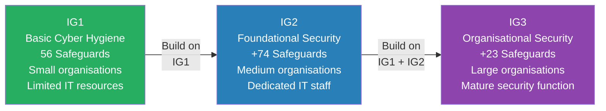
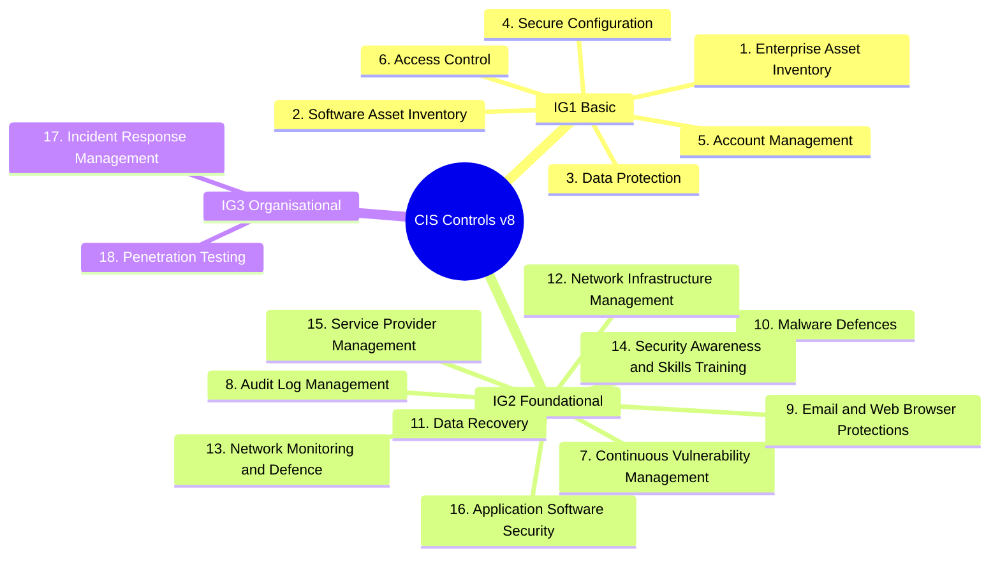
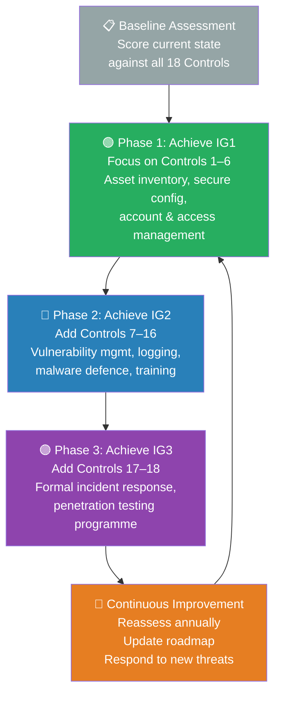

# Session 14: CIS Controls

## Learning Objectives

By the end of this session, you will be able to:

- Describe what the CIS Controls are and explain why they are widely adopted
- Identify the three Implementation Groups and their intended audiences
- List the 18 CIS Controls v8 and categorise them by Implementation Group
- Apply a maturity assessment approach to evaluate an organisation's CIS Controls posture
- Compare CIS Controls to the NIST CSF and the Australian Essential Eight

## Presentation Materials

[:material-presentation: View Slides – CIS Part 1](../slides-original/slide_61507221_1.md){ .md-button .md-button--primary }
[:material-presentation: View Slides – CIS Part 2](../slides-original/slide_61980341_1.md){ .md-button .md-button--primary }
[:material-presentation: View Slides – CIS Part 3](../slides-original/slide_75721674_1.md){ .md-button .md-button--primary }

---

## Introduction to CIS Controls

The **CIS Controls** (formerly the SANS Critical Security Controls) are a prioritised set of cybersecurity best practices developed and maintained by the **Center for Internet Security (CIS)** — a non-profit organisation that brings together government, industry, academia, and security practitioners worldwide.

The CIS Controls were originally created in 2008 in response to a problem that US government agencies identified: organisations were implementing frameworks that were theoretically sound but failing to address the most common, actual attack techniques observed in the wild. The Controls were deliberately built from the "outside in" — starting with attack data, then defining defences.

**Key characteristics:**

- **Prioritised** — Controls are ordered by impact, so organisations tackle the highest-risk gaps first
- **Prescriptive** — Each control includes specific, actionable Safeguards (formerly Sub-Controls)
- **Community-maintained** — Updated through a transparent global consensus process
- **Mapped to other frameworks** — CIS publishes official mappings to NIST CSF, ISO 27001, MITRE ATT&CK, and others
- **Free to use** — The full Controls document is freely available from the CIS website

**CIS Controls v8**, released in May 2021, consolidated the prior v7.1's 20 controls into 18 and reorganised Safeguards around activities (rather than devices), reflecting the modern reality of cloud, mobile, and remote work.

---

## Implementation Groups (IGs)

A major strength of CIS Controls v8 is the **Implementation Group (IG)** system, which allows organisations to prioritise based on their size, resources, and risk profile. All 153 Safeguards across the 18 Controls are assigned to one or more IGs.

### IG1 — Basic Cyber Hygiene (56 Safeguards)

IG1 is designed for **small organisations** with limited cybersecurity expertise and IT resources. The 56 IG1 Safeguards represent the minimum baseline that every organisation — regardless of size — should achieve. They protect against the most common, low-sophistication attacks and are achievable without specialised security staff.

*Example IG1 organisations: Small businesses, local councils, community organisations, sole practitioners.*

### IG2 — Foundational Security (adds 74 Safeguards)

IG2 is designed for **medium-to-large organisations** with dedicated IT staff managing a diverse technology environment. These organisations often handle sensitive data or provide services that, if disrupted, would cause significant impact. IG2 Safeguards address more sophisticated attack techniques and require tools such as vulnerability scanners, log management systems, and endpoint detection platforms.

*Example IG2 organisations: Regional government agencies, mid-size enterprises, healthcare providers.*

### IG3 — Organisational Security (adds 23 Safeguards)

IG3 is designed for **large enterprises and critical infrastructure** operators with mature security functions — typically including a dedicated security team or SOC. IG3 Safeguards address advanced persistent threats (APTs), sophisticated adversaries, and stringent regulatory obligations. They require significant investment in people, process, and technology.

*Example IG3 organisations: Banks, utilities, federal government agencies, large technology companies.*

---

## The 18 CIS Controls

### IG1 Controls (1–6)

| # | Control | Purpose |
|---|---------|---------|
| 1 | **Inventory and Control of Enterprise Assets** | Actively manage all hardware connected to the network — you can't protect what you can't see |
| 2 | **Inventory and Control of Software Assets** | Actively manage all software to ensure only authorised software is installed and executing |
| 3 | **Data Protection** | Develop processes and controls to identify, classify, securely handle, retain, and dispose of data |
| 4 | **Secure Configuration of Enterprise Assets and Software** | Establish and maintain secure configurations for hardware, software, and operating systems |
| 5 | **Account Management** | Use processes and tools to assign and manage authorisation to credentials for user accounts |
| 6 | **Access Control Management** | Use processes and tools to create, assign, manage, and revoke access credentials and privileges |

### IG2 Controls (7–16)

| # | Control | Purpose |
|---|---------|---------|
| 7 | **Continuous Vulnerability Management** | Continuously acquire, assess, and take action on new information in order to identify and remediate vulnerabilities |
| 8 | **Audit Log Management** | Collect, alert, review, and retain audit logs to detect, understand, or recover from an attack |
| 9 | **Email and Web Browser Protections** | Improve protections and detections for threats from email and web vectors |
| 10 | **Malware Defences** | Prevent or control installation, spread, and execution of malicious applications, code, or scripts |
| 11 | **Data Recovery** | Establish and maintain data recovery practices sufficient to restore in-scope enterprise assets |
| 12 | **Network Infrastructure Management** | Establish, implement, and actively manage network devices and configurations |
| 13 | **Network Monitoring and Defence** | Operate processes and tooling to establish and maintain comprehensive network monitoring |
| 14 | **Security Awareness and Skills Training** | Establish and maintain a security awareness programme to influence behaviour |
| 15 | **Service Provider Management** | Develop a process to evaluate service providers who hold sensitive data or are responsible for critical IT functions |
| 16 | **Application Software Security** | Manage the security life cycle of in-house developed, hosted, or acquired software |

### IG3 Controls (17–18)

| # | Control | Purpose |
|---|---------|---------|
| 17 | **Incident Response Management** | Establish a programme to prepare, detect, contain, analyse, and remediate security incidents |
| 18 | **Penetration Testing** | Test the effectiveness and resilience of enterprise assets through penetration testing |

---

## Deep Dive: CIS Control 1 — Inventory and Control of Enterprise Assets

Control 1 is foundational because **you cannot protect assets you do not know exist**. Shadow IT, forgotten servers, and unmanaged IoT devices are persistent entry points for attackers.

**Key Safeguards (IG1):**

- **1.1** — Establish and maintain a detailed enterprise asset inventory (hardware assets), including portable devices, network devices, and IoT
- **1.2** — Address unauthorised assets by removing them, denying network access, or quarantining them until they are verified
- **1.3** — Utilise an active discovery tool to identify assets connected to the network — passive inventory alone misses dormant or intermittent devices

**Key Safeguards (IG2 additions):**

- **1.4** — Use Dynamic Host Configuration Protocol (DHCP) logging to update the asset inventory
- **1.5** — Use a passive asset discovery tool to identify assets in the environment

**Why attackers love unknown assets:** An unpatched server running an end-of-life operating system — that no one knows exists — cannot be patched, monitored, or decommissioned. These "shadow" assets are a favourite initial access point in ransomware attacks.

---

## Deep Dive: CIS Control 5 — Account Management

Control 5 addresses one of the most exploited weaknesses in any environment: **poorly managed accounts**. Credential theft, password spraying, and privilege escalation attacks all rely on weak account hygiene.

**Key Safeguards (IG1):**

- **5.1** — Establish and maintain an inventory of all accounts (user and admin) — including service accounts
- **5.2** — Use unique passwords for all accounts — enforce through a password manager or PAM solution
- **5.3** — Disable dormant accounts after a defined period of inactivity (typically 45 days)
- **5.4** — Restrict administrator privileges to dedicated administrator accounts — do not use admin accounts for daily work
- **5.5** — Establish and maintain an inventory of service accounts

**Key Safeguards (IG2 additions):**

- **5.6** — Centralise account management through a directory service (Active Directory, LDAP, cloud IdP)

!!! warning "The Threat of Stale Accounts"
    Former employees, contractors, or service accounts that are never disabled represent a significant risk. Many data breaches have been traced to credentials that were valid months — or years — after the associated person left the organisation.

---

## Deep Dive: CIS Control 16 — Application Software Security

Control 16 addresses the security of applications developed, hosted, or acquired by the organisation. Web application attacks remain the most common attack pattern in data breaches globally.

**Key Safeguards (IG2):**

- **16.1** — Establish and maintain a secure application development process
- **16.2** — Establish and maintain a process to accept and address software vulnerabilities (vulnerability disclosure programme)
- **16.3** — Perform root cause analysis on security vulnerabilities detected in applications and remediate
- **16.4** — Establish and maintain only necessary ports, protocols, and services for each application
- **16.5** — Use up-to-date and trusted third-party software components
- **16.6** — Establish a process to receive and address reports of software vulnerabilities

**Key Safeguards (IG3 additions):**

- **16.7** — Use standardised and vetted libraries and frameworks for each application
- **16.8** — Separate production and non-production environments
- **16.9** — Train developers in application security concepts and secure coding techniques
- **16.10** — Apply secure design principles in application architectures
- **16.11** — Leverage vetted modules and services for application security functions (auth, crypto, logging)
- **16.12** — Implement code-level security checks in the development pipeline (SAST, DAST, SCA)
- **16.13** — Conduct threat modelling for application changes

---

## Maturity Assessment Against CIS Controls

Organisations use maturity assessments to understand their current posture and prioritise improvement. The CIS Controls support a structured assessment approach:

1. **Define scope** — identify the systems, environments, and business units in scope
2. **Select target IG** — determine which Implementation Group is appropriate for the organisation's profile
3. **Assess each Safeguard** — for each Safeguard in the target IG, evaluate:
   - Is a policy in place?
   - Is a technical control implemented?
   - Is the control monitored and measured?
   - Is there evidence of effectiveness?
4. **Score and document** — assign a completion percentage per Control and per IG
5. **Gap analysis** — identify which Safeguards are missing or partially implemented
6. **Roadmap** — prioritise gap remediation by risk impact and implementation effort

A common scoring model uses four levels:
- **Not Implemented (0%)** — no policy, process, or control exists
- **Partially Implemented (25–75%)** — some activity exists but is incomplete or inconsistent
- **Largely Implemented (75–99%)** — implemented but with minor gaps or documentation issues
- **Fully Implemented (100%)** — policy, control, and evidence of effectiveness all present

---

## CIS Controls Implementation Roadmap

Organisations new to CIS Controls should follow a phased approach aligned to the Implementation Groups:

---

## CIS Controls and NIST CSF — Complementary Frameworks

The CIS Controls and NIST CSF are complementary — one provides "what to do" (CIS), the other provides "how to think about it" (NIST CSF). CIS publishes an official mapping between the two.

| NIST CSF Function | Relevant CIS Controls |
|-------------------|----------------------|
| GOVERN | Control 5 (Account Mgmt), Control 15 (Service Provider Mgmt) |
| IDENTIFY | Control 1 (Asset Inventory), Control 2 (Software Inventory), Control 7 (Vulnerability Mgmt) |
| PROTECT | Controls 3, 4, 6, 9, 10, 12, 14, 16 |
| DETECT | Controls 8 (Audit Logs), Control 13 (Network Monitoring) |
| RESPOND | Control 17 (Incident Response) |
| RECOVER | Control 11 (Data Recovery), Control 17 |

Many organisations use NIST CSF for executive communication and governance, and CIS Controls as the technical implementation guide for their security team.

---

## Australian Essential Eight vs CIS Controls

The **ACSC Essential Eight** and CIS Controls IG1 address similar foundational problems, though from different perspectives. The Essential Eight is a targeted list optimised for the Australian threat environment; CIS Controls IG1 is broader but comparably prioritised.

| Essential Eight Strategy | Closest CIS Control(s) |
|--------------------------|------------------------|
| Application control | Control 2 (Software Inventory), Control 4 (Secure Config) |
| Patch applications | Control 7 (Vulnerability Management) |
| Configure Microsoft Office macros | Control 4 (Secure Config), Control 9 (Email/Web Protections) |
| User application hardening | Control 4 (Secure Config) |
| Restrict administrative privileges | Control 5 (Account Mgmt), Control 6 (Access Control) |
| Patch operating systems | Control 7 (Vulnerability Management) |
| Multi-factor authentication | Control 6 (Access Control) |
| Regular backups | Control 11 (Data Recovery) |

An organisation achieving Essential Eight Maturity Level 2 would have addressed most of CIS IG1, but would still have gaps across Controls 1, 3, 8, 9, 10, 13, 14, and 15.

---

## Key Takeaways

- CIS Controls v8 provides 18 prioritised, actionable security controls with 153 specific Safeguards
- The **Implementation Group** model allows organisations to adopt controls progressively based on size and risk profile — starting with IG1 for all organisations
- **Asset management** (Controls 1 and 2) is foundational — every other control depends on knowing what you have
- **Account management** (Control 5) remains one of the highest-impact controls because credential compromise underlies the majority of breaches
- CIS Controls and NIST CSF are complementary — use NIST CSF for governance framing and CIS Controls for technical implementation guidance
- The Australian Essential Eight covers most of CIS IG1 but does not replace the full CIS Controls programme

---

## Review Questions

1. What is the purpose of Implementation Groups in CIS Controls v8, and how should an organisation determine which IG is appropriate for their situation?
2. Why is CIS Control 1 (Asset Inventory) considered foundational? Describe a real-world attack scenario where unknown assets were the entry point.
3. An organisation has all IG1 Safeguards implemented but has not started on IG2. Which IG2 controls would you prioritise first, and why?
4. Compare CIS Control 5 (Account Management) with the Essential Eight strategy "Restrict Administrative Privileges." What does each cover that the other does not?
5. How does CIS Control 16 (Application Software Security) support a DevSecOps approach? Which Safeguards would appear in a secure development pipeline?

## Discussion Points

- The CIS Controls were built "outside in" from observed attack data. What are the advantages and limitations of this approach compared to top-down risk frameworks like ISO 27001?
- IG1 represents "basic cyber hygiene" yet many organisations have not achieved it. What are the most common barriers to achieving IG1, and how can they be overcome?
- How should an organisation communicate CIS Controls progress to a board of directors who have no technical background?
