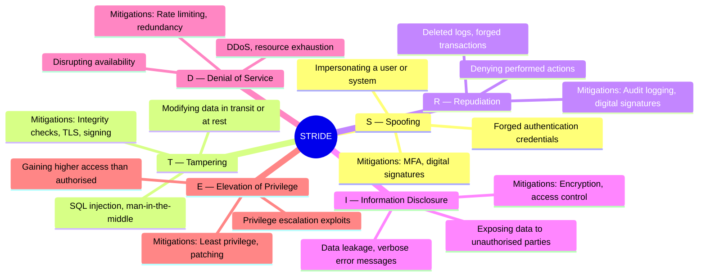
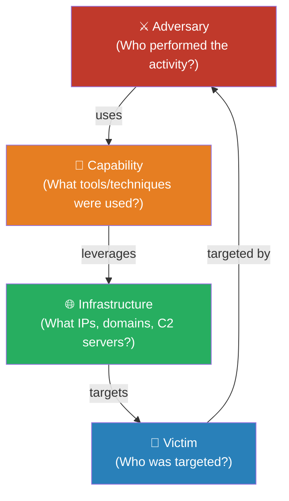

# Session 15: Advanced Threat Analysis Techniques

## Learning Objectives

By the end of this session, you will be able to:

- Define threat analysis and distinguish it from threat intelligence
- Apply STRIDE, PASTA, and DREAD threat modelling methodologies
- Describe the MITRE ATT&CK framework's structure and apply it to real-world scenarios
- Explain the concepts of threat hunting, adversary simulation, and purple teaming
- Use the Diamond Model to structure intrusion analysis
- Evaluate vulnerabilities using CVSS scoring

## Presentation Materials

!!! info "Session Materials"
    This session draws on external frameworks including MITRE ATT&CK, NIST NVD, and industry threat reports. No dedicated slide deck is associated with this session — the content is sourced directly from the frameworks referenced below.

---

## What is Threat Analysis?

**Threat analysis** is the systematic process of identifying, categorising, and evaluating potential threats to an information system, organisation, or environment. Its goal is to inform defensive decisions — what to protect, how strongly, and in what priority order.

Threat analysis is distinct from — but closely related to — **threat intelligence**:

| Concept | Focus | Output |
|---------|-------|--------|
| **Threat Analysis** | Structured examination of how threats apply to a specific system or organisation | Risk ratings, attack trees, threat models |
| **Threat Intelligence** | Collection and analysis of information about adversaries and their capabilities | IOCs, TTPs, threat actor profiles |

Threat analysis answers: *"Given what we know about threats, where are we most vulnerable?"*  
Threat intelligence answers: *"What are adversaries doing, and who is targeting organisations like ours?"*

Both are essential inputs to a mature security programme.

---

## Threat Modelling Methodologies

**Threat modelling** is a structured approach to identifying threats during the design of systems, applications, or processes. Several methodologies exist, each with different strengths.

### STRIDE

STRIDE was developed by Microsoft and is one of the most widely used threat modelling frameworks for application security. It categorises threats by the type of attack they represent.

STRIDE is applied by drawing a Data Flow Diagram (DFD) of the system, then systematically asking: "Which STRIDE threats apply at each data flow, process, data store, and trust boundary?"

### PASTA — Process for Attack Simulation and Threat Analysis

PASTA is a risk-centric methodology that ties threat modelling directly to business impact. It follows a seven-stage process:

| Stage | Name | Activities |
|-------|------|-----------|
| 1 | Define Business Objectives | Understand business drivers, compliance requirements, and asset criticality |
| 2 | Define Technical Scope | Identify components, APIs, third-party dependencies, and data flows |
| 3 | Application Decomposition | Create DFDs, identify trust boundaries, and enumerate data stores |
| 4 | Threat Analysis | Identify relevant threats using threat intelligence sources and attack libraries |
| 5 | Vulnerability and Weakness Analysis | Map known vulnerabilities and weaknesses to the application components |
| 6 | Attack Modelling and Simulation | Construct attack trees and simulate likely attack scenarios |
| 7 | Risk and Impact Analysis | Calculate residual risk, prioritise mitigations, and produce a threat model report |

PASTA is particularly suited to complex enterprise applications where security decisions must be justified on business-risk grounds.

### DREAD — Risk Scoring Model

DREAD is a qualitative scoring model used to rate the severity of individual threats identified during a threat model. Each dimension is scored 1–10:

| Dimension | Question |
|-----------|----------|
| **D**amage | How bad would an attack be if it succeeded? |
| **R**eproducibility | How easily can the attack be reproduced? |
| **E**xploitability | How much work is required to launch the attack? |
| **A**ffected Users | How many users are impacted? |
| **D**iscoverability | How easily can the vulnerability be found? |

A DREAD score is calculated as: `(D + R + E + A + D) / 5`. High scores (7–10) indicate critical threats requiring immediate remediation.

!!! note "DREAD Limitations"
    DREAD scoring is subjective and can be inconsistent across different analysts. It works best when used within a team with agreed scoring criteria and calibration exercises. Some organisations drop Discoverability as it can incentivise security through obscurity.

---

## MITRE ATT&CK Framework

The **MITRE ATT&CK** (Adversarial Tactics, Techniques, and Common Knowledge) framework is a globally accessible knowledge base of real-world adversary behaviours, maintained by MITRE Corporation. It is one of the most widely used references in modern threat detection, incident response, and red team operations.

ATT&CK is structured around three levels:

- **Tactics** — the adversary's goals (the "why")
- **Techniques** — the methods used to achieve a tactic (the "how")
- **Sub-techniques** — specific implementations of a technique
- **Procedures** — specific, documented use of a technique by a named threat group

### The 14 ATT&CK Tactics (Enterprise Matrix)

| Tactic | ID | Purpose |
|--------|----|---------|
| Reconnaissance | TA0043 | Gathering information to plan the attack |
| Resource Development | TA0042 | Acquiring infrastructure, tools, and capabilities |
| Initial Access | TA0001 | Gaining a foothold in the environment |
| Execution | TA0002 | Running adversary-controlled code |
| Persistence | TA0003 | Maintaining access across reboots and credential changes |
| Privilege Escalation | TA0004 | Gaining higher-level permissions |
| Defence Evasion | TA0005 | Avoiding detection by security tools |
| Credential Access | TA0006 | Stealing credentials |
| Discovery | TA0007 | Understanding the environment |
| Lateral Movement | TA0008 | Moving through the environment |
| Collection | TA0009 | Gathering data of interest |
| Command and Control | TA0011 | Communicating with compromised systems |
| Exfiltration | TA0010 | Stealing data out of the environment |
| Impact | TA0040 | Manipulating, disrupting, or destroying systems/data |

### Using ATT&CK in Practice

ATT&CK has practical applications across the security function:

- **Threat detection** — map SIEM rules and detection logic to ATT&CK techniques to measure coverage
- **Threat hunting** — use ATT&CK as a hypothesis source: "Are we seeing T1059 (Command and Scripting Interpreter) activity that bypasses our controls?"
- **Red team planning** — structure red team operations around realistic tactic-by-tactic adversary emulation
- **Gap analysis** — identify which ATT&CK techniques have no detection coverage in your environment
- **Reporting** — communicate incidents in a standardised language that translates across teams and organisations

---

## Threat Hunting

**Threat hunting** is a proactive, human-driven process of searching through networks and systems to detect and isolate advanced threats that evade existing automated controls.

| Approach | Description |
|----------|-------------|
| **Reactive detection** | Alerts trigger investigation — waiting for the security tooling to fire |
| **Threat hunting** | Analyst-driven searches based on hypotheses about adversary behaviour — not waiting for an alert |

### Hypothesis-Driven Hunting

A threat hunt begins with a hypothesis — a statement about a possible adversary behaviour that may not be caught by existing controls:

*"Threat actors targeting organisations in our sector are using living-off-the-land techniques (LOLBins) to avoid EDR detection. Are we seeing unusual use of `wmic.exe`, `mshta.exe`, or `certutil.exe` in our environment?"*

The hunter then queries data sources (EDR telemetry, logs, SIEM) to test the hypothesis, investigating anomalies until the hypothesis is confirmed or refuted.

### TTP-Based Hunting

TTP-based hunting uses ATT&CK techniques as the hunting framework. The team selects a technique (e.g., T1003 — OS Credential Dumping), understands what data would be generated if that technique was used, and hunts for that data.

---

## Adversary Simulation

Adversary simulation tests whether an organisation's defences would actually stop a real attacker — not just whether the controls are configured correctly.

### Red Team Operations

A **red team** is a group that simulates a real-world adversary to test the organisation's detection and response capabilities. Unlike a penetration test (which focuses on finding all vulnerabilities), a red team exercise:

- Uses realistic adversary TTPs (often from ATT&CK)
- Focuses on specific objectives (e.g., exfiltrating sensitive data, achieving domain admin)
- Tests people, processes, and technology — not just technical controls
- Remains covert for as long as possible

### Purple Teaming

**Purple teaming** combines red team (adversary simulation) and blue team (defence) activities in a collaborative exercise. Rather than adversarial competition, purple team exercises are joint improvement exercises where:

- The red team executes an ATT&CK technique
- The blue team confirms whether the technique was detected and by which control
- Both teams work together to improve detections where gaps are found

### Breach and Attack Simulation (BAS)

**BAS tools** (e.g., AttackIQ, SafeBreach, Cymulate) automate adversary simulation at scale — running thousands of ATT&CK technique simulations against an environment to continuously test detection coverage without requiring a full red team engagement.

---

## Cyber Threat Intelligence (CTI)

CTI informs threat analysis by providing context about adversaries, their motivations, and their methods. CTI is typically categorised by level:

| Level | Description | Audience |
|-------|-------------|---------|
| **Strategic** | High-level trends, threat landscape, geopolitical context | Board, executives, risk managers |
| **Operational** | Information about ongoing campaigns and threat actor operations | SOC managers, incident responders |
| **Tactical** | TTPs — how adversaries operate | Security architects, detection engineers |
| **Technical** | IOCs — IPs, domains, hashes, signatures | SOC analysts, SIEM/EDR tooling |

Quality CTI reduces analyst workload, improves detection fidelity, and helps prioritise defensive investments based on who is actually targeting the organisation.

---

## Diamond Model of Intrusion Analysis

The **Diamond Model** (Caltagirone, Pendergast, Betz — 2013) provides a structured way to understand and document intrusion events. It places four core features at the corners of a diamond:

The Diamond Model is particularly useful for:

- **Attribution analysis** — connecting infrastructure and capabilities to known threat actors
- **Pivoting** — using knowledge of one feature (e.g., a C2 IP) to discover related infrastructure or victims
- **Campaign tracking** — connecting multiple intrusion events to the same adversary

---

## Attack Attribution

Attribution is the process of identifying who is responsible for a cyberattack. It is one of the most difficult problems in cybersecurity.

### Technical Attribution

Technical attribution uses evidence from the intrusion itself:

- **Malware code** — programming language, coding style, build artefacts, embedded strings
- **Infrastructure** — domain registration patterns, hosting providers, IP geolocation
- **TTPs** — overlap with documented threat actor behaviour in ATT&CK
- **Operational security failures** — mistakes made by the adversary that reveal identity

### Challenges of Attribution

- **False flag operations** — sophisticated adversaries deliberately plant evidence implicating other actors
- **Infrastructure sharing** — multiple threat groups reuse the same bulletproof hosting providers
- **Code reuse** — tools and malware frameworks are shared, stolen, or purchased on criminal marketplaces
- **Geopolitical pressure** — public attribution has diplomatic consequences and requires a higher standard of evidence than technical attribution alone

!!! warning "Attribution Confidence"
    Attribution assessments should always include a stated confidence level. "We assess with moderate confidence that this activity is consistent with APT28 TTPs" is far more responsible than an unqualified attribution claim.

---

## Vulnerability Analysis — CVSS Scoring

The **Common Vulnerability Scoring System (CVSS)** is an industry-standard method for assessing the severity of security vulnerabilities. It produces a score from 0.0 to 10.0.

CVSS v3.1 uses three metric groups:

| Metric Group | Description |
|-------------|-------------|
| **Base Score** | Intrinsic characteristics of a vulnerability — attack vector, complexity, privileges required, user interaction, scope, and impact on CIA |
| **Temporal Score** | Characteristics that change over time — exploit code availability, remediation status, report confidence |
| **Environmental Score** | Organisation-specific adjustments — asset criticality, existing controls that modify impact |

| CVSS Score Range | Severity |
|-----------------|---------|
| 0.0 | None |
| 0.1 – 3.9 | Low |
| 4.0 – 6.9 | Medium |
| 7.0 – 8.9 | High |
| 9.0 – 10.0 | Critical |

Vulnerabilities are tracked in the **NVD (National Vulnerability Database)** and assigned a **CVE (Common Vulnerabilities and Exposures)** identifier (e.g., CVE-2021-44228 — the Log4Shell vulnerability).

!!! note "CVSS is Not Enough Alone"
    A CVSS score reflects technical severity, not organisational risk. A Critical (9.8) vulnerability in software you don't run is less urgent than a Medium (5.4) vulnerability in your public-facing authentication service. Environmental scoring and asset context must inform prioritisation.

---

## Threat Analysis Reporting

Effective threat analysis is only valuable if communicated clearly to the right audience.

**Executive Summary** — 1–2 pages covering:
- Overall risk rating and key findings
- Business impact of identified threats
- Top 3–5 recommended actions and their expected risk reduction
- No technical jargon

**Technical Report** — detailed findings covering:
- Threat model scope and methodology
- All identified threats, their STRIDE/DREAD classification, and evidence
- CVE references and CVSS scores for identified vulnerabilities
- ATT&CK technique mappings
- Detailed mitigation recommendations

**IOC Sharing** — structured threat intelligence can be shared using:
- **STIX** (Structured Threat Information Expression) — a standardised language for describing cyber threat intelligence
- **TAXII** (Trusted Automated eXchange of Intelligence Information) — a protocol for exchanging STIX data
- **MISP** — open-source threat intelligence sharing platform widely used in the Australian and global security community

---

## Key Takeaways

- Threat analysis and threat intelligence are complementary disciplines — analysis applies intelligence to specific systems and contexts
- **STRIDE** provides a structured checklist for application-level threats; **PASTA** connects threats to business risk; **DREAD** provides a consistent scoring approach
- The **MITRE ATT&CK** framework is the industry-standard reference for adversary behaviour — it maps tactics to techniques across the full attack lifecycle
- **Threat hunting** is proactive and hypothesis-driven — it finds threats that automated tools miss
- The **Diamond Model** provides a structured way to document and pivot across intrusion features (adversary, capability, infrastructure, victim)
- **CVSS** quantifies vulnerability severity, but organisational context must determine actual remediation priority

---

## Review Questions

1. Distinguish between threat analysis and threat intelligence. Give an example of each in the context of a financial services organisation.
2. Apply STRIDE to a web application login page. For each category, identify one specific threat and one mitigating control.
3. A threat hunter has a hypothesis that an attacker is using T1059.001 (PowerShell) to run encoded commands that evade logging. What data sources would you query to test this hypothesis, and what would a positive indicator look like?
4. Using the Diamond Model, describe how a SOC analyst could pivot from a newly discovered malicious IP address to identify other potential victims or related infrastructure.
5. A vulnerability scanner reports 847 findings across your environment. Explain how you would use CVSS Base Score, Temporal Score, and Environmental Score — together with asset criticality — to prioritise the remediation backlog.

## Discussion Points

- Attribution of cyberattacks is politically sensitive. Should organisations publicly attribute attacks? What are the responsibilities and risks involved?
- The MITRE ATT&CK framework is built from observed real-world adversary behaviour. What are the limitations of a framework that is, by definition, based on what has already happened?
- How should threat modelling be integrated into a software development lifecycle? At what stages, and who should be involved?
