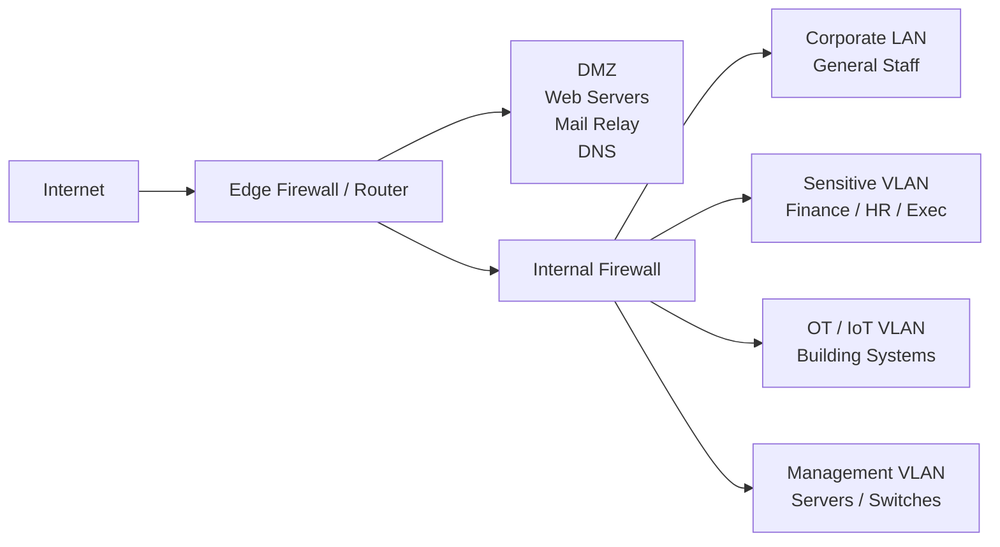
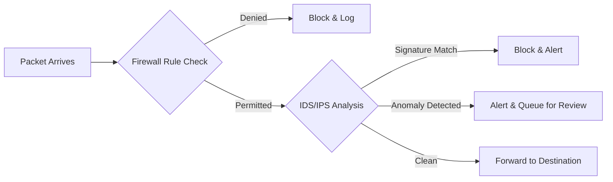

# Session 16: Network Security Fundamentals

## Learning Objectives

By the end of this session, students will be able to:

- Explain the role of network architecture in defining an organisation's attack surface
- Describe network segmentation strategies, including VLANs, DMZs, and Zero Trust Network Access
- Compare firewall types — packet filtering, stateful inspection, NGFW, and WAF
- Explain how IDS/IPS systems detect and respond to threats
- Describe VPN technologies and their appropriate use cases
- Identify common network attack vectors and their mitigations
- Outline the components of a network security policy

---

## 16.1 Introduction — The Network as the Primary Attack Surface

Every organisation that connects to the internet exposes itself to risk. The network is not simply infrastructure — it is the primary pathway through which attackers reach systems, data, and people. Understanding how networks are structured, how traffic flows, and where controls must be applied is foundational to every other area of cybersecurity.

Network security is not achieved by a single tool or policy. It is the combination of architecture, access controls, monitoring, and response capability working in concert. A firewall alone is insufficient; an unmonitored, flat network with poor segmentation will be compromised regardless of perimeter defences.

!!! info "The Evolving Perimeter"
    The traditional network perimeter — a firewall separating "inside" from "outside" — no longer reflects reality. Cloud services, remote work, and mobile devices mean that the perimeter is now everywhere. Modern network security must account for this with segmentation, identity-aware controls, and continuous monitoring.

---

## 16.2 Network Architecture Concepts

### LANs, WANs, and the Internet

- **Local Area Network (LAN)**: A network confined to a building or campus. High speed, low latency, typically under a single administrative domain.
- **Wide Area Network (WAN)**: Connects geographically separated networks — e.g., branch offices linked to a head office via MPLS, leased lines, or site-to-site VPN.
- **The Internet**: A public, untrusted network. All traffic traversing the internet must be treated as potentially hostile.

### Demilitarised Zone (DMZ)

A DMZ is a network segment that sits between the internet and the internal corporate network. Servers that must be accessible from the internet — web servers, mail relays, DNS servers — are placed in the DMZ. Even if a DMZ server is compromised, the attacker faces an additional firewall before reaching internal systems.

### VLANs and Subnetting

**VLANs (Virtual Local Area Networks)** allow a single physical switch infrastructure to be logically segmented. Devices on different VLANs cannot communicate without passing through a router or firewall, enabling policy enforcement at the network layer.

**Subnetting** divides an IP address space into smaller, manageable blocks. Combined with VLANs, subnetting provides the foundation for network segmentation.

### Segmented Enterprise Network Architecture

---

## 16.3 Network Segmentation and Zero Trust

### Why Segment?

A flat network, where every device can communicate with every other device, is catastrophically vulnerable. If one endpoint is compromised, an attacker can move laterally without restriction. Segmentation limits the blast radius of a breach.

**Principles of segmentation:**

- Group systems by function, sensitivity, and risk profile
- Enforce traffic policies at segment boundaries
- Apply least-privilege routing — only permit flows that are explicitly required
- Log and alert on inter-segment communication anomalies

### Micro-segmentation

Micro-segmentation extends VLAN-based segmentation to the individual workload level, often implemented in software-defined networking (SDN) environments. Rather than just separating departments, micro-segmentation enforces policy between individual servers or containers.

### Zero Trust Network Access (ZTNA)

ZTNA rejects the assumption that anything inside the network perimeter is trustworthy. Every connection request — regardless of source — must be authenticated, authorised, and continuously validated.

**Key ZTNA principles:**

1. **Verify explicitly** — authenticate and authorise every request based on identity, device health, and context
2. **Use least privilege access** — grant only the minimum access required
3. **Assume breach** — design as if the attacker is already inside; segment, monitor, and minimise lateral movement

---

## 16.4 Firewalls Deep Dive

### Packet Filtering (Stateless)

The earliest form of firewall. Examines each packet in isolation against a set of rules based on:

- Source/destination IP address
- Source/destination port
- Protocol (TCP, UDP, ICMP)

Stateless firewalls cannot track the state of a connection. They can be bypassed by crafted packets that individually appear legitimate.

### Stateful Inspection

Stateful firewalls maintain a connection table. They track the state of TCP/UDP sessions and only permit packets that are part of an established, legitimate session. This prevents many spoofing and injection attacks.

### Next-Generation Firewalls (NGFW)

NGFWs combine stateful inspection with:

- **Deep Packet Inspection (DPI)**: Inspects payload content, not just headers
- **Application awareness**: Identifies and controls applications regardless of port (e.g., blocking Dropbox even on port 443)
- **Integrated IPS**: Detects and blocks exploits inline
- **TLS/SSL inspection**: Decrypts and inspects encrypted traffic (requires certificate trust)
- **User identity integration**: Policies applied to users/groups, not just IP addresses

### Web Application Firewalls (WAF)

WAFs operate at Layer 7 and protect web applications from attacks such as SQL injection, cross-site scripting (XSS), and OWASP Top 10 vulnerabilities. They analyse HTTP/HTTPS traffic and apply rules specific to web application behaviour.

!!! tip "WAF Deployment Modes"
    WAFs can be deployed in **detection mode** (log only) or **prevention mode** (block). Always validate rules in detection mode before enabling prevention to avoid blocking legitimate traffic.

---

## 16.5 Intrusion Detection and Prevention Systems (IDS/IPS)

### Detection Approaches

| Approach | Description | Strengths | Weaknesses |
|---|---|---|---|
| **Signature-based** | Matches traffic against known attack patterns | Low false positives for known threats | Cannot detect zero-day or novel attacks |
| **Anomaly-based** | Establishes a baseline; alerts on deviations | Can detect unknown threats | Higher false positive rate; requires tuning |
| **Hybrid** | Combines both approaches | Broader coverage | Increased complexity |

### Network vs Host-based

- **NIDS/NIPS**: Deployed at network choke points (span port, inline tap). Monitors traffic flowing between systems.
- **HIDS/HIPS**: Installed on individual endpoints. Monitors system calls, file integrity, log events. Can detect attacks that encrypted network traffic would hide.

### Network Traffic Inspection Pipeline

---

## 16.6 Virtual Private Networks (VPNs)

### VPN Types

**Site-to-site VPN**: Creates a permanent encrypted tunnel between two network locations — e.g., a branch office and head office. The tunnel is transparent to end users.

**Remote access VPN**: Allows individual users to connect to the corporate network over the internet. The user's device appears as if it is on the internal network.

### VPN Protocols

| Protocol | Description | Use Case |
|---|---|---|
| **IPSec** | Operates at Layer 3; encrypts IP packets. Used in site-to-site and remote access VPNs. | Enterprise site-to-site |
| **SSL/TLS VPN** | Uses TLS; operates at Layer 4–7. Accessible via web browser or lightweight client. | Remote access; clientless access |
| **WireGuard** | Modern, lightweight protocol with smaller codebase and strong cryptography. | Modern remote access |

### Split Tunnelling Risks

Split tunnelling allows VPN users to route some traffic through the corporate VPN and other traffic directly to the internet. While this reduces bandwidth on the corporate network, it introduces risk:

- Traffic to internet-based cloud services bypasses corporate monitoring and filtering
- A compromised endpoint can act as a bridge between the internet and the corporate network

!!! warning "Split Tunnelling Policy"
    Organisations handling sensitive data or subject to compliance requirements should disable split tunnelling, or implement strict controls on which traffic can bypass the VPN.

---

## 16.7 Network Monitoring

### NetFlow

NetFlow (and similar standards such as IPFIX and sFlow) captures metadata about network flows — source/destination IP, port, protocol, byte count, duration — without recording payload content. This provides visibility into communication patterns with minimal storage overhead. Useful for:

- Detecting unusual data exfiltration volumes
- Identifying unexpected connections to external hosts
- Baseline and anomaly detection

### Packet Capture

Full packet capture tools (e.g., **Wireshark**, **tcpdump**) record the complete contents of network traffic. Invaluable for incident investigation but impractical for continuous monitoring at scale due to storage requirements.

### SNMP and Syslog

- **SNMP (Simple Network Management Protocol)**: Used to query and monitor network device statistics — interface utilisation, error rates, hardware status.
- **Syslog**: Standardised protocol for forwarding log events from network devices, servers, and applications to a centralised log server or SIEM.

---

## 16.8 Wireless Network Security

### WPA2 vs WPA3

| Feature | WPA2 | WPA3 |
|---|---|---|
| Key exchange | 4-way handshake (PMKID attack vulnerable) | SAE (Simultaneous Authentication of Equals) — resistant to offline dictionary attacks |
| Encryption | AES-CCMP | AES-GCMP-256 (optional) |
| Forward secrecy | No | Yes — SAE provides perfect forward secrecy |
| Open network protection | None | OWE (Opportunistic Wireless Encryption) |

### EAP Types

Enterprise wireless networks use **802.1X** with an authentication server (RADIUS) and EAP (Extensible Authentication Protocol):

- **EAP-TLS**: Mutual certificate-based authentication — most secure
- **PEAP (Protected EAP)**: Wraps EAP in TLS tunnel; server certificate only
- **EAP-TTLS**: Similar to PEAP with additional inner authentication flexibility

### Rogue Access Point Detection

A rogue AP is an unauthorised wireless access point connected to the corporate network. Attackers also deploy **evil twin** APs — devices mimicking a legitimate SSID to perform man-in-the-middle attacks. Wireless IDS (WIDS) monitors the RF environment for:

- Unrecognised BSSIDs on corporate SSIDs
- APs with unexpected channel or power settings
- Deauthentication flood attacks

---

## 16.9 DNS Security

### DNS-Based Attack Vectors

| Attack | Description |
|---|---|
| **DNS hijacking** | Attacker modifies DNS responses to redirect users to malicious servers |
| **DNS cache poisoning** | Forged DNS responses inserted into a resolver's cache |
| **DNS tunnelling** | Data exfiltrated or C2 communication conducted by encoding data in DNS queries |
| **BGP hijacking** | Attacker announces false routes to intercept traffic at a routing level |

### DNSSEC

DNSSEC (DNS Security Extensions) adds cryptographic signatures to DNS records. Resolvers can verify that DNS responses are authentic and unmodified. DNSSEC does not encrypt DNS traffic — it provides integrity and authenticity only.

### DNS Filtering and Sinkholing

**DNS filtering** blocks resolution of known malicious domains at the DNS layer, before a connection is established. **Sinkholing** redirects traffic destined for known malicious domains to an internal server, enabling detection of infected hosts and preventing command-and-control communication.

---

## 16.10 Common Network Attack Mitigations

| Attack | Description | Mitigation |
|---|---|---|
| **ARP Spoofing** | Attacker sends forged ARP replies to associate their MAC with a legitimate IP | Dynamic ARP Inspection (DAI) on managed switches; static ARP entries for critical hosts |
| **VLAN Hopping** | Attacker gains access to traffic on a different VLAN via switch trunk negotiation | Disable DTP on access ports; use a dedicated, unused native VLAN |
| **DNS Poisoning** | Forged DNS responses redirect users | DNSSEC; encrypted DNS (DoH/DoT); monitor for anomalous DNS behaviour |
| **BGP Hijacking** | False route announcements redirect internet traffic | RPKI (Resource Public Key Infrastructure); BGP route filtering |
| **ICMP Flood / Smurf** | Overwhelms target with ICMP traffic | Rate-limit ICMP; block directed broadcast; upstream scrubbing |

---

## 16.11 Network Security Policy Components

A comprehensive network security policy addresses:

1. **Acceptable Use Policy (AUP)**: Defines permitted and prohibited use of corporate network resources
2. **Remote Access Policy**: Requirements for VPN use, device health checks, MFA, and split tunnelling
3. **Wireless Policy**: Approved SSIDs, guest network isolation, prohibition of personal hotspots
4. **Network Change Management**: Process for requesting, approving, and documenting firewall rule changes and network modifications
5. **Monitoring and Logging Policy**: Defines what is logged, retention periods, and who may access logs
6. **Incident Response Integration**: How network alerts feed into the incident response process

!!! note "Policy Without Enforcement is Decoration"
    Policies only have value when they are enforced through technical controls, communicated to staff, and reviewed regularly. A firewall ruleset that contradicts the stated policy is a compliance risk and a security gap.

---

## Key Takeaways

- Network security is multi-layered: architecture, firewalls, IDS/IPS, VPNs, monitoring, and policy all contribute
- Segmentation — through VLANs, DMZs, and micro-segmentation — limits attacker lateral movement
- NGFWs and WAFs provide application-aware inspection; stateless packet filtering alone is insufficient
- DNS is a critical control plane that attackers regularly abuse; DNSSEC and DNS filtering address key risks
- Zero Trust Network Access represents the modern evolution beyond perimeter-based thinking
- Network monitoring (NetFlow, syslog, packet capture) provides the visibility needed to detect and investigate threats

---

## Review Questions

1. Explain the purpose of a DMZ and describe which types of servers are typically placed there, and why.
2. Compare stateful inspection firewalls with Next-Generation Firewalls. What additional capabilities does an NGFW provide, and in what scenarios are those capabilities most valuable?
3. Describe how DNS sinkholing works and explain how it can be used to both detect compromised hosts and disrupt attacker command-and-control infrastructure.
4. A user reports that their laptop connects to the corporate Wi-Fi but is unable to access internal systems. An investigation reveals they are connected to an SSID with the same name as the corporate network but a different BSSID. What attack is occurring, and what controls could have detected or prevented it?
5. Your organisation is reviewing its VPN policy. Some staff argue for split tunnelling to improve performance for cloud-based tools. What are the security risks of split tunnelling, and what compensating controls would you recommend if split tunnelling is enabled?

---

## Discussion Points

- How does the principle of "assume breach" change the way we design network architecture compared to traditional perimeter-defence thinking?
- Consider a small business with limited budget. Which network security controls would you prioritise, and why?
- As more organisations move workloads to the cloud, does traditional network segmentation become less relevant or more important? Justify your position.
