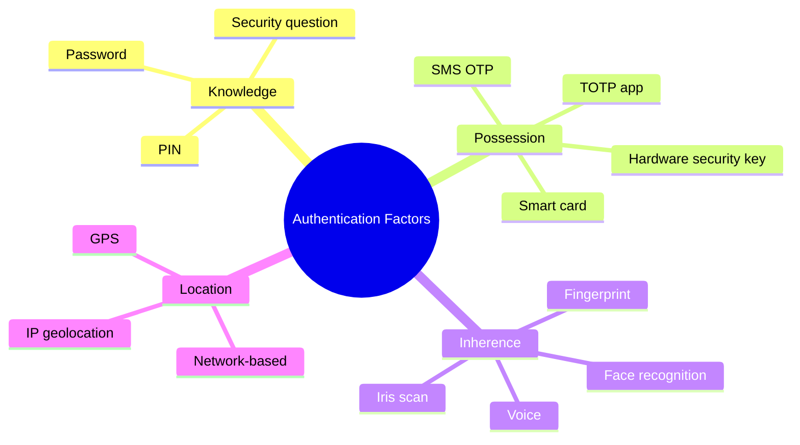
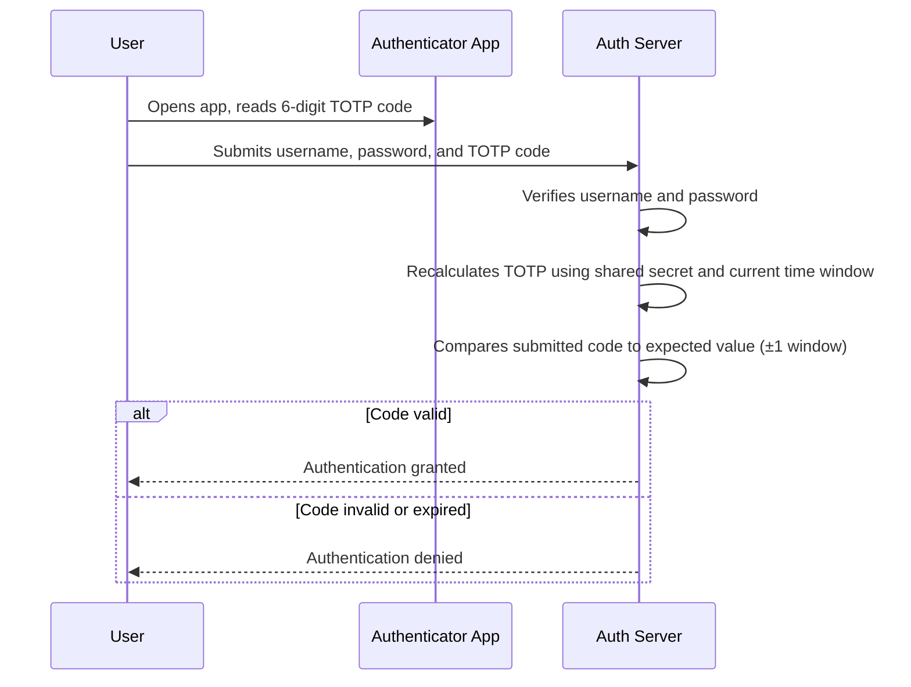
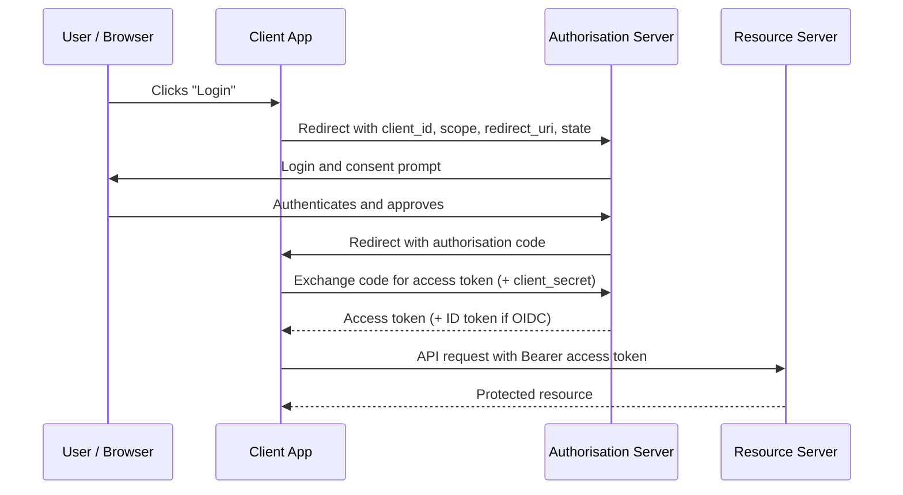

# Session 17: Implementing Secure Authentication Protocols

## Learning Objectives

By the end of this session, students will be able to:

- Explain password entropy and describe why specific hashing algorithms are appropriate for credential storage
- Describe how TOTP, HOTP, FIDO2/WebAuthn, and push-based MFA function
- Compare SAML 2.0, OAuth 2.0, and OpenID Connect, and identify appropriate use cases for each
- Explain the Kerberos authentication model and identify its key attack vectors
- Describe common authentication attack techniques including credential stuffing, MFA fatigue, and pass-the-hash
- Outline the organisational considerations for rolling out MFA at scale

---

## 17.1 Introduction — The Authentication Crisis

Authentication is the front door of every information system. It is the first control that stands between an attacker and an organisation's data. Yet authentication is also the most frequently defeated control — not because cryptography is broken, but because of how it is implemented, how users behave, and how attackers have adapted.

The scale of the problem is staggering. Billions of username-and-password credentials are available in public breach datasets. Credential stuffing — the automated testing of stolen credentials against other services — succeeds because users reuse passwords. Phishing bypasses MFA through adversary-in-the-middle proxies. The authentication challenge is not primarily technical; it is systemic.

This session examines the full spectrum of authentication mechanisms, from password hashing to hardware security keys and federated identity protocols.

---

## 17.2 Password Security Deep Dive

### Password Strength and Entropy

**Entropy** measures the unpredictability of a password in bits. A password's entropy is determined by the size of the character set and the length:

> Entropy (bits) = log₂(character set size^length)

A 12-character password using lowercase only (26 characters) has approximately 56 bits of entropy. The same length using upper, lower, digits, and symbols (94 characters) reaches approximately 79 bits.

**Key insight**: Length contributes more to entropy than complexity. A 20-character passphrase of random words is both more memorable and more resistant to brute force than an 8-character password with symbols.

### Hashing Passwords — Why MD5 and SHA-1 Are Unsuitable

Cryptographic hash functions like MD5 and SHA-1 are designed to be fast. For password storage, this is a fatal flaw: a modern GPU can test billions of MD5 hashes per second, making offline brute-force attacks against leaked hash databases trivial.

Password hashing algorithms are intentionally **slow** and **memory-hard**:

| Algorithm | Key Property | Notes |
|---|---|---|
| **bcrypt** | Configurable work factor (cost); computationally expensive | Widely used; work factor should be ≥12 |
| **scrypt** | Memory-hard in addition to CPU-expensive | Resistant to GPU/ASIC attacks |
| **Argon2** | Winner of Password Hashing Competition (2015); memory-hard; highly configurable | Current best practice; three variants: Argon2i, Argon2d, Argon2id |

### Password Salting

A **salt** is a unique, randomly generated value appended to a password before hashing. Even if two users have identical passwords, their hashes will differ. Salting defeats:

- **Rainbow table attacks**: Pre-computed hash tables become useless when every hash is unique
- **Credential correlation**: A matching hash in two systems reveals nothing when salts differ

Modern algorithms (bcrypt, scrypt, Argon2) incorporate salting automatically. The salt is stored alongside the hash and is not secret.

### Password Managers

Password managers generate, store, and auto-fill unique, high-entropy passwords for every account. They address the root cause of credential reuse.

**How they work**: All credentials are encrypted with a master password using a key derivation function (such as PBKDF2 or Argon2). The encrypted vault is stored locally or in the cloud. The master password never leaves the device.

**Organisational deployment**: Enterprise password managers integrate with Active Directory, enforce policies, enable credential sharing within teams, and provide audit logs.

---

## 17.3 Multi-Factor Authentication (MFA)

### Authentication Factors

### TOTP — Time-Based One-Time Passwords

TOTP (RFC 6238) generates a 6–8 digit code that changes every 30 seconds. It is the basis of authenticator apps such as Google Authenticator, Microsoft Authenticator, and Authy.

**How it works:**
1. During setup, the server and client share a secret key (typically delivered as a QR code)
2. Both parties independently calculate: `TOTP = HMAC-SHA1(secret, floor(current_time / 30))`
3. The server accepts codes from a small window (±1 interval) to account for clock drift
4. The code is only valid for ~30 seconds; even if intercepted, it expires almost immediately

### HOTP — HMAC-Based OTP

HOTP (RFC 4226) uses a counter rather than time. Each authentication event increments the counter. Used in hardware tokens that have no real-time clock. TOTP is now more common due to its synchronisation simplicity.

### FIDO2 / WebAuthn

FIDO2 is the current gold standard for phishing-resistant MFA. It comprises:

- **WebAuthn**: A W3C standard browser API for cryptographic authentication
- **CTAP2**: The protocol between the authenticator device and the browser/OS

**How it works:**
1. During registration, the authenticator generates a public-private key pair bound to the specific origin (domain)
2. The private key never leaves the authenticator
3. During authentication, the server sends a challenge; the authenticator signs it with the private key
4. Phishing attacks fail because the key pair is bound to the legitimate origin — a fake site cannot use it

Hardware security keys (YubiKey, Google Titan) and device-bound **passkeys** (stored in platform authenticators such as Windows Hello, Face ID) both implement FIDO2.

### Push-Based MFA

Services such as Duo Security and Microsoft Authenticator send a push notification to a registered mobile device. The user approves or denies the authentication request.

!!! warning "MFA Fatigue / Push Bombing"
    Attackers who have obtained a valid username and password can bombard users with repeated push notifications, hoping the user approves one out of frustration. **Number matching** (the app displays a number the user must match to the login screen) and **additional context** (location, application) substantially mitigate this attack.

---

## 17.4 TOTP Authentication Flow

---

## 17.5 Single Sign-On (SSO) Protocols

### SAML 2.0

**Security Assertion Markup Language** is an XML-based standard for enterprise SSO. It enables a user to authenticate once with an **Identity Provider (IdP)** and access multiple **Service Providers (SPs)** without re-authenticating.

**Key components:**
- **IdP (Identity Provider)**: Authenticates users and issues assertions (e.g., Microsoft Active Directory Federation Services, Okta)
- **SP (Service Provider)**: The application the user wants to access (e.g., Salesforce, ServiceNow)
- **SAML Assertion**: A signed XML document stating who the user is and their attributes

**Flows:**
- **SP-initiated**: User visits the SP → redirected to IdP → authenticates → returned to SP with assertion
- **IdP-initiated**: User logs in to the IdP portal → selects an application → forwarded with assertion

### OAuth 2.0

OAuth 2.0 is an **authorisation** framework — it grants applications limited access to resources on behalf of a user without exposing credentials.

**Common grant types:**

| Grant Type | Use Case |
|---|---|
| **Authorisation Code** | Server-side web apps; most secure |
| **Authorisation Code + PKCE** | Mobile/SPA apps; mitigates interception |
| **Client Credentials** | Machine-to-machine (no user context) |
| **Implicit** | Legacy browser apps; deprecated |

### OpenID Connect (OIDC)

OIDC adds an **authentication** layer on top of OAuth 2.0. Where OAuth 2.0 answers "what can this application do?", OIDC answers "who is the user?". OIDC issues an **ID Token** (a JWT) containing identity claims (name, email, subject identifier).

OIDC is the basis of "Sign in with Google" and similar social login flows.

### OAuth 2.0 Authorisation Code Flow

---

## 17.6 Kerberos

Kerberos is the primary authentication protocol in Microsoft Active Directory environments. It is a ticket-based system designed to allow mutual authentication without transmitting passwords on the network.

**Key components:**
- **KDC (Key Distribution Centre)**: The trusted third party; consists of the Authentication Service (AS) and Ticket Granting Service (TGS)
- **TGT (Ticket Granting Ticket)**: Issued after initial authentication; used to request service tickets
- **Service Ticket (ST)**: Grants access to a specific service

**Simplified flow:**
1. User authenticates to the AS with their password hash; receives a TGT encrypted with the KDC's key
2. User presents the TGT to the TGS to request access to a specific service; receives a service ticket
3. User presents the service ticket to the target service

### Kerberos Attack Vectors

| Attack | Description |
|---|---|
| **Golden Ticket** | Attacker forges a TGT using the KRBTGT account hash — grants persistent, unrestricted access |
| **Silver Ticket** | Forged service ticket using a service account hash — more limited scope than golden ticket |
| **Pass-the-Ticket** | Stolen Kerberos tickets reused without knowing the account password |
| **AS-REP Roasting** | Exploits accounts with pre-authentication disabled; offline cracking of the encrypted AS response |
| **Kerberoasting** | Requests service tickets for accounts with SPNs; offline brute-force of the ticket's RC4 encryption |

---

## 17.7 Certificate-Based Authentication

### X.509 Certificates and PKI

An X.509 certificate binds a public key to an identity, signed by a trusted Certificate Authority (CA). Certificate-based authentication eliminates shared secrets — the private key never leaves the holder.

**Mutual TLS (mTLS)** requires both the client and server to present certificates. This is used in:
- API authentication between microservices
- Zero Trust environments where device identity must be verified
- Industrial and OT environments with strict access requirements

### Smart Cards

Smart cards store a certificate and private key in tamper-resistant hardware. Authentication requires physical possession of the card plus a PIN — two factors by design. Widely used in government and defence environments (e.g., CAC, PIV cards in the US Federal context).

---

## 17.8 Passwordless Authentication

**Passkeys** are device-bound FIDO2 credentials, stored in a platform authenticator (phone, laptop). They replace the password entirely with biometric verification on the device.

- **Phishing-resistant**: Cryptographically bound to the domain
- **No shared secret**: The server stores only a public key
- **Portable**: Passkeys can sync across devices via cloud (iCloud Keychain, Google Password Manager) while maintaining security

**Magic links**: A one-time link sent to a verified email address. Simple to implement but depends on email account security.

**Biometrics**: Used for local device unlock (which then triggers FIDO2 assertion). Biometrics themselves are not transmitted to servers.

---

## 17.9 Authentication Attack Vectors

| Attack | Mechanism | Defence |
|---|---|---|
| **Credential stuffing** | Automated replay of breached username/password pairs | MFA; breach monitoring; rate limiting; CAPTCHA |
| **Password spraying** | Low-and-slow brute force with common passwords across many accounts | Account lockout policies; MFA; anomaly detection |
| **MFA fatigue (push bombing)** | Repeated push requests to wear down user resistance | Number matching; limit push attempts; phishing-resistant MFA |
| **SIM swapping** | Attacker socially engineers telco to transfer victim's number | Avoid SMS MFA for high-value accounts; use app-based or hardware MFA |
| **Pass-the-hash** | Reuse of NTLM password hash without cracking | Credential Guard; restricted admin; network logon restrictions |
| **Adversary-in-the-Middle (AiTM)** | Proxy intercepts credentials and session tokens in real time | Phishing-resistant MFA (FIDO2); Conditional Access policies |

---

## 17.10 Implementing MFA at Organisational Scale

Rolling out MFA to an entire organisation requires more than technical configuration.

**Rollout considerations:**

1. **Phased deployment**: Begin with privileged accounts and IT staff, then expand to all users
2. **Enrolment support**: Provide clear instructions, helpdesk support, and self-service enrolment
3. **Backup methods**: Define what happens when a user loses their MFA device — recovery codes, secondary device, helpdesk verification
4. **Exception handling**: Document and approve any exceptions (legacy systems, service accounts); review regularly
5. **User resistance**: Address concerns through communication about why MFA matters; frame as protection for the individual as well as the organisation
6. **Privileged accounts**: Apply stricter controls — hardware keys, no SMS, session time limits

!!! info "MFA for Service Accounts"
    Service accounts cannot interactively approve MFA prompts. Use certificate-based authentication, managed identities (in cloud environments), or Conditional Access policies that restrict service accounts to known network locations and block interactive login.

---

## Key Takeaways

- Password length and uniqueness matter more than complexity rules; password managers are the practical solution to credential hygiene
- Argon2 is the current best practice for password hashing; bcrypt remains acceptable; MD5 and SHA-1 are completely unsuitable
- TOTP is widely deployed but vulnerable to phishing via AiTM proxies; FIDO2/passkeys are phishing-resistant
- SAML 2.0 is the enterprise SSO standard; OAuth 2.0 handles authorisation; OIDC adds identity to OAuth 2.0
- Kerberos is central to Active Directory security; understanding golden/silver ticket attacks is essential for defenders
- MFA rollout is as much an organisational change management challenge as a technical one

---

## Review Questions

1. Explain why bcrypt or Argon2 are appropriate for password storage but SHA-256 is not, despite SHA-256 being considered cryptographically strong.
2. A user asks why they need to use a hardware security key instead of an SMS OTP for their privileged account. Explain the security differences between these two MFA methods, referencing the SIM swapping and AiTM attack vectors.
3. An organisation uses SAML 2.0 for SSO to a cloud HR system. Describe the SP-initiated authentication flow, identifying the roles of the IdP, SP, and the browser.
4. Describe the Kerberoasting attack. What does the attacker need to perform it, what do they gain, and what two controls can significantly reduce the risk?
5. Your organisation is planning to deploy MFA to 2,000 staff. Identify three non-technical challenges you would expect to encounter and propose a mitigation strategy for each.

---

## Discussion Points

- Passkeys are being adopted by major platforms. What barriers exist to widespread adoption and how might they be overcome in enterprise environments?
- Should SMS-based OTP be considered acceptable MFA for sensitive systems in 2025? Justify your position with reference to known attack techniques.
- How does "passwordless" authentication change the helpdesk support model, particularly for account recovery?
