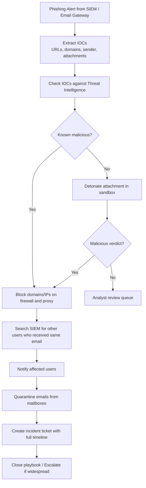
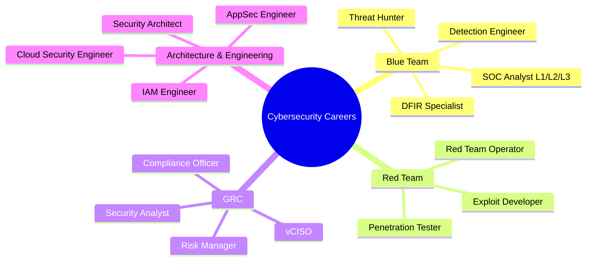

# Session 18: Advanced Cybersecurity — Threat Detection and Response

## Learning Objectives

By the end of this session, students will be able to:

- Describe the structure, tiers, and tools of a Security Operations Centre (SOC)
- Explain how SIEM correlation rules are used to detect threats and how tuning reduces false positives
- Describe the role of SOAR in automating security response workflows
- Compare XDR, SIEM, and SOAR and identify their respective roles in a detection ecosystem
- Apply threat hunting concepts using the MITRE ATT&CK framework
- Explain the digital forensics process, including order of volatility and chain of custody
- Identify key security operations metrics and understand how they measure programme effectiveness
- Describe emerging threats including AI-powered attacks, supply chain compromise, and RaaS

---

## 18.1 Introduction — From Reactive to Proactive Security

The cybersecurity landscape has shifted fundamentally. Prevention alone is not a viable strategy: sophisticated adversaries will eventually find a way in. The question is no longer "will we be compromised?" but "how quickly will we detect it, and how effectively will we respond?"

Organisations that rely solely on perimeter defences and signature-based detection operate reactively — discovering breaches only after significant damage has occurred. The **mean time to detect (MTTD)** for breaches averages weeks to months without proactive detection capabilities. During that dwell time, attackers establish persistence, move laterally, exfiltrate data, and prepare destructive payloads.

This session covers the operational tools, techniques, and workflows that shift an organisation from reactive to proactive: SOC operations, SIEM/SOAR/XDR, threat hunting, deception technology, digital forensics, and the metrics that measure programme maturity.

---

## 18.2 Security Operations Centre (SOC)

A SOC is a centralised team responsible for the continuous monitoring, detection, analysis, and response to cybersecurity events. It combines people, processes, and technology.

### SOC Tier Structure

| Tier | Role | Responsibilities |
|---|---|---|
| **L1 Analyst** | Alert triage | Monitor SIEM dashboards; triage incoming alerts; escalate confirmed incidents; close false positives |
| **L2 Analyst** | Incident investigation | Deep-dive investigations; correlate data across sources; containment actions; escalate complex cases |
| **L3 Analyst / Threat Hunter** | Advanced analysis | Threat hunting; malware analysis; forensics; detection engineering (writing new rules) |
| **SOC Manager** | Operations leadership | Team management; reporting; process improvement; stakeholder communication |

### Core SOC Tools

- **SIEM**: Central log aggregation and correlation
- **SOAR**: Automated playbook execution and case management
- **EDR (Endpoint Detection and Response)**: Endpoint telemetry and response
- **Threat Intelligence Platform (TIP)**: Contextualises alerts with known threat actor TTPs
- **Ticketing System**: Case tracking and documentation (e.g., ServiceNow, JIRA)

!!! info "SOC Models"
    Organisations may operate an **in-house SOC**, a **co-managed SOC** (internal team supplemented by a managed security service provider), or a fully **outsourced MSSP**. Cost, talent availability, and compliance requirements typically drive this decision.

---

## 18.3 SIEM — Advanced Usage

### Correlation Rules and Use Cases

A SIEM (Security Information and Event Management) system ingests log data from across the environment — firewalls, endpoints, Active Directory, cloud platforms, applications — and applies **correlation rules** to identify patterns indicative of attacks.

**Example correlation rules:**

- **Brute force**: >10 failed login attempts from one source IP in 60 seconds, followed by a successful login
- **Privilege escalation**: User account added to Domain Admins outside of approved change window
- **Lateral movement**: Successful authentication from workstation A to workstation B using credentials not normally used for that path
- **Data exfiltration**: Large outbound data transfer to an external IP after hours

### Tuning to Reduce False Positives

New SIEM deployments inevitably generate high volumes of false positives. An overwhelmed L1 analyst experiencing alert fatigue will eventually dismiss genuine incidents.

**Tuning strategies:**

1. **Whitelist known-good behaviour**: Exclude scheduled tasks, service accounts, and maintenance windows from triggering certain rules
2. **Threshold adjustment**: Raise thresholds based on observed baseline activity
3. **Contextual enrichment**: Add asset criticality and user risk scores to prioritise high-value alerts
4. **Regular review**: Track false positive rates per rule and retire or rewrite rules with consistently poor signal-to-noise ratios

### Threat Hunting with SIEM

Threat hunting uses the SIEM's data to proactively search for signs of compromise that automated rules have not caught.

---

## 18.4 SOAR — Security Orchestration, Automation and Response

SOAR platforms automate repetitive analyst tasks, integrate disparate security tools, and enforce consistent response processes through **playbooks**.

### What SOAR Does

- **Playbook automation**: Defines step-by-step response procedures that execute automatically or semi-automatically
- **Case management**: Aggregates evidence, actions, and communications for each incident
- **Tool integration**: Connects SIEM, TIP, EDR, firewall, ticketing systems, and communication platforms via APIs
- **Metrics tracking**: Records response times, analyst workloads, and playbook effectiveness

### Automated Phishing Response Playbook



---

## 18.5 Extended Detection and Response (XDR)

XDR unifies telemetry from multiple security domains — endpoint, network, email, identity, and cloud — into a single detection and response platform. Where SIEM aggregates logs for human analysis, XDR applies vendor-built detection logic across correlated data from all sources.

| Capability | SIEM | SOAR | XDR |
|---|---|---|---|
| Log aggregation | ✓ | — | Partial |
| Correlation rules | ✓ | — | ✓ (native) |
| Automated response | Partial (with SOAR) | ✓ | ✓ |
| Cross-domain correlation | ✓ (with integration effort) | — | ✓ (native) |
| Threat hunting | ✓ | — | ✓ |
| Alert management | ✓ | ✓ | ✓ |

XDR reduces the integration burden for smaller security teams. Mature organisations often run SIEM + SOAR + XDR together for maximum coverage.

---

## 18.6 Threat Hunting — Advanced Techniques

Threat hunting is the proactive, human-driven search for threats that have evaded automated detection. It does not wait for an alert.

### Hypothesis-Driven Hunting

The hunter starts with a hypothesis derived from threat intelligence, recent incidents, or industry reports:

> *"Based on the recent surge in Qakbot campaigns targeting Australian financial organisations, we hypothesise that an attacker may have established persistence via a scheduled task and is performing credential harvesting."*

The hunter then queries SIEM/EDR data to test the hypothesis: looking for unusual scheduled task creation, LSASS access, or credential dumping tool artefacts.

### TTP-Based Hunting with MITRE ATT&CK

The MITRE ATT&CK framework catalogues adversary tactics, techniques, and procedures. Threat hunters use it to:

- Identify high-risk techniques not covered by current detection rules
- Search for evidence of specific techniques in log data (e.g., T1059 — Command and Scripting Interpreter)
- Prioritise detection engineering based on techniques used by threat actors targeting their industry

### Baselining and Anomaly Detection

Hunters establish behavioural baselines for users, systems, and network flows, then search for deviations:

- A user who normally accesses 50 files per day suddenly accesses 5,000
- A server that never makes outbound connections initiates one to a foreign IP
- A workstation running PowerShell with encoded commands at 2 AM

---

## 18.7 Deception Technologies

Deception technology creates fictitious assets — **honeypots**, **honeytokens**, and **deception platforms** — that look legitimate to an attacker but whose access indicates malicious activity.

| Technology | Description | Example |
|---|---|---|
| **Honeypot** | A fake system designed to attract and detect attacker activity | A fake Windows server with realistic shares and an open RDP port |
| **Honeytoken** | A fake credential, file, or record whose use signals compromise | A fake AWS key in a code repository; accessing it triggers an immediate alert |
| **Deception platform** | Enterprise-grade, distributed deception with fake users, systems, and credentials | Attacker pivots to a fake domain controller; every action is recorded |

Deception is a high-fidelity detection method: there is almost no legitimate reason for anyone to interact with a honeypot or honeytoken. False positive rates are extremely low.

---

## 18.8 Digital Forensics Fundamentals

### Order of Volatility

When responding to an incident, evidence must be collected in order of volatility — most volatile first, least volatile last. Volatile evidence is lost when a system is powered off or rebooted.

```mermaid
sequenceDiagram
    participant IR as Incident Responder
    participant SYS as Compromised System
    participant STORE as Evidence Storage

    IR->>SYS: Capture running processes and network connections
    SYS-->>STORE: Memory dump (RAM) — most volatile
    IR->>SYS: Capture swap space / pagefile
    SYS-->>STORE: Pagefile / swap
    IR->>SYS: Acquire forensic image of live disk
    SYS-->>STORE: Disk image (dd / FTK Imager)
    IR->>SYS: Preserve remote and centralised logs
    SYS-->>STORE: Syslog, SIEM logs, cloud logs — least volatile
    IR->>STORE: Verify hashes; document chain of custody
    IR->>IR: Analysis phase begins
```

**Order of volatility (most to least):**

1. CPU registers and cache
2. RAM (running processes, network connections, encryption keys)
3. Swap space / pagefile
4. Running disk state
5. Disk image
6. Remote and archived logs

### Chain of Custody

Chain of custody is a documented record of who collected, handled, transferred, and analysed evidence. It is essential when:

- Evidence may be used in legal proceedings
- Demonstrating that evidence has not been tampered with
- Responding to regulatory investigations

Every transfer of evidence must be documented: time, person, location, purpose, and whether the evidence was copied or moved.

### Forensic Imaging

A forensic image is a bit-for-bit copy of a storage device. The original device is write-protected during imaging to prevent modification of evidence.

- **`dd`** (Linux): A standard Unix tool capable of creating raw disk images
- **FTK Imager**: A widely used Windows-based forensic imaging tool that creates verified images with hash validation (MD5/SHA-1 of the image)

After imaging, a cryptographic hash of the image is recorded. Re-verification of this hash at any point proves the image has not been altered.

### Memory Forensics

RAM contains artefacts that do not exist on disk: running process lists, network connections, decrypted data, credentials, and malware that lives entirely in memory (fileless malware).

**Volatility** is the leading open-source memory forensics framework. Analysts use it to:

- List running processes and detect process injection
- Extract network connection tables
- Identify injected DLLs and malicious code regions
- Dump password hashes from LSASS memory

---

## 18.9 Threat Intelligence Platforms (TIPs)

Threat intelligence platforms aggregate, normalise, and correlate threat data from multiple sources — open-source feeds, commercial feeds, ISACs, and internal observations.

| Platform | Type | Key Features |
|---|---|---|
| **MISP** | Open-source | Community sharing; STIX/TAXII support; rich API; widely deployed |
| **OpenCTI** | Open-source | Graph-based knowledge representation; MITRE ATT&CK integration |
| **Recorded Future** | Commercial | Real-time intelligence; automated enrichment; broad source coverage |

### Integration with SIEM and SOAR

TIPs feed indicators of compromise (IOCs) — malicious IP addresses, domains, file hashes — into SIEM and SOAR:

- **SIEM integration**: Alerts fire when network traffic or logs reference a known-malicious indicator
- **SOAR integration**: Playbooks query the TIP during automated triage to determine if an IOC has known threat actor attribution

---

## 18.10 Security Operations Metrics and KPIs

Metrics demonstrate the value and maturity of the security operations programme and drive continuous improvement.

| Metric | Description | Target Direction |
|---|---|---|
| **MTTD (Mean Time to Detect)** | Average time from compromise to detection | Minimise |
| **MTTR (Mean Time to Respond)** | Average time from detection to containment/remediation | Minimise |
| **False Positive Rate** | Percentage of alerts that are not genuine threats | Minimise through tuning |
| **Alert Volume by Severity** | Distribution of alerts across severity levels | Increase high-fidelity; reduce noise |
| **Coverage** | Percentage of MITRE ATT&CK techniques with active detection | Maximise |
| **Playbook Automation Rate** | Percentage of incidents handled with SOAR automation | Increase for repeatable case types |
| **Dwell Time** | Time an attacker was present before detection | Minimise |

---

## 18.11 Emerging Threats

### AI-Powered Attacks

Generative AI lowers the skill floor for attackers:

- **Spear phishing at scale**: LLMs generate highly personalised, grammatically flawless phishing emails
- **Deepfakes**: Synthetic audio and video used to impersonate executives in business email compromise and vishing attacks
- **Automated vulnerability research**: AI-assisted fuzzing and exploit development accelerates the time from patch release to working exploit

### Supply Chain Attacks

Rather than attacking a hardened organisation directly, attackers compromise a trusted supplier, software vendor, or managed service provider. The SolarWinds attack (2020) compromised thousands of organisations via a trojanised software update. Key mitigations:

- Software composition analysis (SCA) to identify vulnerable dependencies
- Vendor risk assessments and security requirements in procurement contracts
- Code signing and verification of software updates

### Ransomware-as-a-Service (RaaS)

RaaS platforms allow technically unsophisticated criminals to deploy ransomware in exchange for a share of the ransom payment. The RaaS operator provides the malware, infrastructure, negotiation portal, and customer support. This has dramatically lowered the barrier to entry and increased the frequency of attacks.

**Defence priorities against ransomware:**

1. Offline, tested, immutable backups — the most effective recovery control
2. EDR with behavioural detection of encryption activity
3. Network segmentation to limit lateral movement prior to detonation
4. Privileged access controls to prevent attackers from disabling security tools

---

## 18.12 Career Pathways in Cybersecurity



Each pathway builds on foundational skills developed in a course like VU23217. A SOC Analyst role is typically an accessible entry point, with progression to threat hunting, DFIR, or detection engineering over time. Certifications such as CompTIA Security+, CySA+, CEH, GCIA, and GCFE support progression in each pathway.

---

## 18.13 Course Summary — VU23217 Learning Outcomes

This course — Cyber Security Essentials (VU23217) — has covered the full breadth of foundational cybersecurity knowledge required of a cybersecurity practitioner in an Australian context:

| Sessions | Topic Area |
|---|---|
| 1–3 | Cybersecurity fundamentals, threat landscape, CIA triad |
| 4–6 | Risk management, governance, compliance frameworks |
| 7–9 | Cryptography — symmetric, asymmetric, PKI, TLS |
| 10–12 | Identity and access management, Active Directory, PAM |
| 13–15 | Endpoint security, malware, vulnerability management |
| 16 | Network security — architecture, firewalls, IDS/IPS, DNS |
| 17 | Authentication protocols — MFA, SSO, FIDO2, Kerberos |
| 18 | Threat detection and response — SOC, SIEM, SOAR, forensics |

Students completing this course can:

- Apply risk management frameworks to identify, assess, and treat cybersecurity risks
- Implement and evaluate technical controls across network, endpoint, identity, and application layers
- Contribute to incident detection, investigation, and response workflows
- Communicate security concepts to technical and non-technical stakeholders
- Identify appropriate career pathways and further study options

---

## Key Takeaways

- The SOC is the operational heart of a cybersecurity programme; its effectiveness depends on skilled analysts, well-tuned tools, and documented processes
- SIEM provides visibility; SOAR provides speed; XDR provides unified correlation — mature programmes leverage all three
- Threat hunting proactively uncovers attacker presence that automated detection has missed; MITRE ATT&CK provides a structured framework
- Digital forensics requires disciplined evidence handling — order of volatility, chain of custody, and verified imaging are non-negotiable
- Ransomware-as-a-service and AI-enhanced attacks are increasing the frequency and sophistication of threats facing Australian organisations
- Cybersecurity is a career, not just a subject — the skills developed in this course are directly applicable to SOC analyst, GRC, and security engineering roles

---

## Review Questions

1. Describe the three-tier SOC analyst model. What types of tasks does each tier handle, and what skills differentiate an L2 from an L1 analyst?
2. A SIEM rule triggers 500 alerts per day, of which 490 are false positives. Describe three specific tuning strategies you would apply to improve the signal-to-noise ratio for this rule.
3. Explain how a SOAR phishing playbook reduces analyst workload and response time. What are the limits of automation in incident response, and when must a human analyst intervene?
4. An attacker has compromised a Windows workstation and is living off the land using built-in tools. Describe how you would approach a threat hunt for this activity using MITRE ATT&CK, and identify three specific data sources you would query.
5. A senior manager asks you to justify the investment in a threat intelligence platform. What specific operational improvements would you reference, and how would you measure the return on investment?

---

## Discussion Points

- How should Australian organisations balance privacy considerations with the need to collect comprehensive logs for threat detection? Reference the Australian Privacy Principles where relevant.
- With AI lowering the technical barrier for attackers, should the cybersecurity industry focus more on defensive AI, or on fundamentals like patching and MFA? Is there a tension between these priorities?
- Consider the career pathways discussed. Which area of cybersecurity interests you most, and what specific skills or certifications would you pursue first?
