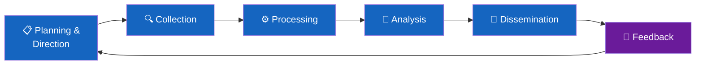
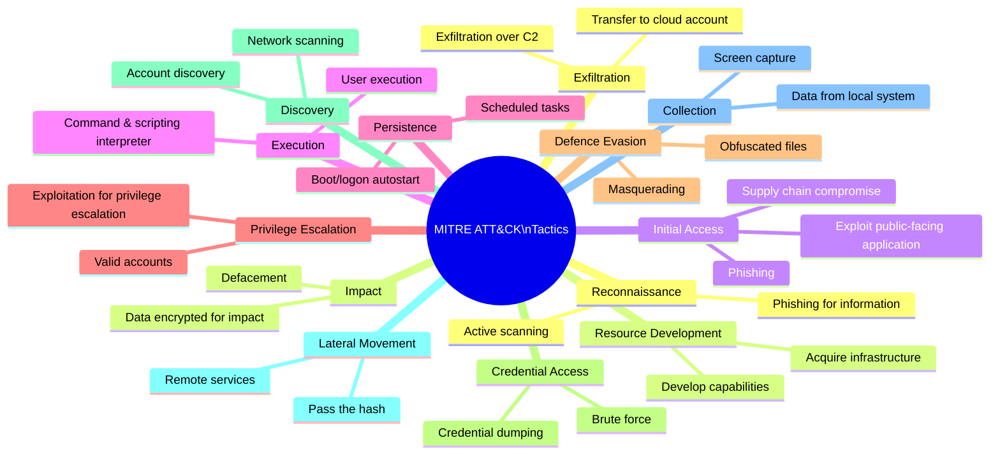
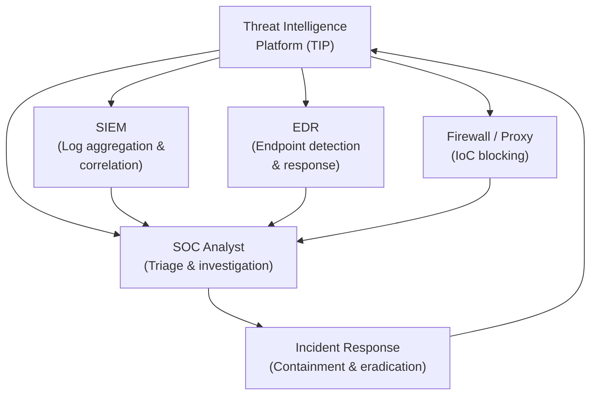

# Session 2: Cybersecurity Threat Intelligence

**Week 2 — VU23217 Cyber Security Essentials**

## Learning Objectives

By the end of this session you will be able to:

- Articulate why organisations need dedicated cybersecurity programmes
- Explain the human factor in cybersecurity and the importance of security awareness culture
- Distinguish between threats, vulnerabilities, and risks
- Categorise threat actors by type and motivation
- Describe the threat intelligence lifecycle
- Define Indicators of Compromise (IoCs) and give examples
- Explain the MITRE ATT&CK framework at a conceptual level
- Describe how threat intelligence integrates into security operations

!!! info "Assessment 1 (AT1) begins this week"
    The AT1 portfolio task is introduced in this session. Begin collecting evidence of your engagement with the course material from Week 2 onwards.

---

## Presentation Materials

[:material-presentation: View Slides — Session 2 (Part A)](../slides-original/slide_51973623_1.md){ .md-button .md-button--primary }
[:material-presentation: View Slides — Session 2 (Part B)](../slides-original/slide_52185493_1.md){ .md-button }
[:material-presentation: View Slides — Supporting Content](../slides-original/slide_65104952_1.md){ .md-button }

---

## 1. Why Organisations Need Cybersecurity

### The Cost of Inaction

The financial and reputational consequences of a cyber incident are substantial. IBM's *Cost of a Data Breach Report* consistently places the global average cost of a breach at over USD $4 million. For Australian organisations, the ACSC's *Annual Cyber Threat Report* documents tens of thousands of cybercrime reports per year, with losses in the hundreds of millions of dollars.

The costs of a breach extend beyond immediate financial loss:

| Cost Category | Examples |
|--------------|---------|
| **Direct financial loss** | Ransom payments, fraud, theft of funds |
| **Incident response** | Forensic investigation, legal fees, notification costs |
| **Regulatory fines** | Privacy Act penalties, GDPR fines (up to 4% of global turnover) |
| **Reputational damage** | Customer churn, loss of business partnerships, media coverage |
| **Operational disruption** | Downtime, productivity loss, supply chain disruption |
| **Long-term brand impact** | Years-long recovery of customer trust |

### Regulatory Requirements

Australian organisations are subject to a range of laws and standards that mandate cybersecurity controls:

- **Privacy Act 1988 (Cth)** — Notifiable Data Breaches (NDB) scheme requires organisations to notify affected individuals and the OAIC of eligible data breaches
- **Security of Critical Infrastructure Act 2018** — imposes obligations on operators of critical infrastructure sectors (energy, water, communications, finance, defence industry)
- **Australian Government ISM** (Information Security Manual) — the ASD's framework for protecting government systems, widely adopted by contractors
- **ASX Corporate Governance Principles** — require listed companies to disclose material cyber risks

!!! warning "Mandatory breach notification"
    Under the NDB scheme, organisations must notify the OAIC and affected individuals within 30 days of becoming aware of an eligible data breach. Failure to notify can result in civil penalties of up to $50 million for organisations.

### Reputational Damage

Trust is difficult to build and easy to destroy. High-profile breaches such as the 2022 Optus and Medibank incidents in Australia demonstrated that customer data breaches attract intense media scrutiny, parliamentary inquiries, and lasting reputational harm. Organisations that handle incidents well — with transparency and rapid action — recover faster than those that are evasive or slow to respond.

---

## 2. Security Awareness Culture — The Human Factor

### Humans as the Weakest Link

Technical controls (firewalls, antivirus, encryption) address technical vulnerabilities. But humans represent the most exploited attack surface of all. Research from Verizon's *Data Breach Investigations Report* consistently finds that over 80% of breaches involve a human element — phishing, stolen credentials, or simple error.

!!! danger "The cost of one click"
    A single employee clicking a malicious email attachment can initiate a ransomware infection that propagates across an entire network within minutes. No technical control fully compensates for untrained users.

### Social Engineering as the Primary Vector

**Social engineering** is the manipulation of human psychology to gain unauthorised access or information. It is effective because it bypasses technical controls entirely by targeting the person operating those controls. Common psychological levers include:

- **Authority** — impersonating management, the ATO, or law enforcement
- **Urgency** — "Your account will be suspended in 24 hours"
- **Scarcity** — "This offer expires tonight"
- **Fear** — "Your computer is infected — call this number"
- **Reciprocity** — providing a small favour to create obligation
- **Social proof** — "Everyone else in your team has already completed this"

### Building a Security Awareness Culture

A security-aware culture requires more than annual compliance training. Effective programmes include:

1. **Regular phishing simulations** — test employees with realistic fake phishing emails; use failures as learning opportunities, not punishment
2. **Role-specific training** — finance staff need training on invoice fraud; developers need secure coding training
3. **Clear reporting pathways** — employees must know exactly how and where to report suspicious activity
4. **Leadership modelling** — when executives visibly follow security policies, employees follow
5. **Positive reinforcement** — recognise employees who report incidents or near-misses

---

## 3. Threats, Vulnerabilities, and Risk

These three terms are frequently confused. Understanding the precise relationship between them is fundamental to security work.

| Term | Definition | Example |
|------|-----------|---------|
| **Threat** | An actor or event with the potential to cause harm | A ransomware group targeting healthcare organisations |
| **Vulnerability** | A weakness that could be exploited | An unpatched Apache web server with a known CVE |
| **Risk** | The likelihood and impact of a threat exploiting a vulnerability | High likelihood × high impact = critical risk |

The relationship is often expressed as:

> **Risk = Threat × Vulnerability × Impact**

A threat without a vulnerability poses no risk. A vulnerability with no threat to exploit it is low priority. Risk management is about identifying where threats and vulnerabilities intersect, then applying controls to reduce either likelihood or impact.

!!! note "Risk in context"
    A zero-day vulnerability in a piece of software your organisation doesn't use poses near-zero risk to you, regardless of how severe the vulnerability is. Contextualising risk to your specific environment is a core skill.

---

## 4. Threat Actor Categories

Not all threats come from the same source. Understanding the motivation, capability, and typical tactics of different threat actors helps prioritise defences.

| Actor Type | Motivation | Capability | Typical TTPs |
|-----------|-----------|-----------|-------------|
| **Nation-state actors** | Espionage, sabotage, influence | Very high — significant resources | APTs, zero-days, supply chain attacks |
| **Cybercriminals** | Financial gain | High — professional operations, RaaS | Ransomware, BEC fraud, credential theft |
| **Insider threats** | Disgruntlement, financial pressure, ideology | High — legitimate access | Data exfiltration, sabotage, fraud |
| **Hacktivists** | Political or ideological goals | Moderate | DDoS, website defacement, data leaks |
| **Script kiddies** | Thrill-seeking, notoriety | Low — use existing tools | Port scanning, known exploits, DoS |
| **Competitors** | Competitive advantage | Variable | Corporate espionage, social engineering |

!!! info "Insider threats are often overlooked"
    Insider threats are particularly difficult to defend against because insiders have legitimate access. Controls must focus on monitoring for anomalous behaviour, applying least-privilege access, and conducting regular access reviews rather than just blocking external attackers.

---

## 5. The Threat Intelligence Lifecycle

Threat intelligence is not simply a list of bad IP addresses — it is a structured process of converting raw data into actionable knowledge. The lifecycle has five phases:

### Phase 1: Planning and Direction

Define intelligence requirements. What threats is the organisation most concerned about? What decisions will the intelligence inform? Requirements might include: "Which threat actors are targeting our sector?" or "Are our suppliers compromised?"

### Phase 2: Collection

Gather raw data from multiple sources:

- **Open Source Intelligence (OSINT)** — news, forums, vulnerability databases (NVD, CVE), government advisories (ACSC, CISA)
- **Technical feeds** — commercial threat intelligence platforms (e.g., Recorded Future, CrowdStrike), open feeds (AlienVault OTX, Abuse.ch)
- **Internal telemetry** — SIEM logs, firewall logs, EDR alerts, DNS query logs
- **Dark web monitoring** — monitoring paste sites and criminal forums for leaked data or sale of access

### Phase 3: Processing

Raw data must be normalised, deduplicated, and structured. This involves converting logs into a consistent format, tagging IoCs with context, and enriching data (e.g., geolocating an IP address, identifying who owns a domain).

### Phase 4: Analysis

Analysts identify patterns, correlate data, and assess significance. Key questions: Is this a targeted attack or opportunistic scanning? Is this a known threat group? What is the likely next step in the attack chain? Analysis produces intelligence products — reports, dashboards, alerts.

### Phase 5: Dissemination

Intelligence is distributed to the right stakeholders in the right format. A CISO needs a strategic brief; a SOC analyst needs IoC feeds; a developer needs a vulnerability advisory. Format and audience matter.

### Feedback Loop

Consumers of intelligence provide feedback on its usefulness, enabling continuous improvement of the intelligence programme.

---

## 6. Indicators of Compromise (IoCs)

**Indicators of Compromise** are artifacts observed in a network or on a system that — with high confidence — indicate a security incident has occurred or is in progress. IoCs are the evidence of an attack.

| IoC Type | Examples | Use |
|----------|---------|-----|
| **IP addresses** | `185.220.101.45` (known Tor exit node used by attackers) | Block at firewall, alert on outbound connection |
| **Domain names** | `update-service[.]ru` (C2 domain) | Block in DNS, alert on DNS query |
| **File hashes** | `SHA256: a3f5b2c1...` (hash of known malware binary) | Block in EDR, scan endpoints |
| **URLs** | `http://malicious[.]site/payload.exe` | Block in web proxy |
| **Email addresses** | Sender domains associated with phishing campaigns | Block at email gateway |
| **Registry keys** | `HKLM\Software\malware_persistence_key` | Alert on creation, scan endpoints |
| **Mutex names** | Unique strings created by malware in memory | Detect in memory forensics |

!!! tip "IoC limitations"
    IoCs are reactive — they describe attacks that have already been observed. Sophisticated attackers rotate infrastructure frequently, making IoC-based detection insufficient on its own. Behaviour-based detection (looking for *how* attackers operate, not *which* infrastructure they use) is more resilient.

---

## 7. The MITRE ATT&CK Framework

**MITRE ATT&CK** (Adversarial Tactics, Techniques, and Common Knowledge) is a globally recognised knowledge base of adversary behaviour based on real-world observations. It organises attack behaviour into **tactics** (the *why* — the adversary's goal) and **techniques** (the *how* — the method used to achieve that goal).

### Why ATT&CK Matters

ATT&CK provides a common language for security teams to:

- **Describe attacks** consistently across teams and organisations
- **Map detections** — identify which techniques your existing tools detect and which have gaps
- **Prioritise defences** — focus on the techniques most commonly used against your sector
- **Conduct purple team exercises** — simulate attacker behaviour to test defences

The ATT&CK Navigator (available at [attack.mitre.org](https://attack.mitre.org)) allows teams to visualise coverage and gaps in their detection capabilities.

---

## 8. Integrating Threat Intelligence into Security Operations

Threat intelligence is most valuable when it is operationalised — embedded into day-to-day security processes rather than sitting in a report nobody reads.

### Integration Points

- **SIEM enrichment** — automatically tag log events with threat intelligence context (e.g., flag logins from known malicious IP ranges)
- **Firewall and proxy blocking** — automatically block IoC-matched traffic
- **EDR rules** — add detection rules for known malware hashes, filenames, or behaviours
- **Vulnerability management** — prioritise patching based on whether vulnerabilities are being actively exploited in the wild
- **Security awareness training** — tailor phishing simulations to mirror current real-world campaigns

---

## Key Takeaways

- Organisations face significant financial, regulatory, and reputational consequences from cybersecurity failures
- Humans are the most exploited attack surface; security awareness culture is a critical defensive layer
- **Threat**, **vulnerability**, and **risk** are distinct concepts — risk is the product of threat likelihood and impact
- Threat actors range from nation-states to opportunistic script kiddies, each with different motivations and capabilities
- The threat intelligence lifecycle — Planning → Collection → Processing → Analysis → Dissemination → Feedback — converts raw data into actionable knowledge
- **Indicators of Compromise (IoCs)** are artifacts that indicate a security incident; their limitations require behaviour-based detection to complement them
- MITRE ATT&CK provides a structured taxonomy of adversary tactics and techniques
- Threat intelligence is most valuable when integrated into SIEM, EDR, firewalls, and SOC workflows

---

## Review Questions

1. A business owner argues that their organisation is too small to justify a dedicated security awareness programme. Using data about human factors in breaches and the cost of incidents, construct a counter-argument.

2. Explain the relationship between threats, vulnerabilities, and risk using a specific example from the healthcare sector. How would you use this relationship to justify prioritising one security investment over another?

3. Compare and contrast nation-state actors and cybercriminals as threat categories. How would your organisation's defensive posture differ depending on which actor type poses the greater risk?

4. The MITRE ATT&CK framework organises adversary behaviour into tactics and techniques. Pick any three tactics from the ATT&CK mindmap and describe a specific technique under each, explaining how a SOC analyst might detect it.

5. A security analyst receives a report containing a list of 500 IP addresses flagged as malicious. Describe the limitations of simply blocking all 500 IPs at the firewall, and explain what additional steps would make this intelligence more useful.

---

## Discussion Points

- Security awareness training is sometimes dismissed as "tick-box compliance." What evidence would you use to make the case that genuine cultural change is achievable and measurable?
- The ACSC's NDB scheme requires breach notification within 30 days. Is 30 days too long, given the speed at which breaches spread? What are the practical challenges of faster notification?
- Threat intelligence sharing between organisations (ISACs, government–industry partnerships) benefits everyone but requires competitors to share sensitive data about their breaches and vulnerabilities. How should organisations approach this tension?