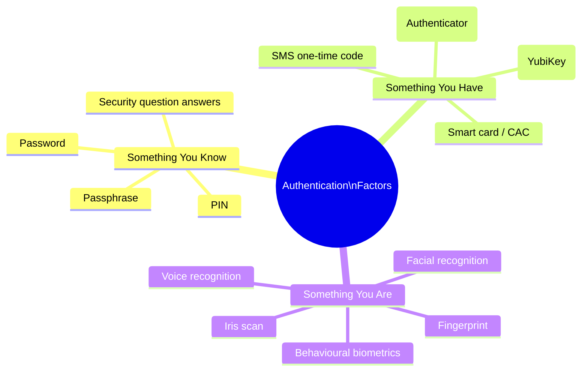
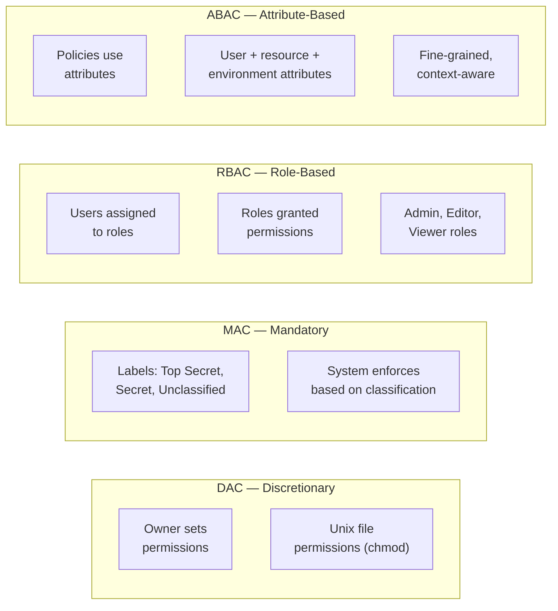

# Session 3: Authentication, Authorisation, and Threat Vectors

**Week 3 — VU23217 Cyber Security Essentials**

## Learning Objectives

By the end of this session you will be able to:

- Distinguish between authentication and authorisation and explain why both are necessary
- Identify the three authentication factors and give examples of each
- Explain how Multi-Factor Authentication (MFA) works and why it is critical
- Describe common authentication attacks and how they are carried out
- Compare authorisation models: DAC, MAC, RBAC, and ABAC
- Identify major threat vectors and the attack types associated with each
- Recognise common and emerging attack types including phishing variants and social engineering techniques
- Trace the flow of a phishing attack from initial delivery to credential compromise

---

## Presentation Materials

[:material-presentation: View Slides — Session 3 (Part A)](../slides-original/slide_51975879_1.md){ .md-button .md-button--primary }
[:material-presentation: View Slides — Supporting Content](../slides-original/slide_55371421_1.md){ .md-button }

---

## 1. Authentication vs Authorisation

Two fundamental access control concepts are often conflated but serve distinct purposes:

| Concept | Question Answered | Example |
|---------|------------------|---------|
| **Authentication** | *Who are you?* | Verifying a user's identity with a password + MFA code |
| **Authorisation** | *What are you allowed to do?* | Granting a verified user read-only access to a specific file share |

**Authentication** comes first — a system must know *who* is requesting access before deciding *what* that person is allowed to do. These are independent controls: a system can authenticate a user successfully but still deny them access to a resource they are not authorised to use.

!!! warning "Conflating the two creates gaps"
    A common mistake is to assume that because a user has been authenticated, they can be trusted with any resource. This violates the **principle of least privilege**. Authorisation must be enforced independently of authentication.

The combination of strong authentication and fine-grained authorisation is the foundation of **Identity and Access Management (IAM)**.

---

## 2. Authentication Factors

Authentication factors fall into three categories — often remembered as **something you know, something you have, something you are**:



### Factor Strengths and Weaknesses

| Factor | Strengths | Weaknesses |
|--------|-----------|-----------|
| **Knowledge (know)** | Simple, no hardware required | Can be guessed, phished, or reused across sites |
| **Possession (have)** | Harder to steal remotely | Physical loss, SIM-swapping (for SMS), device theft |
| **Inherence (are)** | Cannot be forgotten or shared | Biometric data is permanent — cannot be changed if compromised |

### Password Security Fundamentals

Passwords remain the dominant knowledge factor. Key principles:

- **Length over complexity** — a 16-character passphrase is stronger than an 8-character complex password
- **Unique passwords per service** — reuse allows credential stuffing attacks to compromise multiple accounts
- **Password managers** — tools like Bitwarden or 1Password enable unique, random passwords at scale
- **Checking for compromise** — the [Have I Been Pwned](https://haveibeenpwned.com) database allows users and organisations to check whether credentials appear in known breaches

---

## 3. Multi-Factor Authentication (MFA)

**Multi-Factor Authentication** requires users to present credentials from at least **two different factor categories**. A password plus an OTP code is MFA; two passwords are not.

### Why MFA Is Critical

Stolen passwords are one of the most common causes of account compromise. MFA ensures that a stolen password alone is insufficient to access an account — the attacker would also need the physical device generating the second factor.

The ACSC's *Essential Eight* lists MFA as a top-priority mitigation. Microsoft reports that MFA blocks over 99.9% of automated credential-stuffing attacks.

### MFA Types

| MFA Type | How It Works | Security Level |
|---------|-------------|---------------|
| **SMS OTP** | A code sent to your phone number | Moderate — vulnerable to SIM-swapping |
| **Authenticator app (TOTP)** | Time-based codes generated by an app (Google Authenticator, Authy) | High |
| **Push notification** | Approve a login prompt on a registered device (Duo, Microsoft Authenticator) | High — but vulnerable to MFA fatigue attacks |
| **Hardware security key (FIDO2)** | Physical key (YubiKey) that performs cryptographic challenge-response | Very high — phishing-resistant |
| **Passkeys** | Device-bound cryptographic credentials, replaces passwords entirely | Very high — passwordless, phishing-resistant |

!!! tip "Prefer phishing-resistant MFA"
    SMS OTP and TOTP codes can be intercepted by real-time phishing proxies. Hardware security keys (FIDO2/WebAuthn) and passkeys are phishing-resistant because they verify the legitimate site domain as part of authentication.

---

## 4. Common Authentication Attacks

### Brute Force

An attacker systematically tries every possible password combination. Modern systems mitigate this with account lockout policies and rate limiting. The effectiveness depends heavily on password length and complexity.

```
# Example: A 6-digit PIN has 1,000,000 combinations.
# At 1,000 attempts/second (rate limited), exhaustive brute force takes ~16 minutes.
# A 12-character alphanumeric password has ~3.2 × 10²¹ combinations — computationally infeasible.
```

### Credential Stuffing

Attackers obtain username/password pairs from previous data breaches (available on dark web markets) and systematically test them against other services. This is highly effective because people reuse passwords across sites. Tools like Sentry MBA and OpenBullet automate this at scale.

### Password Spraying

Instead of trying many passwords against one account (triggering lockout), attackers try **one common password** (e.g., `Summer2024!`) against **many accounts**. This avoids account lockout thresholds while still successfully compromising accounts that use common passwords.

### Man-in-the-Middle (MiTM) Authentication Attacks

Real-time phishing proxies (e.g., Evilginx2, Modlishka) sit between the victim and a legitimate site. When the victim authenticates (including entering an MFA code), the proxy captures the session token in real time and relays it to the attacker — bypassing traditional MFA entirely.

!!! danger "MiTM bypasses most MFA"
    Attackers using reverse-proxy phishing toolkits can capture session cookies after successful MFA authentication. Only FIDO2 hardware keys and passkeys are resistant to this attack because they bind the authentication to the legitimate domain.

---

## 5. Authorisation Models

Once a user is authenticated, what can they access? Authorisation models define the rules.



| Model | Description | Best Suited For | Example |
|-------|-------------|----------------|---------|
| **DAC** (Discretionary) | Resource owners control access | Small teams, personal systems | Unix/Linux file permissions |
| **MAC** (Mandatory) | System enforces access based on classification labels | Government, defence, high-security | SELinux, MLS systems |
| **RBAC** (Role-Based) | Permissions granted to roles; users assigned roles | Enterprise environments | Azure AD roles, AWS IAM roles |
| **ABAC** (Attribute-Based) | Dynamic policies based on user, resource, and environment attributes | Cloud, zero-trust architectures | AWS IAM policies with conditions |

### Principle of Least Privilege

Regardless of which model is used, the **principle of least privilege** should always apply: users, processes, and systems should have only the minimum access required to perform their function. Excess permissions significantly expand the blast radius of a compromised account.

---

## 6. Threat Vectors

A **threat vector** is the path or means by which an attacker gains access to a system. Understanding vectors helps organisations prioritise where to invest in defensive controls.

| Vector | Description | Common Attacks |
|--------|-------------|---------------|
| **Email** | Most prevalent entry point for attacks | Phishing, malicious attachments, BEC |
| **Web / Browser** | Malicious websites, watering holes, browser exploits | Drive-by downloads, XSS, malvertising |
| **Network** | Exploiting exposed services or intercepting traffic | Port scanning, MiTM, protocol exploitation |
| **Physical** | Physical access to devices or facilities | Tailgating, rogue USB drops, shoulder surfing |
| **Supply chain** | Compromising trusted vendors or software | SolarWinds, XZ Utils backdoor |
| **Insider** | Malicious or negligent employees | Data exfiltration, sabotage, accidental exposure |
| **Cloud misconfiguration** | Incorrectly configured cloud services | Exposed S3 buckets, overly permissive IAM roles |

---

## 7. Common and Emerging Attack Types

### Phishing and Its Variants

```mermaid
sequenceDiagram
    actor Attacker
    actor Victim
    participant FakeLogin as Fake Login Page\n(attacker-controlled)
    participant RealBank as Real Bank\n(legitimate site)

    Attacker->>Victim: 1. Send phishing email:\n"Your account is suspended.\nVerify now."
    Victim->>FakeLogin: 2. Clicks link, lands on\nconvincing fake site
    Victim->>FakeLogin: 3. Enters username & password
    FakeLogin->>Attacker: 4. Credentials captured\nin real time
    FakeLogin->>RealBank: 5. Proxy forwards credentials\nto real site (MiTM)
    RealBank->>FakeLogin: 6. Returns MFA challenge
    FakeLogin->>Victim: 7. Prompts victim for\nMFA code
    Victim->>FakeLogin: 8. Enters MFA code
    FakeLogin->>Attacker: 9. Session token captured —\nattacker now authenticated
    Note over Attacker,RealBank: Attacker has full account access;\nvictim session is hijacked
```

**Phishing variants:**

- **Phishing** — broad, untargeted email campaigns using generic lures (package deliveries, account alerts)
- **Spear-phishing** — targeted attack using personal details about the victim (name, employer, recent events) to increase credibility
- **Whaling** — spear-phishing targeting senior executives (CEOs, CFOs) for high-value fraud (e.g., fake invoice approval)
- **Smishing** — phishing via SMS ("Your parcel is held — click to reschedule")
- **Vishing** — voice phishing; attackers call victims pretending to be banks, the ATO, or IT support
- **Quishing** — phishing via malicious QR codes embedded in documents or physical locations

### Watering Hole Attacks

Rather than targeting victims directly, attackers compromise websites that their targets are known to visit (industry forums, supplier portals). Victims are infected when they visit a site they already trust.

### Drive-by Downloads

Malicious code embedded in web pages (often via compromised advertising networks) automatically downloads and executes malware when a victim visits the page — with no click required. Keeping browsers and plugins updated is the primary defence.

### Business Email Compromise (BEC)

A sophisticated fraud in which attackers compromise or impersonate a corporate email account to authorise fraudulent transactions. A common scenario: the attacker impersonates a CEO and emails the CFO requesting an urgent wire transfer to a new supplier. BEC causes billions of dollars in losses annually worldwide.

---

## 8. Social Engineering Techniques

Social engineering is the art of manipulating people into performing actions or divulging information. Technical defences are powerless against a skilled social engineer.

| Technique | Description | Example |
|-----------|-------------|---------|
| **Pretexting** | Creating a fabricated scenario (pretext) to extract information | Calling IT support pretending to be a new employee who forgot their credentials |
| **Baiting** | Leaving a malware-infected USB drive in a car park or common area | Labelling a USB "Salary Review 2024" and leaving it where employees will find it |
| **Quid pro quo** | Offering something in exchange for information or access | Promising a software "upgrade" in return for login credentials |
| **Tailgating / piggybacking** | Following an authorised person through a secured door without authenticating | Walking closely behind an employee as they badge through a secure entrance |
| **Vishing** | Phone-based social engineering using authority and urgency | "This is the ATO. Your file shows an outstanding debt. Provide your TFN to avoid a warrant." |

!!! info "Why social engineering works"
    Social engineering exploits hardwired human responses: we comply with authority figures, we help people in distress, and we act quickly under urgency. No amount of technical security training eliminates these instincts — which is why security culture and clear verification procedures are essential.

### Recognising and Resisting Social Engineering

1. **Verify identity independently** — if someone calls claiming to be from IT or a bank, hang up and call the official number
2. **Slow down** — urgency is a manipulation tactic; take time to verify
3. **Question unusual requests** — legitimate organisations do not ask for passwords over the phone
4. **Report suspicious contact** — even failed attempts are valuable intelligence for the security team

---

## Key Takeaways

- **Authentication** verifies identity; **authorisation** enforces what an authenticated user can do — both are required
- The three authentication factors are: something you **know**, something you **have**, something you **are**
- **MFA** blocks the vast majority of automated credential attacks; phishing-resistant MFA (FIDO2/passkeys) is the gold standard
- Common authentication attacks — brute force, credential stuffing, password spraying, and MiTM phishing — each require different defences
- Authorisation models (DAC, MAC, RBAC, ABAC) govern what authenticated users can access; the **principle of least privilege** applies to all
- Threat vectors include email, web, network, physical, supply chain, insider threats, and cloud misconfiguration
- Phishing and its variants (spear-phishing, smishing, vishing, quishing) remain the most prevalent initial access vector
- Social engineering exploits human psychology — verification procedures and a healthy scepticism are the primary defences

---

## Review Questions

1. A user at your organisation receives an email appearing to come from the CEO, asking them to urgently transfer $50,000 to a new supplier. The email passes spam filters and uses the CEO's real name and signature. Identify the attack type, the threat vector, and at least three steps an organisation should take to prevent or detect this attack.

2. Compare password spraying and credential stuffing. Why does password spraying specifically avoid triggering account lockout mechanisms? What defensive controls target each type of attack?

3. A medium-sized enterprise currently uses only passwords for authentication. The IT manager argues that TOTP-based MFA is sufficient to protect against all phishing attacks. Evaluate this claim, explaining what attack can bypass TOTP-based MFA and what would provide stronger protection.

4. An organisation is moving to a cloud-based SaaS environment with hundreds of employees across five departments. Compare RBAC and ABAC as authorisation models for this environment, noting the trade-offs in granularity, administrative complexity, and suitability for dynamic conditions (e.g., users working from different countries).

5. Using the phishing attack sequence diagram as a reference, trace the steps an attacker takes from initial email delivery to full account compromise. At which point(s) in this chain could a defender intervene, and what technical or procedural control would apply at each point?

---

## Discussion Points

- Biometric authentication (fingerprint, face ID) is increasingly common on personal devices. What are the privacy implications of organisations using biometric data for workplace authentication? Can a biometric be "revoked" the way a password can?
- Supply chain attacks (like the SolarWinds compromise) compromise trusted software that organisations deliberately install. How should organisations evaluate the security of third-party software and services? Is it realistic to expect organisations to audit every dependency?
- "Security awareness training doesn't work" is a common critique — people still click phishing links despite training. Is this a fair assessment? What evidence supports or challenges it, and what approaches to security culture go beyond annual compliance training?