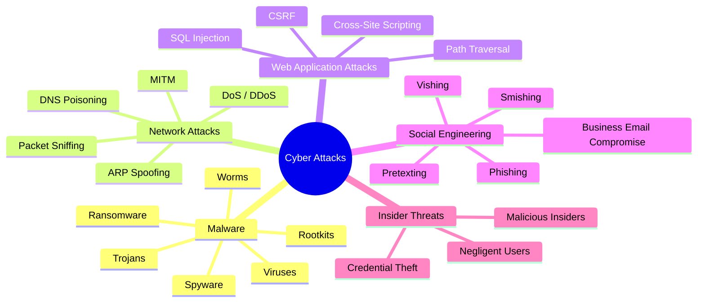
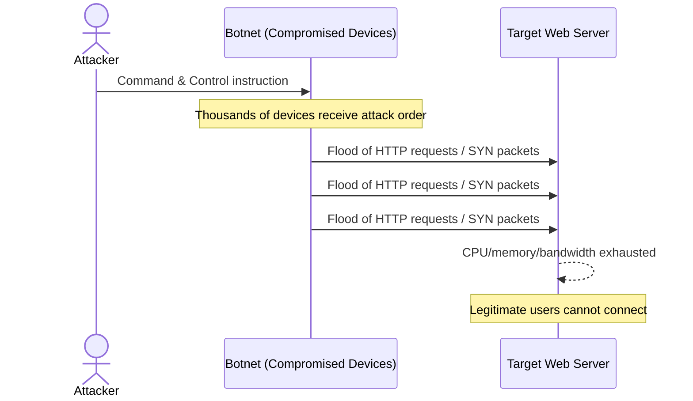
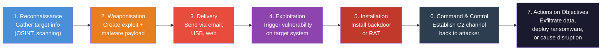

# Session 4: Cyber Attacks — Identification and Analysis

## Learning Objectives

By the end of this session, you will be able to:

- Categorise common and emerging cyber attacks by type and technique
- Identify indicators of compromise (IoCs) and early warning signs of an attack
- Describe how malware, network, and web application attacks operate
- Map an attack to the Cyber Kill Chain framework
- Recognise scam and social engineering tactics relevant to Australian users

## Presentation Materials

[:material-presentation: View Slides](../slides-original/slide_58478046_1.md){ .md-button .md-button--primary }

---

## Taxonomy of Cyber Attacks

Cyber attacks span a wide range of methods and targets. Understanding how attacks are classified helps defenders prioritise detection and response.



Each category exploits different vulnerabilities — technical weaknesses in software, configuration errors, or human behaviour. Real-world attacks frequently combine multiple categories (e.g., a phishing email delivering ransomware).

---

## Identifying Attacks — Indicators and Early Warning Signs

Identifying an attack early dramatically reduces the potential for damage. Security teams monitor for *indicators of compromise* (IoCs) — forensic artefacts that suggest a system has been compromised.

### Common Indicators of Compromise

| Category | Examples |
|---|---|
| Network | Unusual outbound traffic, connections to known malicious IPs, port scanning activity |
| Host | Unexpected processes, new administrator accounts, modified system files |
| Application | Failed login spikes, privilege escalation attempts, abnormal data exports |
| User behaviour | Login from unusual geography, access at odd hours, mass file downloads |

### Anomaly Detection

Baseline normal behaviour first — only then can you detect deviation. Tools such as Security Information and Event Management (SIEM) platforms aggregate logs across systems and apply correlation rules. When an event pattern matches a known attack signature, or deviates significantly from the baseline, an alert is raised.

!!! tip "Australian Context"
    The Australian Cyber Security Centre (ACSC) publishes an annual *Cyber Threat Report* detailing the most prevalent attack types targeting Australian organisations. In the 2022–23 report, ransomware, business email compromise, and phishing dominated the threat landscape.

---

## Malware — A Deep Dive

Malware is malicious software designed to disrupt, damage, or gain unauthorised access to systems.

### Viruses

A virus attaches itself to a legitimate file or program. When the infected file is executed, the virus replicates and may deliver a payload. Viruses require a host file and human action (opening the file) to spread.

### Worms

Unlike viruses, worms are self-replicating and spread autonomously across networks by exploiting vulnerabilities — no user interaction required. The **Mirai botnet** (2016) used worm-like behaviour to compromise hundreds of thousands of IoT devices (cameras, routers, DVRs) with default credentials, then directed them to perform massive DDoS attacks reaching 1.2 Tbps against Dyn DNS, disrupting major websites including Twitter, Netflix, and Reddit.

### Trojans

A Trojan disguises itself as legitimate software. Once installed, it may open a backdoor, steal credentials, or download additional malware. Remote Access Trojans (RATs) give attackers full control over a compromised host.

### Ransomware

Ransomware encrypts a victim's files and demands payment (typically in cryptocurrency) for the decryption key. **WannaCry** (2017) exploited the EternalBlue vulnerability (a leaked NSA exploit) in Windows SMB to spread across networks without any user interaction. It infected over 200,000 systems in 150 countries within hours, causing an estimated $4–8 billion in damages. The UK's National Health Service was severely disrupted, with thousands of appointments cancelled.

### Spyware

Spyware silently monitors user activity — keystrokes, screenshots, browsing history, credentials — and exfiltrates the data to an attacker. Commercial spyware such as Pegasus has been used to target journalists and activists.

### Rootkits

Rootkits operate at the lowest levels of the operating system (kernel or firmware) to hide their presence from security tools. They are among the most difficult malware to detect and remove.

---

## Network Attacks

### Denial of Service (DoS) and Distributed Denial of Service (DDoS)

A DoS attack overwhelms a target system (server, network device, or service) with traffic or requests, making it unavailable to legitimate users. A **DDoS** attack coordinates this from thousands or millions of compromised machines (a *botnet*), massively amplifying the impact.

**SYN Flood:** Exploits the TCP three-way handshake. The attacker sends large numbers of SYN packets with spoofed source IPs. The target responds with SYN-ACK and waits for ACK that never arrives, exhausting its connection table.

**Amplification Attacks:** The attacker sends small requests to publicly accessible servers (DNS, NTP, Memcached) using the victim's spoofed IP. The servers send large responses to the victim — amplifying traffic by 50–70× or more.



### Man-in-the-Middle (MITM)

In a MITM attack, the adversary secretly intercepts and potentially alters communications between two parties who believe they are communicating directly. Techniques include ARP spoofing (poisoning Layer 2 tables), DNS poisoning, and rogue Wi-Fi access points.

### Packet Sniffing

On unencrypted networks, a passive attacker can capture network traffic to harvest credentials, session tokens, and sensitive data. Tools such as Wireshark are legitimate network diagnostic tools that can also be used maliciously.

---

## Web Application Attacks

### SQL Injection

SQL injection occurs when user-supplied input is inserted into a database query without proper sanitisation. An attacker can manipulate the query to retrieve, modify, or delete data.

**Example:** A login form expecting a username might receive the input:
```
' OR '1'='1
```
If the application constructs a query like:
```sql
SELECT * FROM users WHERE username = '[input]' AND password = '[input]'
```
The injected input transforms the logic so the condition always evaluates to true, bypassing authentication entirely.

SQL injection remains the top vulnerability class in OWASP's Top 10 and has been responsible for major breaches, including the 2011 Sony Pictures database leak.

### Cross-Site Scripting (XSS)

XSS attacks inject malicious client-side scripts (typically JavaScript) into web pages viewed by other users.

- **Stored XSS:** The malicious script is saved in the server's database (e.g., in a comment field) and executes every time a user views that page.
- **Reflected XSS:** The script is embedded in a URL; when a victim clicks the link, the script is reflected by the server and executes in the victim's browser.
- **DOM-based XSS:** The attack occurs entirely in the browser; the malicious payload manipulates the Document Object Model without a server round-trip.

XSS can be used to steal session cookies, redirect users, or perform actions on behalf of the victim.

### Cross-Site Request Forgery (CSRF)

CSRF tricks an authenticated user's browser into sending an unintended request to a web application. Because the browser automatically includes cookies, the application cannot distinguish the malicious request from a legitimate one.

---

## The Cyber Kill Chain

Developed by Lockheed Martin, the **Cyber Kill Chain** describes the seven phases of a targeted cyber attack. Understanding this model helps defenders identify where to disrupt an attack.



Defenders can break the kill chain at any stage. For example:
- **Reconnaissance:** Monitor for scanning activity; limit publicly available information
- **Delivery:** Email filtering, URL scanning, web proxies
- **Exploitation:** Patch management, vulnerability scanning
- **Installation:** Endpoint detection and response (EDR), application whitelisting
- **C2:** Egress filtering, DNS monitoring for unusual domains

---

## Scam and Fraud Attacks

Social engineering attacks manipulate people rather than exploit technical vulnerabilities.

### Phishing

Phishing emails impersonate trusted entities (banks, the ATO, delivery services) to trick recipients into clicking malicious links or providing credentials. Spear phishing is targeted at a specific individual using personalised details.

### Vishing and Smishing

**Vishing** (voice phishing) uses phone calls. Attackers impersonate ATO officers, bank fraud teams, or IT support to extract information or payments. **Smishing** uses SMS messages with malicious links or urgent requests.

### Business Email Compromise (BEC)

BEC is a sophisticated scam targeting organisations. Attackers compromise or spoof an executive's email account and instruct finance staff to make urgent wire transfers. The Australian Cyber Security Centre reported that BEC was responsible for the highest financial losses of any cybercrime type in 2022–23.

### Romance Scams

Attackers build long-term fake relationships online before requesting money, typically through cryptocurrency or wire transfer. These scams exploit emotional vulnerability and caused Australians over $40 million in losses in 2022 (Scamwatch).

!!! warning "Legislative Context"
    The Australian government has been under pressure to reform scam regulations. The *Scams Prevention Framework* legislation aims to introduce obligations for banks, telcos, and digital platforms to detect and disrupt scams — though critics have raised concerns about implementation timelines.

---

## Australian Threat Landscape

The ACSC's *Annual Cyber Threat Report* provides authoritative data on threats targeting Australian individuals, businesses, and government.

**Key themes from recent reports:**

- A cybercrime report is submitted every **6 minutes** on average in Australia
- **Ransomware** remains the most destructive threat to businesses and critical infrastructure
- **Critical infrastructure** (health, energy, water) is increasingly targeted
- **Supply chain attacks** are growing — compromising a trusted third-party supplier to reach the primary target
- State-sponsored actors (primarily from China, Russia, Iran, and North Korea) conduct cyber espionage against Australian government and industry

---

## Key Takeaways

- Cyber attacks are categorised by method: malware, network, web application, and social engineering
- Early identification using IoCs significantly reduces breach impact
- Ransomware like WannaCry and botnets like Mirai demonstrate the real-world scale of malware threats
- DDoS attacks exploit TCP handshake weaknesses or amplification to overwhelm targets
- SQL injection and XSS remain the most prevalent web application vulnerabilities
- The Cyber Kill Chain provides a framework for both understanding attacks and designing defences
- Social engineering exploits human trust rather than technical flaws
- Australia faces a high-volume, high-impact cyber threat environment

---

## Review Questions

1. Explain the difference between a virus and a worm. Why can a worm spread more rapidly across a network without user interaction?

2. Using the Cyber Kill Chain, identify at which stage the WannaCry ransomware attack could have been most effectively disrupted, and justify your answer.

3. A company's finance manager receives an email appearing to be from the CEO requesting an urgent $50,000 wire transfer. What attack type is this? What technical and procedural controls could prevent it?

4. Describe the three types of XSS (stored, reflected, DOM-based) and explain what data an attacker might seek to steal via each.

5. The Mirai botnet used compromised IoT devices to conduct DDoS attacks. What security weakness did Mirai exploit, and what could IoT device manufacturers and end users do to prevent devices from being recruited into a botnet?

---

## Discussion Points

- Australia's proposed Scams Prevention Framework places obligations on banks, telcos, and platforms. Who should bear the primary responsibility for preventing scam losses — the individual, the platform, or the government?
- How does the Cyber Kill Chain model need to evolve to account for attacks that skip traditional stages (e.g., supply chain compromises that begin at the Installation phase)?
- Given that BEC attacks often involve no malware and no technical exploits, what non-technical controls are most effective against them?