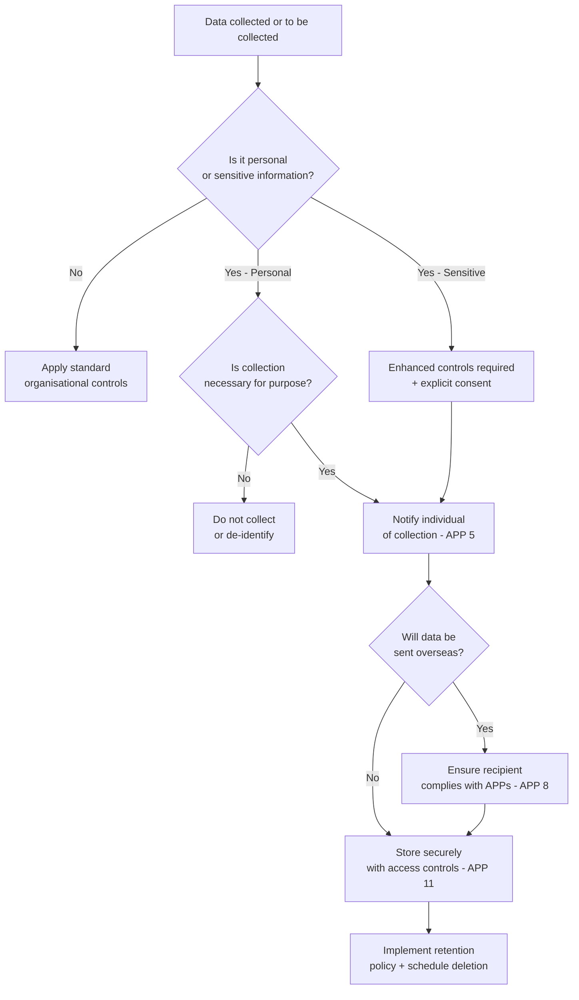
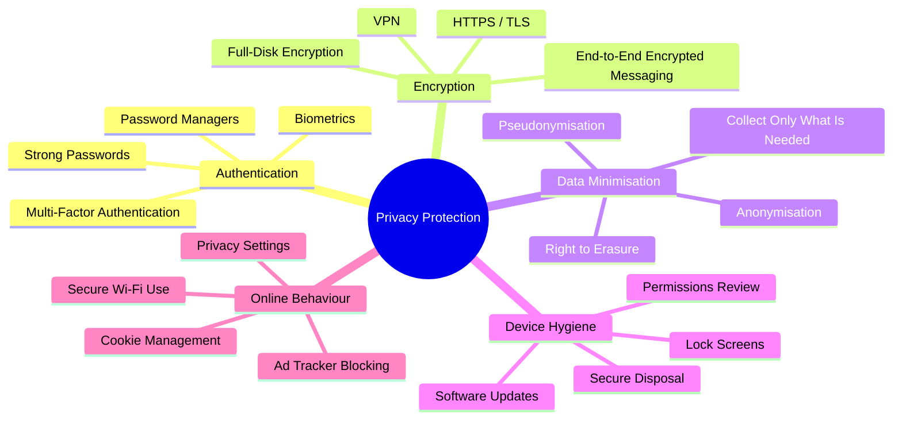

# Session 5: Protecting Personal Data and Privacy

## Learning Objectives

By the end of this session, you will be able to:

- Define personal information and sensitive information under the Australian Privacy Act 1988
- Describe the Australian Privacy Principles (APPs) and their practical significance
- Distinguish between data privacy and data security
- Apply methods to protect personal data for individuals and organisations
- Identify Australian regulatory obligations including the Notifiable Data Breaches scheme

## Presentation Materials

[:material-presentation: View Slides](../slides-original/slide_65736569_1.md){ .md-button .md-button--primary }

---

## What Is Personal Data?

### The Australian Privacy Act 1988

Australia's primary legislation governing personal information is the **Privacy Act 1988 (Cth)**. It applies to Australian Government agencies and organisations with an annual turnover above $3 million (as well as certain smaller organisations).

Under the Act, **personal information** is defined as:

> *Information or an opinion about an identified individual, or an individual who is reasonably identifiable, whether the information or opinion is true or not, and whether the information or opinion is recorded in a material form or not.*

This is deliberately broad — a name combined with an email address, a photo, a tax file number, or even an IP address can all constitute personal information depending on context.

### Sensitive Information

A sub-category of personal information, **sensitive information** attracts stronger protections because of the greater potential for harm or discrimination if misused:

- Racial or ethnic origin
- Political opinions
- Religious or philosophical beliefs
- Trade union membership
- Sexual orientation or practices
- Criminal record
- Health information (including genetic and biometric data)

!!! warning "ATO Under Attack"
    The Australian Taxation Office (ATO) processes personal and financial data for virtually every Australian. Reports indicate the ATO faces approximately **4.7 million cyber attacks every month** — a figure that underscores the scale of threat faced by custodians of sensitive personal data. Protecting this data is not optional; it is a legal and ethical obligation.

---

## Australian Privacy Principles (APPs)

The 13 Australian Privacy Principles, established under Schedule 1 of the Privacy Act, govern how organisations collect, use, store, and disclose personal information.

| APP | Topic | Core Obligation |
|---|---|---|
| APP 1 | Open and transparent management | Maintain a clear, up-to-date privacy policy |
| APP 2 | Anonymity and pseudonymity | Allow individuals to interact anonymously where practicable |
| APP 3 | Collection of solicited personal information | Only collect what is necessary for the stated function |
| APP 4 | Dealing with unsolicited information | Destroy or de-identify unsolicited information that couldn't lawfully have been collected |
| APP 5 | Notification of collection | Notify individuals at or before the time of collection |
| APP 6 | Use or disclosure | Only use/disclose for the primary purpose unless exceptions apply |
| APP 7 | Direct marketing | Strict limits on use for marketing; must allow opt-out |
| APP 8 | Cross-border disclosure | Take steps to ensure overseas recipients comply with the APPs |
| APP 9 | Government-related identifiers | Restrictions on adopting or disclosing government identifiers |
| APP 10 | Quality | Take reasonable steps to ensure information is accurate and up-to-date |
| APP 11 | Security | Take reasonable steps to protect from misuse, interference, loss, and unauthorised access |
| APP 12 | Access | Individuals may request access to their own information |
| APP 13 | Correction | Individuals may request correction of inaccurate information |

---

## Data Privacy vs Data Security

These terms are related but distinct — both are necessary, and neither alone is sufficient.

| Concept | Definition | Example |
|---|---|---|
| **Data Privacy** | The appropriate use of data — who has the right to access it, for what purpose, under what conditions | Only collecting a customer's date of birth if it is genuinely required; not on-selling customer data without consent |
| **Data Security** | The technical and procedural controls that protect data from unauthorised access, modification, or loss | Encrypting a database, requiring MFA for admin access |

An organisation can have strong security (nobody can break in) but poor privacy (the data being protected was never needed in the first place, or is used beyond its original purpose). Conversely, good privacy intentions mean little if data is stored without encryption and is easily stolen.

---

## Methods to Protect Personal Data

### Strong Passwords and Password Managers

Weak or reused passwords are among the most common causes of account compromise. Best practice:

- Minimum 14 characters (passphrases are both stronger and more memorable)
- Unique password for every service
- Use a **password manager** (e.g., Bitwarden, 1Password) to generate and store credentials securely

Password managers store credentials in an encrypted vault. The user only needs to remember one strong master password.

### Multi-Factor Authentication (MFA)

MFA requires at least two of the following factor types:

- **Something you know** — password, PIN
- **Something you have** — authenticator app (TOTP), hardware token (YubiKey), SMS code
- **Something you are** — fingerprint, face recognition

Even if a password is stolen, MFA prevents an attacker from accessing the account. TOTP authenticator apps (such as Google Authenticator or Aegis) are significantly more resistant to SIM-swapping attacks than SMS-based MFA.

### Encryption

**Encryption at rest** protects stored data. If a device is stolen or storage media is improperly disposed of, encrypted data cannot be read without the key. Full-disk encryption tools include BitLocker (Windows) and FileVault (macOS).

**Encryption in transit** protects data as it moves across networks. HTTPS (TLS) encrypts communications between a browser and a web server, preventing interception. Always verify the padlock icon and `https://` prefix before submitting sensitive information.

### Privacy Settings on Social Media

Social media platforms collect significant amounts of personal data and provide granular privacy controls that most users never review. Key actions:

- Limit profile visibility to friends/connections rather than public
- Disable location tagging on posts
- Review app permissions — many third-party apps have broad access to account data
- Regularly audit and revoke access to connected applications

### Virtual Private Networks (VPNs)

A VPN encrypts all traffic between your device and the VPN server, masking your IP address and preventing your ISP or the local network (e.g., a café Wi-Fi) from observing your traffic.

**What a VPN does protect:**
- Traffic on untrusted networks (public Wi-Fi)
- Your IP address from websites you visit
- Traffic from your local ISP

**What a VPN does NOT protect:**
- Malware already on your device
- Websites you log in to (they still see your account)
- Your activity from the VPN provider itself

---

## Personal Data Protection Decision Process

---

## Privacy Protection Methods — Overview

---

## Protecting Data in Organisations

Organisations that collect personal information must implement practices that go beyond individual hygiene.

### Data Minimisation

Collect only the minimum personal information required to fulfil the stated purpose. Excess data is excess liability — a breach exposing data you didn't need to collect is both a legal and reputational problem.

### Purpose Limitation

Personal information collected for one purpose should not be used for another incompatible purpose without the individual's consent. This is enshrined in APP 6.

### Retention Policies

Data should not be kept indefinitely. Establish retention schedules that define how long each category of personal information is retained, and ensure secure deletion or de-identification at the end of the retention period.

### Data Classification

Not all data requires the same level of protection. A classification scheme (e.g., Public → Internal → Confidential → Restricted) helps direct security investment where it is most needed.

---

## Australian Regulatory Framework

### Notifiable Data Breaches (NDB) Scheme

The NDB scheme (introduced 2018, under Part IIIC of the Privacy Act) requires organisations covered by the Privacy Act to notify:

1. The **Office of the Australian Information Commissioner (OAIC)**, and
2. **Affected individuals**

when an *eligible data breach* occurs — that is, unauthorised access to or disclosure of personal information that is likely to result in **serious harm** to any individual.

Organisations must assess potential breaches within **30 days** of becoming aware. Failure to notify can attract significant penalties.

### Office of the Australian Information Commissioner (OAIC)

The OAIC is Australia's independent national regulator for privacy and freedom of information. It:

- Investigates complaints from individuals about how their personal information has been handled
- Conducts audits of agencies' and organisations' privacy practices
- Publishes guidance and data breach statistics

The OAIC's quarterly NDB statistics regularly show the health and education sectors as the highest reporters of data breaches.

!!! info "Penalty Increases"
    Following 2022 amendments (triggered partly by the Optus and Medibank breaches), maximum penalties for serious or repeated privacy breaches increased to $50 million, or three times the value of any benefit obtained, or 30% of the organisation's adjusted Australian turnover — whichever is greatest.

---

## Practical Data Hygiene

### Browser and Web Habits

- **Use HTTPS:** Check for the padlock and `https://` before entering passwords or payment details
- **Clear cookies and cache** periodically — cookies can track your browsing history across sites
- **Use a privacy-focused browser** or install an extension like uBlock Origin to reduce tracker exposure
- **Avoid password autofill** on public or shared computers

### Secure Wi-Fi

- Avoid conducting sensitive transactions (banking, email) on public unencrypted Wi-Fi without a VPN
- Use WPA3 or WPA2 for home networks; disable WPS
- Change default router admin credentials immediately upon setup

### Recognising HTTPS

The TLS padlock icon in the browser address bar indicates that traffic between your browser and the server is encrypted. However, it does **not** guarantee the site is legitimate — phishing sites also use HTTPS. Always verify the domain name carefully.

---

## IoT and Smart Devices — Privacy Risks

Smart home devices (voice assistants, smart TVs, robot vacuums, baby monitors) continuously collect data about occupants' behaviour, health, location, and more. Key risks:

- **Always-on microphones and cameras** — potential for covert monitoring
- **Data sent to overseas servers** — where different (weaker) privacy laws apply
- **Weak default security** — factory passwords, unpatched firmware
- **Third-party data sharing** — device manufacturers may share data with advertisers or data brokers

### Mitigation Strategies

- Research the privacy policy of a smart device before purchase
- Place smart devices on a separate network segment (IoT VLAN)
- Disable features not in use (e.g., remote access, microphone)
- Keep firmware updated
- Change default credentials immediately

---

## Key Takeaways

- Personal information is broadly defined under Australian law; sensitive information attracts heightened protection
- The 13 APPs establish minimum obligations for collecting, using, and securing personal information
- Data privacy (right to use) and data security (protection from breach) are distinct but complementary
- Strong passwords, MFA, encryption, and privacy settings are the individual's primary defence toolkit
- Organisations must apply data minimisation, purpose limitation, and retention policies
- The NDB scheme requires notification of eligible breaches to the OAIC and affected individuals within 30 days
- IoT devices present growing privacy risks that require active management

---

## Review Questions

1. A healthcare organisation collects patient date of birth, Medicare number, and health condition details. Under the Privacy Act, how should each category be classified, and what protections does each category require?

2. Explain the difference between data privacy and data security using an example where an organisation has strong security but poor privacy practices.

3. A staff member at a financial services company loses an unencrypted laptop containing customer names, addresses, and account numbers. Walk through the steps the organisation must take under the Notifiable Data Breaches scheme.

4. Compare SMS-based MFA with a TOTP authenticator app. What specific attack does TOTP defend against that SMS does not?

5. A user connects to a hotel Wi-Fi network and uses a VPN to access their internet banking. What threats does the VPN protect against in this scenario, and what threats does it not address?

---

## Discussion Points

- The OAIC's NDB statistics show health data is the most breached category. What structural or cultural factors in the Australian healthcare system contribute to this? What would meaningfully improve outcomes?
- Data minimisation and business models that monetise personal data are in fundamental tension. How should regulators balance individual privacy rights against commercial interests?
- Smart home devices from Chinese manufacturers have attracted government scrutiny in some countries. How should Australian consumers and policymakers approach this risk?