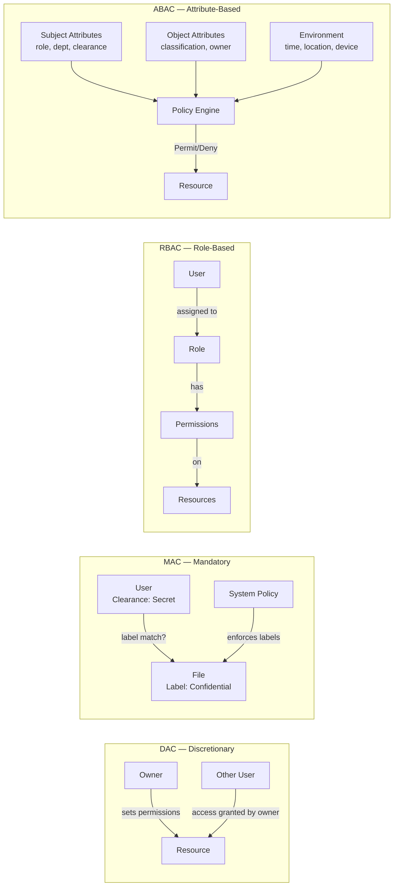
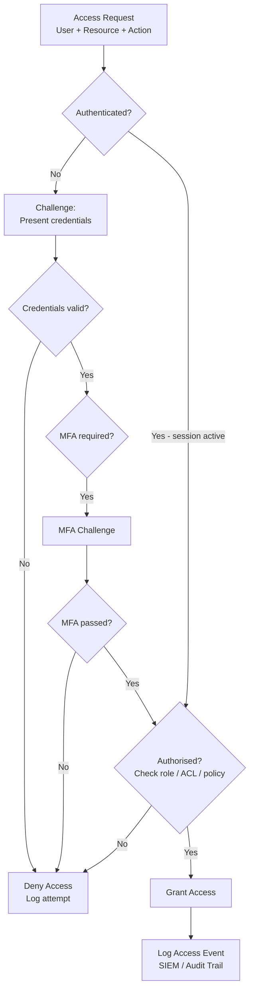
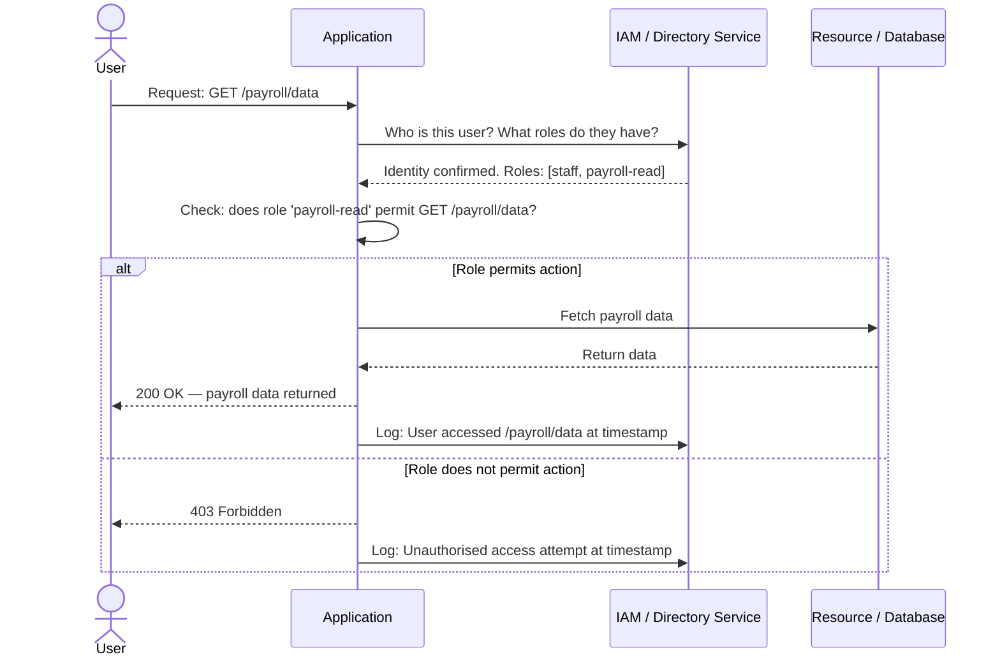

# Session 6: Access Control and Privacy

## Learning Objectives

By the end of this session, you will be able to:

- Define access control and explain why it is foundational to security
- Apply the core principles of least privilege, separation of duties, and zero trust
- Compare the four main access control models: DAC, MAC, RBAC, and ABAC
- Describe authentication and authorisation mechanisms used in enterprise environments
- Identify common access control failures and their consequences
- Explain access control considerations in cloud environments

## Presentation Materials

[:material-presentation: View Slides](../slides-original/slide_52751036_1.md){ .md-button .md-button--primary }
[:material-presentation: View Slides](../slides-original/slide_55371417_1.md){ .md-button .md-button--primary }
[:material-presentation: View Slides](../slides-original/slide_65716465_1.md){ .md-button .md-button--primary }

---

## What Is Access Control?

Access control is the process of granting or denying specific requests to obtain and use information, services, or physical spaces. It answers three fundamental questions:

1. **Authentication** — *Who are you?* Verify the identity of the entity requesting access.
2. **Authorisation** — *What are you allowed to do?* Determine what resources and actions are permitted.
3. **Accountability** — *What did you do?* Log and audit actions for traceability.

Access control is foundational to the CIA triad (Confidentiality, Integrity, Availability). Without it, no other security control can be effective — you cannot protect data if you cannot control who accesses it.

---

## Access Control Principles

### Least Privilege

Every user, system, or process should be granted only the minimum permissions required to perform its legitimate function — and no more. If an attacker compromises an account, least privilege limits the blast radius.

### Need-to-Know

Even within the same privilege level, access to specific information should be limited to those who require it for their job. A payroll officer has a legitimate need to access salary data; a junior developer typically does not.

### Separation of Duties

High-risk tasks should be split between multiple individuals so no single person can complete them unilaterally. For example, the person who requests a financial transfer should not be the same person who approves it.

### Zero Trust

The zero trust model rejects the traditional "trust but verify" assumption that internal networks are inherently safe. Instead: **never trust, always verify**. Every request — whether from inside or outside the network perimeter — must be authenticated and authorised. Zero trust is increasingly important as organisations move to cloud services and remote work environments.

!!! info "Zero Trust in Australia"
    The Australian Signals Directorate's *Essential Eight* mitigation strategies (application control, patch applications, configure Microsoft Office macro settings, user application hardening, restrict admin privileges, patch operating systems, MFA, and regular backups) align with zero trust principles — particularly restricting admin privileges and MFA.

---

## Access Control Models

### Discretionary Access Control (DAC)

In DAC, the *owner* of a resource determines who may access it. Windows and Linux file system permissions are classic examples — the file creator can set read, write, and execute permissions for themselves, a group, and others.

**Strengths:** Flexible; easy to implement  
**Weaknesses:** Difficult to enforce consistently at scale; a user may inadvertently grant excessive access; relies on users making good decisions

### Mandatory Access Control (MAC)

In MAC, access decisions are made by the system based on security *labels* applied to both subjects (users/processes) and objects (files/resources). Users cannot override these labels — even if they own a file, they cannot grant access to a user with a lower clearance level.

MAC is used in high-assurance environments such as government and military systems. Security labels are typically hierarchical (Unclassified → Confidential → Secret → Top Secret) with supplementary *compartments* (e.g., "Eyes Only").

**Strengths:** Strict enforcement; resistant to Trojan horse attacks  
**Weaknesses:** Complex to administer; inflexible for commercial environments

### Role-Based Access Control (RBAC)

RBAC assigns permissions to *roles*, and users are assigned to roles. A "Sales Representative" role has access to the CRM system; an "HR Administrator" role has access to payroll. When an employee changes positions, their role assignment changes — not individual permissions.

RBAC is the most widely deployed model in enterprise environments. Active Directory groups, AWS IAM roles, and most SaaS platforms use RBAC.

**Strengths:** Easy to manage at scale; reflects organisational structure; simplifies audit  
**Weaknesses:** Role explosion (proliferation of too many granular roles); does not account for context (time, location, device)

### Attribute-Based Access Control (ABAC)

ABAC extends RBAC by evaluating *attributes* of the subject (user), object (resource), and environment (context) to make dynamic access decisions. A policy might state: *"A doctor may access a patient record only if the patient is assigned to the doctor's ward AND the access occurs during business hours AND the access is from a hospital workstation."*

ABAC is more expressive than RBAC but also more complex to design and audit.

**Strengths:** Fine-grained, context-aware; suitable for dynamic environments  
**Weaknesses:** Complex policy management; performance overhead

### Model Comparison

---

## Authentication Methods

Authentication is the process of verifying that an entity is who it claims to be. Different methods suit different risk levels and contexts.

| Method | How It Works | Strengths | Weaknesses |
|---|---|---|---|
| **Password** | Secret string known only to the user | Universal support; low cost | Phishable; reuse; weak choices |
| **SMS OTP** | One-time code sent via SMS | Easy to deploy | SIM swapping; interception |
| **TOTP (Authenticator App)** | Time-based one-time code generated locally | Resistant to SIM swap; no network required | Device loss |
| **Hardware Token (FIDO2/WebAuthn)** | Cryptographic key on a physical device (YubiKey) | Phishing-resistant; strong assurance | Cost; device management |
| **Biometrics** | Fingerprint, face, iris recognition | Convenient; non-repudiable | Cannot be changed if compromised; privacy concerns |
| **Smart Card / Certificate** | PKI certificate stored on card | Strong cryptographic identity | PKI infrastructure overhead |

Modern best practice is to combine at least two factor types (MFA). FIDO2/WebAuthn hardware keys or passkeys are increasingly recommended as the highest-assurance option as they are completely phishing-resistant.

---

## Authorisation — Implementation Mechanisms

### Access Control Lists (ACLs)

An ACL is a list associated with a resource that specifies which subjects (users, groups, systems) have which permissions. Network ACLs (on firewalls and routers) control traffic flow; file system ACLs control read/write/execute access.

### Directory Services — Active Directory

Microsoft Active Directory (AD) is the most widely used identity and access management system in enterprise Windows environments. AD organises users, computers, and resources into a hierarchy. Group Policy Objects (GPOs) apply security settings across the domain. Users are assigned to Security Groups that map to RBAC roles.

### Identity and Access Management (IAM)

IAM platforms (e.g., Okta, Microsoft Entra ID, AWS IAM) centralise identity management across multiple systems and applications. Key capabilities include:

- **Single Sign-On (SSO):** One set of credentials for multiple applications
- **Provisioning and de-provisioning:** Automating access when users join, move, or leave
- **Access reviews:** Periodic certification of who has access to what

---

## Physical Access Control

Logical access controls must be complemented by physical controls — no amount of software security prevents an attacker with physical access to a server room.

### Physical Controls

- **Access badges / smart cards:** RFID or NFC-enabled credentials that grant entry to secured areas
- **Biometric entry systems:** Fingerprint or retinal scanners for high-security zones
- **Mantraps / airlocks:** Double-door entry systems that prevent tailgating
- **CCTV and monitoring:** Deter and detect unauthorised physical access
- **Visitor management:** Sign-in registers, visitor badges, escort requirements

### Tailgating and Piggybacking

A common physical security bypass is **tailgating** — following an authorised person through a secured door without authenticating. Staff training and mantraps address this.

---

## Access Control Decision Process

---

## Privilege Management

### Privileged Access Management (PAM)

Privileged accounts (domain administrators, root accounts, service accounts) pose the greatest risk if compromised. PAM solutions (e.g., CyberArk, BeyondTrust) provide:

- **Vaulting of credentials:** Privileged passwords stored encrypted; checked out by authorised users only
- **Session recording:** Full video and keystroke recording of privileged sessions
- **Just-in-time access:** Elevated privileges granted only for the duration of a specific task
- **Least privilege enforcement:** Remove standing admin rights; require justification for elevation

### Admin Account Hygiene

- Administrators should use a separate privileged account for administrative tasks and a standard account for day-to-day work (email, web browsing)
- Never use a domain administrator account for routine work
- Privileged accounts should not have email clients or web browsers
- Implement multi-person authorisation for the most sensitive operations

---

## RBAC Permission Check — Sequence

---

## Access Control in Cloud Environments

Cloud platforms shift access control from on-premises infrastructure to API-driven identity systems. Misconfigured cloud IAM is one of the leading causes of cloud data breaches.

### AWS IAM

AWS Identity and Access Management uses policies (JSON documents) attached to users, groups, or roles to define what actions are permitted on which resources. IAM roles can be assumed by services (EC2 instances, Lambda functions) — avoiding hardcoded credentials.

**Key best practices:**
- Apply least privilege to all IAM policies
- Never use the root account for routine operations
- Rotate access keys regularly; prefer roles over long-lived keys
- Enable CloudTrail for audit logging of all API calls

### Federated Identity

Organisations use federation standards (SAML 2.0, OpenID Connect, OAuth 2.0) to allow users to authenticate with their corporate identity provider (e.g., Entra ID) and gain access to cloud services without separate credentials. This enables SSO at cloud scale.

### Service Accounts

Cloud-native workloads (containers, serverless functions) need their own identities. Service accounts should follow least privilege, have defined scopes, and be audited regularly. Unused service accounts should be disabled promptly.

---

## Common Access Control Failures

| Failure | Description | Example Consequence |
|---|---|---|
| Over-privileged accounts | Users have more access than needed | A compromised sales account can access HR data |
| Shared credentials | Multiple users share a single account | Impossible to attribute actions; accountability fails |
| Stale accounts | Departed staff accounts not disabled | Ex-employee retains access; insider threat vector |
| Privilege creep | Permissions accumulate over time without review | Long-tenured staff have admin rights they no longer need |
| Default credentials | Systems deployed with factory passwords | Attacker uses public defaults to gain access |
| Missing MFA on privileged accounts | Admin accounts protected only by password | Single credential compromise gives full admin access |

!!! danger "Stale Accounts — Real-World Risk"
    The Australian Cyber Security Centre's Essential Eight recommends *restricting administrative privileges* and conducting regular access reviews. Many significant breaches have been facilitated by stale service accounts or contractor accounts that were never disabled after the engagement ended.

---

## Key Takeaways

- Access control combines authentication (who you are), authorisation (what you can do), and accountability (what you did)
- Least privilege, need-to-know, separation of duties, and zero trust are the foundational principles
- DAC is owner-controlled and flexible; MAC is label-based and strict; RBAC is role-oriented and enterprise-friendly; ABAC is dynamic and context-aware
- Physical access controls are as important as logical ones — they are the last line of defence for hardware
- PAM and just-in-time access reduce the risk from compromised privileged accounts
- Cloud IAM introduces new complexity; misconfiguration is the primary risk
- Stale accounts, over-privileged users, and shared credentials are the most common access control failures

---

## Review Questions

1. An employee in the accounts team is promoted to Accounts Manager. Under an RBAC model, describe the process of updating their access. What risks arise if this process is not followed correctly?

2. Compare DAC and MAC. In what types of environments is each model most appropriate, and why would MAC be unsuitable for most commercial organisations?

3. Explain the concept of "privilege creep" and describe two controls that can detect and remediate it.

4. A cloud engineer hardcodes AWS access key credentials into an application's source code, which is then pushed to a public GitHub repository. Identify all the access control failures present in this scenario and recommend remediation steps.

5. Describe a scenario where an ABAC policy would provide better security than a purely RBAC-based approach. What attributes would the policy evaluate, and why does RBAC alone fall short?

---

## Discussion Points

- The zero trust model requires "never trust, always verify" — but this creates friction for users. How should organisations balance security rigour with usability, particularly for frontline workers who are not technically sophisticated?
- Separation of duties is straightforward in large organisations but impractical in small businesses where one person wears many hats. What compensating controls can small organisations use?
- Biometric authentication is increasingly used in mobile devices and border control. What are the privacy implications, and should biometric data be subject to the same protections as sensitive health information under Australian law?