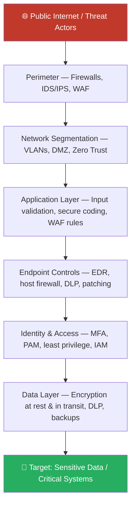
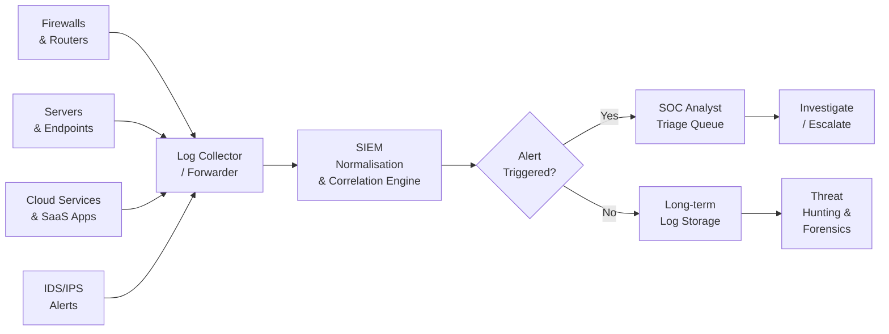
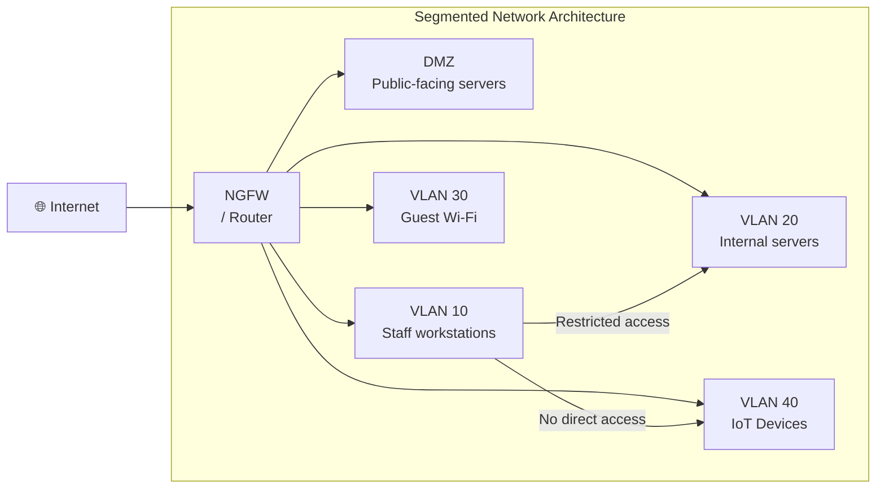

# Session 7: Security Tools, Platforms, and Services

## Learning Objectives

By the end of this session, you will be able to:

- Explain the defence-in-depth (Security Onion) model and why layered security matters
- Identify and categorise the major classes of security tools — perimeter, monitoring, endpoint, identity, and vulnerability management
- Describe the function of SIEM and SOAR platforms in a security operations context
- Explain how to harden routers and switches against common network attacks
- Evaluate the role of managed security services and threat intelligence feeds
- Identify key open-source security tools used by practitioners

---

## Presentation Materials

[:material-presentation: View Slides — Week 7 (Methods & Resources)](../slides-original/slide_53232319_1.md){ .md-button .md-button--primary }
[:material-presentation: View Slides — Security Policies](../slides-original/slide_53277911_1.md){ .md-button .md-button--primary }
[:material-presentation: View Slides — Platforms & Tools](../slides-original/slide_55371415_1.md){ .md-button .md-button--primary }
[:material-presentation: View Slides — Mitigations](../slides-original/slide_59340066_1.md){ .md-button .md-button--primary }

---

## 1. Why Network Security Matters

Modern organisations depend on networks for everything — communication, commerce, service delivery, and critical infrastructure. Every connected device is a potential entry point for an attacker. Protecting the network is not just an IT concern; it directly affects business continuity, regulatory compliance, and the safety of people who depend on those systems.

Network security is the practice of implementing policies, tools, and controls that prevent unauthorised access, misuse, modification, or denial of a computer network and its resources. Effective network security combines technology, process, and people.

---

## 2. Defence in Depth — The Security Onion

The **Security Onion** model is a metaphor for defence-in-depth: an attacker must peel through multiple protective layers before reaching the target data. Each layer adds friction, detection opportunity, and time for defenders to respond.

!!! info "The Security Artichoke"
    Defenders often visualise their security posture as a neat onion — clean, well-defined layers. Attackers, however, experience it more like an artichoke: leaves pointing outward, jagged, and difficult to navigate from any angle. The lesson is to build security that looks messy and unpredictable to an adversary.

Each layer serves a distinct purpose. If one layer is compromised, the next layer continues to provide protection and generates alerts that feed into monitoring systems.

---

## 3. Security Tools by Category

### 3.1 Perimeter Security

The network perimeter is the boundary between a trusted internal network and untrusted external networks.

| Tool | Description |
|------|-------------|
| **Stateful Firewall** | Tracks active connections and allows only expected return traffic. Operates at Layer 3–4. |
| **Next-Generation Firewall (NGFW)** | Adds application-layer inspection, SSL decryption, user-identity awareness, and integrated IPS. |
| **Intrusion Detection System (IDS)** | Monitors traffic passively and raises alerts on suspicious patterns. Does not block. |
| **Intrusion Prevention System (IPS)** | Sits inline and can actively drop malicious packets in real time. |
| **Web Application Firewall (WAF)** | Protects HTTP/S applications against OWASP Top 10 attacks — SQL injection, XSS, CSRF, etc. |

### 3.2 Monitoring and Visibility

You cannot defend what you cannot see. Monitoring tools provide the visibility needed to detect threats.

| Tool | Description |
|------|-------------|
| **SIEM** | Aggregates logs from across the environment, correlates events, and generates alerts. |
| **Network Traffic Analysis (NTA)** | Analyses flow data (NetFlow, sFlow) to detect anomalous communication patterns. |
| **Log Management** | Centralised collection, storage, and search of log data from all systems. |
| **Packet Capture (PCAP)** | Full packet recording for forensic reconstruction of network events. |

### 3.3 Endpoint Security

Endpoints (laptops, servers, mobile devices) are the most common initial point of compromise.

| Tool | Description |
|------|-------------|
| **Antivirus / EDR** | Antivirus detects known malware; Endpoint Detection & Response (EDR) adds behavioural analysis, threat hunting, and automated response. |
| **Host-Based Firewall** | Controls inbound/outbound connections at the individual host level. |
| **Data Loss Prevention (DLP)** | Monitors and blocks unauthorised transfer of sensitive data (e.g., copying to USB, emailing PII). |
| **Patch Management** | Automates the deployment of OS and application security patches. |

### 3.4 Identity and Access Management

Identity is the new perimeter. Most breaches involve compromised credentials.

| Tool | Description |
|------|-------------|
| **IAM Platform** | Centralised user account lifecycle management — provisioning, deprovisioning, role assignment. |
| **Privileged Access Management (PAM)** | Controls, audits, and records access by accounts with elevated privileges (admins, service accounts). |
| **Multi-Factor Authentication (MFA)** | Requires a second factor (OTP, push notification, hardware key) in addition to a password. |
| **Single Sign-On (SSO)** | One set of credentials grants access to multiple applications, reducing password fatigue and sprawl. |

### 3.5 Vulnerability Management

Finding weaknesses before attackers do.

| Tool | Description |
|------|-------------|
| **Vulnerability Scanner** | Automatically discovers and reports known vulnerabilities across hosts and applications (e.g., Nessus, OpenVAS). |
| **Patch Management Platform** | Tracks patch status and automates deployment across fleets of endpoints. |
| **Penetration Testing Tools** | Used by authorised testers to actively exploit vulnerabilities (e.g., Metasploit, Burp Suite). |

---

## 4. Security Platforms — SIEM and SOAR

### 4.1 SIEM Deep Dive

A **Security Information and Event Management (SIEM)** platform is the central nervous system of a Security Operations Centre (SOC). It collects, normalises, and correlates log data from dozens or hundreds of sources to surface actionable alerts.

Key SIEM capabilities:

- **Log aggregation** — collects from firewalls, servers, applications, endpoints, cloud services
- **Normalisation** — converts logs from different formats into a common schema
- **Correlation rules** — detects multi-step attack patterns (e.g., failed logins followed by a successful login from a new country)
- **Alerting** — notifies analysts of high-priority events
- **Dashboards and reporting** — provides situational awareness and compliance evidence
- **Threat intelligence integration** — matches observed indicators against known bad IP addresses, hashes, and domains

Common SIEM platforms include Splunk, Microsoft Sentinel, IBM QRadar, and the open-source Elastic SIEM.

### 4.2 SOAR — Security Orchestration, Automation, and Response

**SOAR** extends SIEM by automating response actions when certain alert conditions are met. Instead of an analyst manually blocking an IP address or disabling a compromised account, a SOAR playbook can execute those actions in seconds.

Example SOAR automation: when a phishing email is detected → extract URL indicators → check against threat intel → block URL at proxy → notify user → close ticket automatically.

---

## 5. Network Security Policies

Technical controls alone are insufficient — they must be backed by documented, enforced policies.

| Policy | Purpose |
|--------|---------|
| **Acceptable Use Policy (AUP)** | Defines permitted and prohibited use of organisational IT resources. |
| **Password Policy** | Sets minimum length, complexity, rotation, and reuse rules for passwords. |
| **Remote Access Policy** | Governs how staff connect to organisational systems from outside the office (VPN requirements, approved devices). |
| **Network Access Control Policy** | Defines who and what can connect to the network and under what conditions. |
| **Data Classification Policy** | Labels data by sensitivity (Public, Internal, Confidential, Restricted) and dictates handling requirements. |

!!! warning "Policy Without Enforcement"
    A policy that is documented but not enforced — technically or through auditing — provides a false sense of security. Policies must be communicated, trained, and regularly audited for compliance.

---

## 6. Securing Routers and Switches

Network devices are high-value targets. Compromising a router or switch gives an attacker visibility into, or control over, all traffic passing through it.

### Hardening Checklist

- **Replace Telnet with SSH** — Telnet transmits credentials in plaintext. Always use SSH (version 2) for device management.
- **Disable unused services and ports** — HTTP management interface, CDP on external interfaces, SNMP v1/v2 (use v3 with authentication).
- **Use Access Control Lists (ACLs)** — Restrict management access to known admin IP ranges; filter inbound/outbound traffic at network boundaries.
- **Implement port security** — Limit the number of MAC addresses per switch port to prevent MAC flooding attacks.
- **Enable VLAN segmentation** — Separate user segments (staff, guest Wi-Fi, IoT, servers) into distinct VLANs to contain lateral movement.
- **Disable unused switch ports** and assign them to a black-hole VLAN.
- **Use 802.1X** — Port-based network access control requiring device authentication before network access is granted.
- **Centralised logging** — Forward all device logs to the SIEM for correlation and audit.
- **Change default credentials** immediately on all devices.

---

## 7. Common Network Attack Mitigations

| Attack | Description | Mitigation |
|--------|-------------|------------|
| **DDoS** | Floods network with traffic to exhaust resources | Rate limiting, upstream scrubbing, anycast routing, CDN |
| **IP Spoofing** | Packets sent with forged source addresses | Ingress/egress filtering (BCP38), uRPF on routers |
| **ARP Spoofing** | Poisons ARP cache to redirect traffic | Dynamic ARP Inspection (DAI) on managed switches |
| **VLAN Hopping** | Exploits misconfigured trunk ports to access other VLANs | Disable DTP, set explicit access/trunk modes, use dedicated native VLAN |
| **Man-in-the-Middle** | Intercepts communications between two parties | Encryption (TLS), certificate pinning, 802.1X |
| **Reconnaissance / Port Scanning** | Maps network topology and open services | Firewall rules blocking unsolicited probes, IDS signatures, network segmentation |

!!! tip "Ingress and Egress Filtering"
    Best Current Practice 38 (BCP38) recommends that ISPs and organisations drop packets arriving on an interface that have a source IP address that could not legitimately originate from that direction. This simple measure prevents a large class of spoofing attacks.

---

## 8. Security Services

Not every organisation can build and staff a full security operations capability. Managed and cloud-based security services fill this gap.

- **MSSP (Managed Security Service Provider)** — outsources monitoring, alerting, and response to a specialist provider operating a 24×7 SOC.
- **SOC-as-a-Service** — cloud-delivered SOC capabilities that can be integrated with an organisation's existing tools.
- **Threat Intelligence Feeds** — commercially or community-sourced streams of indicators of compromise (IoCs): malicious IPs, domains, file hashes. Examples: MISP, AlienVault OTX, Recorded Future.
- **Red Team / Penetration Testing Services** — specialist firms conduct authorised attacks to identify gaps before real attackers do.
- **Vulnerability Disclosure Programmes** — structured processes for external researchers to report vulnerabilities responsibly.

---

## 9. Open-Source Security Tools

| Tool | Category | Description |
|------|----------|-------------|
| **Security Onion** | Platform | Linux distribution bundling Zeek, Suricata, Elastic SIEM, and supporting tools. Used for network monitoring and threat hunting. |
| **Snort / Suricata** | IDS/IPS | Open-source network intrusion detection engines with rule-based threat detection. Suricata adds multi-threading and protocol support. |
| **Wireshark** | Packet Analysis | GUI-based protocol analyser for capturing and dissecting network packets. Essential for troubleshooting and forensics. |
| **Zeek (formerly Bro)** | Network Analysis | Generates rich, structured logs of network activity (DNS queries, HTTP sessions, TLS certificates, file transfers). Ideal for threat hunting. |
| **OpenVAS / Greenbone** | Vulnerability Scanning | Open-source vulnerability scanner covering thousands of CVEs. |
| **OSSEC / Wazuh** | Host-based IDS | Open-source HIDS with file integrity monitoring, log analysis, and active response capabilities. |

---

## Key Takeaways

- Defence-in-depth (the Security Onion) means attackers must overcome multiple layers — no single control is sufficient.
- Security tools fall into five categories: perimeter, monitoring, endpoint, identity, and vulnerability management.
- SIEM is the central aggregation and correlation platform for a SOC; SOAR adds automated response.
- Network devices must be hardened: replace Telnet with SSH, apply ACLs, enable port security, segment with VLANs.
- Common network attacks (DDoS, spoofing, ARP poisoning) have well-understood mitigations that should be applied by default.
- Open-source tools like Security Onion, Suricata, and Zeek provide enterprise-grade capabilities at low cost.

---

## Review Questions

1. Explain the Security Onion model and describe why having multiple layers of security is more effective than relying on a single strong control.
2. What is the difference between an IDS and an IPS? In what network positions would each be deployed?
3. A SIEM alert fires showing 50 failed SSH login attempts from an external IP address followed by one successful login. Walk through how a SOC analyst should triage and respond to this alert.
4. List five specific hardening steps that should be applied to a newly deployed managed switch before it goes into production.
5. An organisation with limited resources cannot afford a dedicated SOC team. What managed or cloud-based security service options are available, and what are the trade-offs of outsourcing security monitoring?

---

## Discussion Points

- Should organisations prefer a single integrated security platform (e.g., one vendor's NGFW + EDR + SIEM) or best-of-breed tools from multiple vendors? What are the trade-offs?
- How does the "security artichoke" metaphor change how you think about the attacker's perspective versus the defender's perspective?
- What are the ethical and privacy implications of deep packet inspection and full packet capture within an organisation's network?

