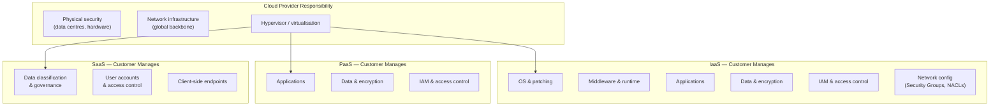
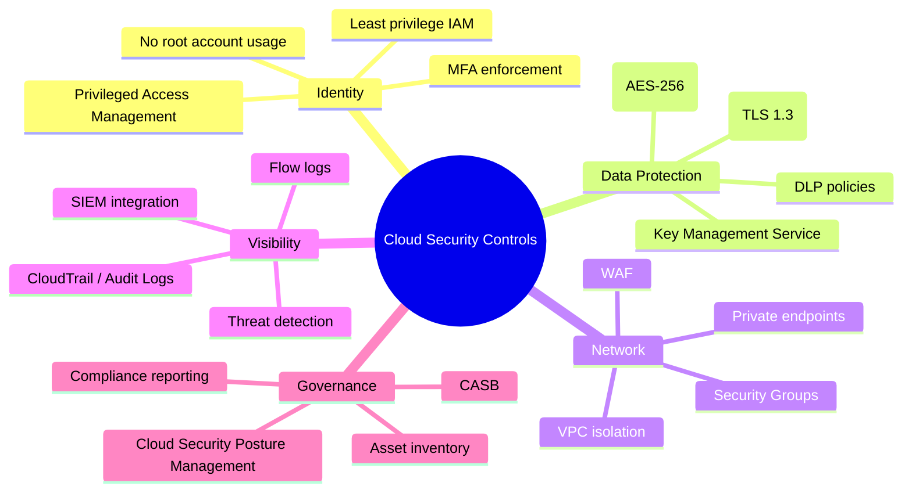

# Session 8: Cloud Security

## Learning Objectives

By the end of this session, you will be able to:

- Explain the three cloud service models (IaaS, PaaS, SaaS) and their security implications
- Describe the shared responsibility model and identify which security controls are the customer's responsibility
- Identify the key cloud security risks and how they are mitigated
- Apply IAM, encryption, and network security controls in a cloud environment
- Explain the role of a Cloud Access Security Broker (CASB)
- Describe security requirements for containers and Kubernetes
- Reference Australian and international cloud security compliance frameworks

---

## 1. Cloud Computing Models

Cloud computing delivers IT resources — compute, storage, networking, and software — as on-demand services over the internet. Understanding the three service models is essential because each model places different security responsibilities on the customer.

### 1.1 Infrastructure as a Service (IaaS)

The cloud provider supplies virtualised hardware: compute, storage, and networking. The customer manages everything above the hypervisor — operating systems, middleware, applications, and data.

**Examples**: AWS EC2, Azure Virtual Machines, Google Compute Engine.

### 1.2 Platform as a Service (PaaS)

The cloud provider manages the underlying infrastructure *and* the operating system and runtime environment. The customer manages applications and data.

**Examples**: AWS Elastic Beanstalk, Azure App Service, Google App Engine, Heroku.

### 1.3 Software as a Service (SaaS)

The provider manages everything — infrastructure, platform, and application. The customer only manages their data, user accounts, and configuration.

**Examples**: Microsoft 365, Salesforce, Google Workspace, ServiceNow.

---

## 2. Cloud Deployment Models

| Model | Description | Use Case |
|-------|-------------|----------|
| **Public Cloud** | Infrastructure shared among many tenants, owned by a provider | Cost-effective general workloads |
| **Private Cloud** | Dedicated infrastructure for a single organisation, on-premises or hosted | High-security, regulated workloads |
| **Hybrid Cloud** | Combination of public and private, connected by network | Burst capacity, data sovereignty requirements |
| **Multi-Cloud** | Uses services from two or more public cloud providers | Avoiding vendor lock-in, best-of-breed services |

---

## 3. The Shared Responsibility Model

In cloud computing, security responsibilities are **shared** between the cloud provider and the customer. The exact division varies by service model.

!!! warning "Misunderstanding Shared Responsibility"
    The most common cloud security mistake is assuming the provider handles security aspects that are actually the customer's responsibility. Misconfigured S3 buckets, unpatched virtual machines, and overly permissive IAM policies are all customer-side failures that have caused major data breaches.

---

## 4. Key Cloud Security Risks

| Risk | Description | Example Incident |
|------|-------------|-----------------|
| **Data Breach** | Unauthorised access to sensitive data stored in the cloud | Misconfigured S3 bucket exposes customer PII |
| **Insecure APIs** | Cloud management APIs without proper authentication or rate limiting | API key leaked in public GitHub repository |
| **Account Hijacking** | Attacker gains access to a cloud management account | Phishing captures root AWS credentials |
| **Misconfiguration** | Security settings left at insecure defaults | Public database with no password, open security groups |
| **DoS / Resource Abuse** | Flooding services or running up costs through API abuse | Crypto-mining malware deployed after credential theft |
| **Insufficient Logging** | Lack of audit trails makes incident detection and investigation difficult | Breach discovered months late due to no log monitoring |
| **Insider Threat** | Malicious or negligent actions by authorised users | Administrator accidentally deletes production database |

---

## 5. Cloud Security Controls

### 5.1 Identity and Access Management (IAM)

IAM is the foundation of cloud security. Every action in a cloud environment is performed by an identity — a human user, service account, or role.

- **Principle of least privilege** — grant only the minimum permissions required for the task
- **Role-based access control (RBAC)** — assign permissions to roles, assign roles to identities
- **MFA everywhere** — enforce MFA for all human accounts, especially privileged ones
- **Avoid root/administrator credentials** — use role assumption for administrative tasks; never use the root account for day-to-day operations
- **Service accounts and instance profiles** — use platform-managed credentials, not long-lived access keys embedded in code

### 5.2 Encryption

Encryption protects data from being read if storage media are stolen or network traffic is intercepted.

| Type | Standard | Cloud Mechanism |
|------|----------|----------------|
| **At rest** | AES-256 | AWS KMS, Azure Key Vault, GCP Cloud KMS; enable for all storage volumes, databases, and object stores |
| **In transit** | TLS 1.3 | Enforce HTTPS on all endpoints; disable TLS 1.0/1.1; use certificate pinning for mobile apps |
| **Key management** | FIPS 140-2 | Use cloud-native key management services; rotate keys regularly; use customer-managed keys (CMK) for sensitive workloads |

### 5.3 Network Security Groups and Virtual Firewalls

Cloud networks use virtual equivalents of physical network security controls:

- **Security Groups** (AWS) / **Network Security Groups** (Azure) — stateful firewall rules attached to virtual machines or subnets
- **Network Access Control Lists (NACLs)** — stateless subnet-level filtering (deny rules)
- **Virtual Private Cloud (VPC)** — logically isolated network with controlled ingress/egress via internet gateways, NAT gateways, and VPN connections
- **Private endpoints** — access cloud services (storage, databases) over the private network rather than the public internet

### 5.4 Cloud Access Security Broker (CASB)

A **CASB** sits between cloud service users and cloud providers, enforcing security policies for SaaS and cloud application usage.

CASB capabilities:
- Visibility into which cloud services employees are using (including shadow IT)
- Data loss prevention for files uploaded to SaaS platforms
- Threat detection for anomalous user behaviour in cloud applications
- Compliance reporting for data residency requirements

### 5.5 Security Logging and Monitoring

Every action in a cloud environment should be logged and monitored.

| Platform | Native Logging Service |
|----------|----------------------|
| **AWS** | CloudTrail (API activity), VPC Flow Logs, GuardDuty (threat detection) |
| **Azure** | Azure Monitor, Azure Defender, Microsoft Sentinel |
| **GCP** | Cloud Audit Logs, Security Command Centre |

Logs should be:

- Retained for a minimum period defined by policy (commonly 1–7 years)
- Shipped to a centralised SIEM for correlation and alerting
- Monitored for privilege escalation, unusual geographic access, and service configuration changes

---

## 6. Container Security

Containers (Docker) and container orchestration (Kubernetes) introduce specific security considerations.

### Docker Security Basics

- **Use minimal base images** — smaller images have fewer packages and a smaller attack surface
- **Run as non-root** — containers should not run as the root user inside the container
- **Scan images for vulnerabilities** — use tools like Trivy, Snyk, or AWS ECR scanning to check images before deployment
- **Use read-only filesystems** where possible
- **Never store secrets in images** — use environment variables injected at runtime, or a secrets manager

### Kubernetes Security Basics

- **Role-Based Access Control (RBAC)** — restrict which service accounts and users can access Kubernetes API resources
- **Network Policies** — limit pod-to-pod communication to only what is required
- **Pod Security Standards** — enforce restrictions on container privileges, host network access, and volume mounts
- **Secrets management** — use a secrets manager (HashiCorp Vault, AWS Secrets Manager) rather than Kubernetes Secrets stored in etcd without encryption
- **Audit logging** — enable Kubernetes API server audit logs and ship to SIEM

!!! tip "Image Scanning in CI/CD"
    Integrate container image scanning into your CI/CD pipeline so that every build is checked for known CVEs before it reaches production. Fail the build if high-severity vulnerabilities are found.

---

## 7. Compliance in the Cloud

Organisations using cloud services must still meet their compliance obligations. The cloud provider may hold certifications, but the customer remains responsible for their own compliance posture.

| Framework | Scope | Relevance |
|-----------|-------|-----------|
| **Australian Government ISM** | Australian Government agencies | Mandates cloud security controls for agencies using cloud; aligned with ACSC's cloud security guidance |
| **ISO 27017** | Cloud service controls | Extends ISO 27001 with cloud-specific controls for both providers and customers |
| **SOC 2** | US / global | Type II reports from cloud providers attest to the effectiveness of their security controls |
| **PCI DSS** | Payment card data | Applies to any cloud workload processing cardholder data |
| **Privacy Act 1988 (Cth)** | Personal information | Data stored in cloud services is still subject to Australian privacy law and the NDB Scheme |

!!! info "Data Sovereignty"
    Australian organisations handling sensitive government data or health information must consider where data is stored and processed. Many cloud providers offer Australian regions (AWS ap-southeast-2, Azure Australia East) to meet data residency requirements.

---

## 8. Cloud Security Best Practices

1. **Enable MFA on every account** — especially root/global administrator accounts
2. **Apply least privilege by default** — start with no permissions and add only what is needed
3. **Encrypt everything** — enable encryption on all storage services by default; never create unencrypted databases or object stores
4. **Monitor everything** — enable logging on all services; set alerts for critical events (root login, privilege escalation, security group changes)
5. **Audit IAM regularly** — review and remove unused accounts, roles, and overly permissive policies at least quarterly
6. **Test your controls** — conduct regular penetration testing, use cloud security posture management (CSPM) tools to detect misconfigurations continuously
7. **Automate security checks** — use infrastructure-as-code (IaC) scanning tools to catch misconfigurations before deployment
8. **Have an incident response plan** — cloud environments can be compromised; know how to isolate, investigate, and recover

---

## Key Takeaways

- The shared responsibility model defines a clear boundary: the cloud provider secures the infrastructure; the customer secures their data, identities, and configuration.
- Misconfiguration is the leading cause of cloud security incidents — apply secure defaults and enforce them with policy.
- IAM (with MFA and least privilege) and encryption (at rest and in transit) are the two most critical cloud security controls.
- Logging and monitoring (CloudTrail, Azure Monitor) must be enabled and connected to a SIEM for effective threat detection.
- Container environments require their own security posture: image scanning, RBAC, and secrets management.
- Australian organisations must consider data sovereignty and comply with the ISM, Privacy Act, and relevant industry standards.

---

## Review Questions

1. A developer stores an AWS access key in a public GitHub repository. Walk through the steps an attacker could take to exploit this, and the steps the organisation should take to respond and prevent recurrence.
2. Explain the shared responsibility model for IaaS. Which security controls is the cloud customer responsible for, and which are the provider's responsibility?
3. What is a CASB, and what specific problem does it solve that a traditional firewall cannot?
4. A multinational company is deploying a new application that processes Australian citizens' health records. What data sovereignty and compliance considerations apply to their choice of cloud region and provider?
5. List five Kubernetes-specific security controls and explain why each one matters.

---

## Discussion Points

- Should Australian government agencies use public cloud services for classified or sensitive data? What controls and frameworks would apply?
- How does the multi-cloud strategy affect security operations? Is it more or less secure than using a single cloud provider?
- What are the privacy implications of a CASB inspecting employees' SaaS usage, including personal devices used for work?
