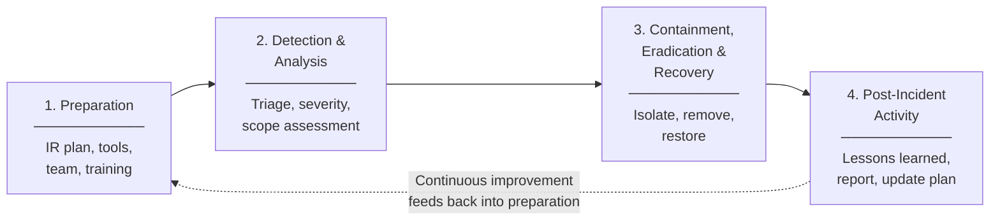
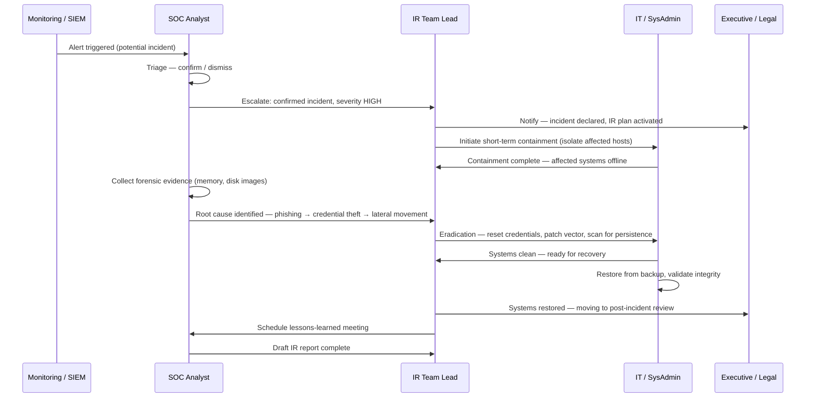

# Session 9: Incident Response Plans

## Learning Objectives

By the end of this session, you will be able to:

- Define the terms event, alert, and incident and explain how they differ
- Describe the NIST SP 800-61 incident response lifecycle and the purpose of each phase
- Explain the composition and roles of a Computer Incident Response Team (CIRT/CSIRT)
- Describe containment, eradication, and recovery strategies and when to apply each
- Explain the purpose of post-incident activity and lessons-learned reviews
- Reference the Australian NDB Scheme, ACSC reporting obligations, and Critical Infrastructure Act
- Describe how to structure a playbook for a specific incident type (e.g., ransomware)

---

## Presentation Materials

[:material-presentation: View Slides — Incident Response Overview](../slides-original/slide_53824515_1.md){ .md-button .md-button--primary }
[:material-presentation: View Slides — IR Plans and Playbooks](../slides-original/slide_55371412_1.md){ .md-button .md-button--primary }

---

## 1. What Is an Incident?

Security professionals use three related terms that are often confused:

| Term | Definition | Example |
|------|------------|---------|
| **Event** | Any observable occurrence in a system or network | A user logging in, a firewall blocking a connection |
| **Alert** | An event that a security tool has flagged as potentially significant | IDS alert for a port scan from an external IP |
| **Incident** | A confirmed or suspected violation of security policy, or an adverse event that threatens confidentiality, integrity, or availability | Confirmed ransomware infection on a file server |

Not every alert becomes an incident. Analysts triage alerts — investigating context, confirming or dismissing — before declaring an incident. Declaring an incident triggers a formal response process with defined responsibilities and notifications.

---

## 2. The Incident Response Lifecycle — NIST SP 800-61

The United States National Institute of Standards and Technology (NIST) Special Publication 800-61 provides the most widely used framework for computer security incident handling. It defines four phases:

### Phase 1: Preparation

Preparation is the most important phase — everything done before an incident determines how well the team will perform when one occurs.

Preparation activities include:

- Documenting the **IR plan** — roles, escalation paths, communication templates, legal obligations
- Developing **runbooks and playbooks** for common incident types (ransomware, phishing, data breach, DDoS)
- Maintaining a current **contact list** — internal team, legal, PR, executives, ACSC, law enforcement, cyber insurance broker
- **Pre-staging tools** — forensic workstations, write blockers, memory acquisition tools, network capture capability
- **Training and awareness** — ensuring all IR team members understand their roles
- Running **tabletop exercises** to test the plan without the pressure of a real incident

### Phase 2: Detection and Analysis

Incidents are detected through multiple channels:

- SIEM correlation rule triggers
- EDR/antivirus alert
- Help desk report from an end user
- External notification (ACSC, vendor, threat intelligence partner, law enforcement)
- Routine log review or threat hunting

Once a potential incident is identified, analysts perform **triage**:

1. Confirm the alert is not a false positive
2. Gather initial indicators (affected systems, timeline, attack vector)
3. Classify severity
4. Notify the appropriate stakeholders

**Severity Classification Example:**

| Severity | Criteria | Response SLA |
|----------|----------|-------------|
| **Critical** | Active ransomware, data exfiltration in progress, critical infrastructure compromise | Immediate — 24/7 response |
| **High** | Confirmed malware on critical server, suspected insider threat, C2 beacon detected | Respond within 1 hour |
| **Medium** | Phishing email opened but no payload executed, account compromise suspected | Respond within 4 hours |
| **Low** | Policy violation, reconnaissance scan, malware blocked by AV | Respond within 24 hours |

### Phase 3: Containment, Eradication, and Recovery

#### Containment

Containment limits the damage from an incident. There are two types:

- **Short-term containment** — immediate actions to stop the spread (isolating affected systems from the network, blocking malicious IPs, disabling compromised accounts)
- **Long-term containment** — measures applied while a clean recovery is prepared (creating a clean segment, applying temporary patches, increasing monitoring)

!!! warning "Evidence Preservation"
    Before making changes to a compromised system, preserve forensic evidence. Take a memory dump and disk image where possible. Courts and insurance claims may require forensic evidence collected in a chain-of-custody process. Turning a system off before imaging can destroy volatile evidence.

#### Eradication

Eradication removes the threat from the environment:

- Remove malware and malicious artefacts
- Close the vulnerability or attack vector that was exploited
- Reset compromised credentials
- Patch affected systems
- Verify no persistence mechanisms remain (scheduled tasks, registry run keys, new user accounts, backdoors)

#### Recovery

Recovery restores affected systems to normal, verified-clean operation:

- Restore from known-good backups (verify the backup pre-dates the compromise)
- Rebuild systems from scratch where trust cannot be re-established
- Validate system integrity before returning to production
- Monitor restored systems closely for signs of re-infection

### Phase 4: Post-Incident Activity

The lessons-learned phase transforms the incident into organisational improvement.

- Hold a **lessons-learned meeting** within two weeks of the incident closing, involving all key stakeholders
- Document findings in an **IR report** — timeline, root cause, impact, actions taken, recommendations
- Update **playbooks** based on what worked and what did not
- Review and improve detection rules in the SIEM
- Report to regulators if required (see Section 10)

---

## 3. IR Team Structure — CSIRT

A **Computer Security Incident Response Team (CSIRT)** or **Computer Incident Response Team (CIRT)** is the group responsible for managing security incidents.

| Role | Responsibilities |
|------|----------------|
| **IR Team Lead / Incident Commander** | Overall coordination of the response; decision-maker; executive communications |
| **Security Analyst** | Technical investigation, log analysis, indicator correlation |
| **Forensic Investigator** | Evidence collection, chain of custody, malware analysis |
| **System Administrator** | Implements containment actions (isolating hosts, blocking IPs, restoring from backup) |
| **Legal Counsel** | Advises on notification obligations, evidence preservation, law enforcement liaison |
| **Communications / PR** | Manages external communications, customer notifications, media statements |
| **Executive Sponsor** | Authorises major decisions (taking systems offline, engaging law enforcement, paying ransom) |

For organisations without a dedicated CSIRT, these roles may be filled by existing staff or augmented by a retained incident response firm.

---

## 4. Incident Response Sequence

---

## 5. IR Playbook — Ransomware Response

A **playbook** is a detailed, step-by-step procedure for responding to a specific incident type. Below is a condensed ransomware response playbook.

**Trigger**: Ransomware encryption detected on one or more systems.

**Step 1 — Detect and Triage**

- Identify affected hosts from EDR/SIEM alerts and user reports
- Determine the ransomware variant if possible (check ransom note, file extension, VirusTotal)
- Assess scope: how many systems are affected?

**Step 2 — Immediate Containment**

- Isolate affected hosts from the network immediately (pull cable or use EDR isolation feature)
- Identify and isolate any hosts that communicated with the initial victim (lateral movement candidates)
- Disable affected user accounts
- Block known command-and-control (C2) IP addresses and domains at the firewall

**Step 3 — Notify Stakeholders**

- Notify IR Team Lead, IT management, and executive sponsor
- Contact cyber insurance broker immediately — many policies require prompt notification
- If critical infrastructure or government systems are affected, notify the ACSC

**Step 4 — Preserve Evidence**

- Take memory dumps and disk images of affected systems before any remediation
- Capture network traffic logs, firewall logs, and SIEM events for the incident window
- Document chain of custody for all forensic evidence

**Step 5 — Assess Recovery Options**

- Determine if clean, pre-compromise backups are available
- Check backup integrity — some ransomware attacks destroy or encrypt backups
- Assess decryption options (law enforcement may have decryptors for some variants)

**Step 6 — Eradication and Recovery**

- Rebuild compromised systems from scratch or restore from verified clean backups
- Reset all credentials that existed on or accessed compromised systems
- Patch the initial access vector before returning systems to production
- Verify no persistence mechanisms remain

**Step 7 — Post-Incident**

- Conduct lessons-learned review
- Report to ACSC and regulators as required
- Update the playbook with observations from this incident

!!! info "Paying the Ransom"
    Paying a ransom does not guarantee data recovery and may violate sanctions regulations if the ransomware group is on a government sanctions list. It also signals willingness to pay, potentially making the organisation a repeat target. The decision must involve legal counsel and the executive team.

---

## 6. Australian Context

### Notifiable Data Breaches (NDB) Scheme

Under the **Privacy Act 1988 (Cth)**, the NDB Scheme requires organisations covered by the Act to notify the Office of the Australian Information Commissioner (OAIC) and affected individuals when an eligible data breach occurs.

An **eligible data breach** has occurred when:

1. There is unauthorised access to, or disclosure of, personal information
2. A reasonable person would conclude this is likely to result in **serious harm** to affected individuals
3. The organisation has been unable to prevent the serious harm

Notification must occur **as soon as practicable**, generally within 30 days of becoming aware of the breach.

### ACSC Incident Reporting

The **Australian Cyber Security Centre (ACSC)** encourages all organisations to report significant cyber incidents at [cyber.gov.au](https://www.cyber.gov.au). Reporting is mandatory for:

- Critical infrastructure operators under the **Security of Critical Infrastructure Act 2018 (Cth)** (SOCI Act)
- Australian Government agencies
- Organisations in sectors regulated under industry-specific legislation

### Security of Critical Infrastructure Act (SOCI)

The SOCI Act 2018 (amended 2022) imposes obligations on operators of critical infrastructure assets across 11 sectors (electricity, water, communications, financial services, health, etc.) including:

- Mandatory reporting of serious cyber incidents to the ACSC within 12 hours (critical) or 72 hours (significant)
- Implementation of a Critical Infrastructure Risk Management Programme (CIRMP)
- Potential for government intervention in response to catastrophic cyber attacks

---

## 7. Tabletop Exercises

A **tabletop exercise** is a discussion-based simulation of an incident scenario. Participants walk through how they would respond to a hypothetical scenario without performing any real actions — making it low-risk and high-value for testing the IR plan.

**Why run tabletop exercises?**

- Reveals gaps in the IR plan before a real incident
- Ensures team members know their roles and contacts
- Tests communication flows between technical, management, and legal teams
- Identifies decisions that need pre-authorisation (e.g., who can authorise taking systems offline?)
- Builds muscle memory and confidence

**Example tabletop scenario**: *"It is 2 AM on a Friday. An automated SIEM alert fires indicating that 50 GB of data has been exfiltrated from your HR database server to an external IP over the past 3 hours. Your IT manager is on leave. What do you do?"*

---

## Key Takeaways

- An incident is a confirmed adverse security event; not every alert is an incident — triage determines which are.
- The NIST SP 800-61 lifecycle provides four phases: Preparation → Detection & Analysis → Containment, Eradication & Recovery → Post-Incident Activity.
- Preparation — IR plan, playbooks, pre-staged tools, and tabletop exercises — determines how well a team responds under pressure.
- Evidence preservation must happen before remediation; forensic images and chain-of-custody documentation are critical for legal and insurance purposes.
- In Australia, the NDB Scheme, ACSC reporting, and the SOCI Act impose mandatory notification obligations for eligible incidents.
- Playbooks provide step-by-step procedures for specific incident types — ransomware, phishing, data breach — and remove decision paralysis during a crisis.

---

## Review Questions

1. Explain the difference between an event, an alert, and an incident. Give a specific example of each in the context of a corporate network.
2. Walk through the four phases of the NIST SP 800-61 incident response lifecycle. Why is the Preparation phase considered the most important?
3. A ransomware attack has encrypted 30 servers in your organisation's production environment. Using the containment–eradication–recovery framework, describe the specific steps you would take in each stage.
4. Under the Australian NDB Scheme, what conditions must be met before an organisation is required to notify the OAIC and affected individuals? What is the notification timeframe?
5. Why are tabletop exercises valuable, and what makes a good tabletop scenario? Describe a scenario you would use to test an organisation's readiness for a cloud account compromise.

---

## Discussion Points

- Should organisations that pay ransoms be required to disclose this publicly? What are the arguments for and against mandatory disclosure?
- How does the SOCI Act change the security obligations for operators of critical infrastructure? Is 12 hours a realistic timeframe for reporting a major incident?
- After a major incident, what makes a lessons-learned process genuinely useful rather than a blame exercise? What cultural conditions are needed?
