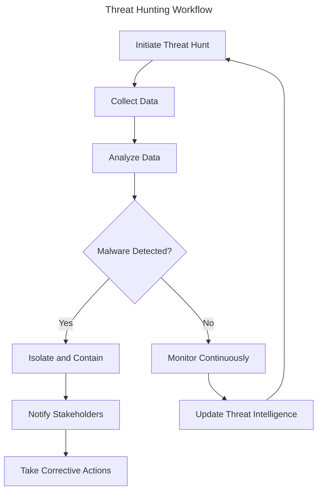
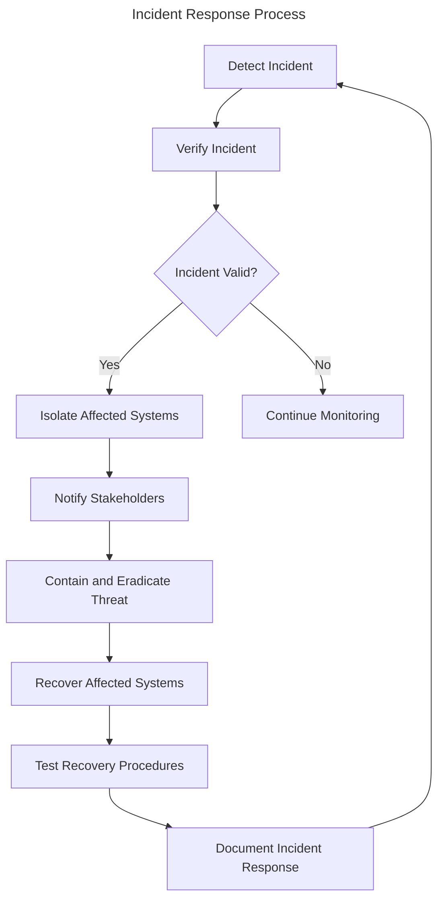

# Session 11: Advanced Threat Hunting and Response
!!! note
    **Threat Hunting and Response** is a critical process that aims to proactively identify and respond to advanced and targeted attacks within the organisational network.
!!! tip
    A successful threat hunting strategy involves continuous monitoring of network traffic, log analysis, and the use of threat intelligence to identify potential security threats.
!!! success
    By implementing effective threat hunting and response processes, organisations can significantly improve their ability to identify and mitigate potential security threats in real-time.

---

# 11.1 Introduction to Advanced Threat Hunting
!!! note
    **Advanced Threat Hunting** involves the use of various techniques and tools to identify and investigate potential security threats in a proactive and systematic manner.
!!! example
    ```python
from typing import Tuple
def network_traffic_analysis(packet_capture: Tuple[str, str, str]) -> bool:
    """
    Analyzes network traffic data to identify potential malware activity
    Args:
        packet_capture (Tuple[str, str, str]): Network traffic packet capture data
    Returns:
        bool: True if malware activity detected, False otherwise
    """
    # Implement network traffic analysis function here
    pass
# Example usage:
packet_capture = ("192.168.1.1", "192.168.1.2", "TCP")
if network_traffic_analysis(packet_capture):
    print("Malware activity detected")
else:
    print("Network traffic analysis complete")
```
!!! warning
    **Insufficient Network Traffic Analysis** can lead to delayed identification of security threats, allowing attackers to compromise the organisational network for extended periods.

---

# 11.2 Identifying and Investigating Advanced Threats
!!! info
    **Identifying Advanced Threats** involves the analysis of various data sources to identify potential security threats, including logs, network traffic, and endpoint data.
!!! tip
    **Best Practices for Identifying Advanced Threats** include:
    * Continuous monitoring of network traffic and logs
    * Implementing threat intelligence feeds for real-time threat information
    * Conducting regular vulnerability scans and penetration testing
    * Ensuring endpoint security measures are up-to-date and configured correctly
!!! example
    ```bash
# Example usage of a threat hunting tool
apt-get install burpsuite
```

---

# 11.3 Effective Response to Advanced Threats
!!! danger
    **Delayed Response to Advanced Threats** can result in significant damage to organisational reputation, data breaches, and financial losses.
!!! tip
    **Best Practices for Responding to Advanced Threats** include:
    * Implementing incident response plans and procedures
    * Ensuring timely communication with stakeholders
    * Conducting thorough post-incident analysis to identify root causes
    * Implementing corrective actions to prevent similar incidents in the future
!!! example
    ```sql
-- Example usage of a database query to retrieve incident data
SELECT *
FROM incident_logs
WHERE severity = 'Critical'
ORDER BY timestamp DESC;
```

---

# 11.4 Implementing Advanced Threat Hunting and Response
!!! success
    **Effective Implementation of Advanced Threat Hunting and Response** requires a combination of people, process, and technology.
!!! tip
    **Best Practices for Implementing Advanced Threat Hunting and Response** include:
    * Building a skilled and knowledgeable team to identify and respond to advanced threats
    * Developing and implementing threat hunting and response procedures
    * Integrating threat hunting and response tools and technologies into existing security frameworks
    * Conducting regular training and simulation exercises to improve response capabilities

---

# 11.5 Review Questions
!!! question
    1. What is the primary goal of advanced threat hunting?
    2. What is the difference between threat hunting and incident response?
    3. What are some best practices for identifying and investigating advanced threats?
    4. How can organisations ensure effective response to advanced threats?
    5. What is the importance of implementing advanced threat hunting and response capabilities?

---

# 11.6 Discussion Points
!!! question
    1. What are some common challenges faced by organisations when implementing advanced threat hunting and response capabilities?
    2. How can organisations balance the need for advanced threat hunting and response capabilities with limited resources and budgets?
    3. What are some emerging trends and technologies in advanced threat hunting and response that organisations should be aware of?
    4. How can organisations measure the effectiveness of their advanced threat hunting and response capabilities?

---

# 11.7 Key Takeaways
* **Advanced Threat Hunting and Response** is a critical process that aims to proactively identify and respond to advanced and targeted attacks within the organisational network.
* **Identifying Advanced Threats** involves the analysis of various data sources, including logs, network traffic, and endpoint data.
* **Effective Response to Advanced Threats** requires a combination of people, process, and technology.
* **Best Practices for Identifying and Investigating Advanced Threats** include continuous monitoring, threat intelligence feeds, and regular vulnerability scans.
* **Best Practices for Responding to Advanced Threats** include incident response plans, timely communication, and post-incident analysis.
* **Effective Implementation of Advanced Threat Hunting and Response** requires a skilled team, well-documented procedures, and integrated tools and technologies.

---

# Diagrams



---

