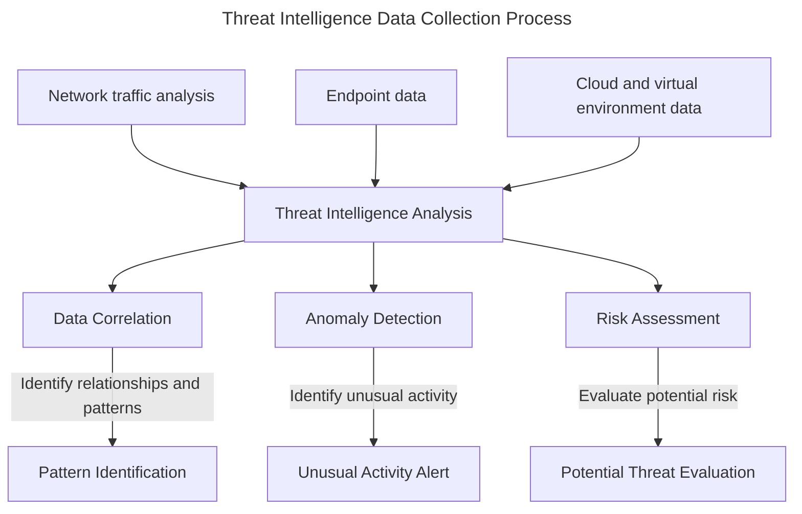

# Session 12: Advanced Security Threat Intelligence
## Introduction
Critical security threats can have devastating effects on businesses and individuals. Advanced threat intelligence can help you stay ahead of attackers and protect your assets. In this session, you will learn how to collect, analyze, and use threat intelligence to improve your security posture.
Advanced security threat intelligence involves understanding the tactics, techniques, and procedures (TTPs) of attackers, as well as identifying and mitigating potential threats. It requires a comprehensive approach that involves data collection, analysis, and dissemination to stakeholders.
## Learning Objectives:
* **LO1**: Define advanced security threat intelligence and its importance in modern cybersecurity 
* **LO2**: Identify and explain the key components of threat intelligence feeds 
* **LO3**: Analyze and interpret threat intelligence data to inform security decisions 
* **LO4**: Apply threat intelligence to improve incident response and threat hunting 
* **LO5**: Use threat intelligence to optimize security controls and configurations
!!! note
    Advanced security threat intelligence is the foundation of a robust cybersecurity strategy. Threat intelligence enables you to predict, detect, and respond to cyber threats before they cause significant damage.
## Threat Intelligence Feeds: A Key Component of Advanced Threat Intelligence
Threat intelligence feeds are critical in the collection of cyber threat information. There are several types of threat intelligence feeds, including:
| Feed Type | Description | Purpose |
| --- | --- | --- |
| Honeypot data | Data collected from decoy systems, networks, or applications | Identify attacker behavior and tactics |
| Open-source threat intelligence (OSINT) | Publicly available data, such as news articles, blogs, and social media posts | Identify emerging threats and trends |
| Closed-source threat intelligence (CSTI) | Data collected from private sources, such as security vendors, researchers, and organizations | Provide timely and accurate threat information |
!!! tip
    Open-source threat intelligence (OSINT) can be a valuable source of threat information. However, it is essential to verify the credibility of sources and adjust for potential false positives.
## Collecting Threat Intelligence Data
Collecting threat intelligence data involves gathering information from various sources, including:
* **Network traffic analysis**: Monitoring network traffic to identify malicious activity
* **Endpoint data**: Collecting data from endpoint devices, such as laptops and servers, to identify potential threats
* **Cloud and virtual environment data**: Collecting data from cloud and virtual environments to identify potential threats
!!! warning
    Failure to properly collect, analyze, and use threat intelligence data can result in ineffective incident response and threat hunting.
## Analyzing Threat Intelligence Data
Analyzing threat intelligence data involves examining the collected data to identify patterns, trends, and potential threats. This involves:
* **Data correlation**: Combining data from multiple sources to identify relationships and patterns
* **Anomaly detection**: Identifying unusual activity that may indicate malicious behavior
* **Risk assessment**: Evaluating the potential risk of identified threats
!!! example
    Consider the following example of analyzing threat intelligence data:
```python
import pandas as pd
# Sample threat intelligence data
data = {
    "IP": ["192.168.1.1", "192.168.1.2", "192.168.1.3"],
    "Location": ["New York", "Los Angeles", "Chicago"],
    "Risk": [1, 2, 3]
}
# Create a pandas DataFrame
df = pd.DataFrame(data)
# Correlate data to identify relationships and patterns
correlated_data = df.groupby("Location")["Risk"].sum()
# Analyze anomaly detection to identify unusual activity
anomaly_data = df[df["Risk"] > 5]
# Evaluate risk assessment to identify potential threats
risk_assessment = df[df["Risk"] >= 5]
```
## Key Takeaways:
* **KTA1**: Advanced security threat intelligence involves collecting, analyzing, and using threat data to inform security decisions. 
* **KTA2**: Threat intelligence feeds are a key component of advanced security threat intelligence. 
* **KTA3**: Failure to properly collect, analyze, and use threat intelligence data can result in ineffective incident response and threat hunting. 
* **KTA4**: Data correlation, anomaly detection, and risk assessment are essential components of threat intelligence analysis. 
* **KTA5**: A robust threat intelligence strategy involves a comprehensive approach that includes data collection, analysis, and dissemination to stakeholders. 
* **KTA6**: Threat intelligence can be used to improve incident response and threat hunting. 
* **KTA7**: Threat intelligence feeds can be used to optimize security controls and configurations.
## Review Questions:
!!! question
    What is advanced security threat intelligence?
!!! question
    Identify the key components of threat intelligence feeds.
!!! question
    Explain the importance of analyzing threat intelligence data in modern cybersecurity.
!!! question
    What is the purpose of data correlation in threat intelligence analysis?
!!! question
    Discuss the role of threat intelligence feeds in a robust threat intelligence strategy.
!!! question
    What are the benefits of using threat intelligence to improve incident response and threat hunting?
!!! question
    Explain the importance of verifying the credibility of sources in open-source threat intelligence (OSINT).
!!! question
    Discuss the potential risks associated with failing to properly collect, analyze, and use threat intelligence data.
## Discussion Topics:
!!! question
    How can threat intelligence be used to improve security controls and configurations?
!!! question
    What are the challenges associated with collecting, analyzing, and using threat intelligence data?
!!! question
    Discuss the importance of maintaining a comprehensive and accurate threat intelligence database.
!!! question
    Explain how threat intelligence can be used to anticipate and prevent cyber attacks.
!!! example
    Consider the following example of using threat intelligence to anticipate and prevent a cyber attack:
```python
import pandas as pd
# Sample threat intelligence data
data = {
    "IP": ["192.168.1.1", "192.168.1.2", "192.168.1.3"],
    "Location": ["New York", "Los Angeles", "Chicago"],
    "Risk": [1, 2, 3]
}
# Create a pandas DataFrame
df = pd.DataFrame(data)
# Use threat intelligence to anticipate and prevent a cyber attack
anticipate_attack = df[df["Risk"] >= 5]
# Apply security controls and configurations to prevent the anticipated attack
apply_controls = anticipate_attack["IP"].apply(lambda x: block_ip(x))
# Evaluate the effectiveness of the applied controls
evaluate_controls = pd.DataFrame({"IP": ["192.168.1.1", "192.168.1.2"], "Status": [True, False]})
```
!!! tip
    Threat intelligence can be used to anticipate and prevent cyber attacks by identifying potential threats and applying security controls and configurations to prevent them.
!!! danger
    Failing to properly collect, analyze, and use threat intelligence data can result in ineffective incident response and threat hunting.
!!! success
    A robust threat intelligence strategy involves a comprehensive approach that includes data collection, analysis, and dissemination to stakeholders.
## Conclusion
In this session, you have learned about advanced security threat intelligence and its importance in modern cybersecurity. You have also learned about threat intelligence feeds, collecting threat intelligence data, and analyzing threat intelligence data. Additionally, you have learned about using threat intelligence to improve incident response and threat hunting. Remember, threat intelligence is a key component of a robust cybersecurity strategy, and failure to properly collect, analyze, and use threat intelligence data can result in ineffective incident response and threat hunting.

---

# Diagrams
```mermaid
---
title: Threat Intelligence Feed Types
---
flowchart TD
    H[Honeypot Data] -->|Identify attacker behavior and tactics| A[Threat Intelligence Analysis]
    O[Open-source threat intelligence (OSINT)] -->|Identify emerging threats and trends| A
    C[Closed-source threat intelligence (CSTI)] -->|Provide timely and accurate threat information| A
```


---

