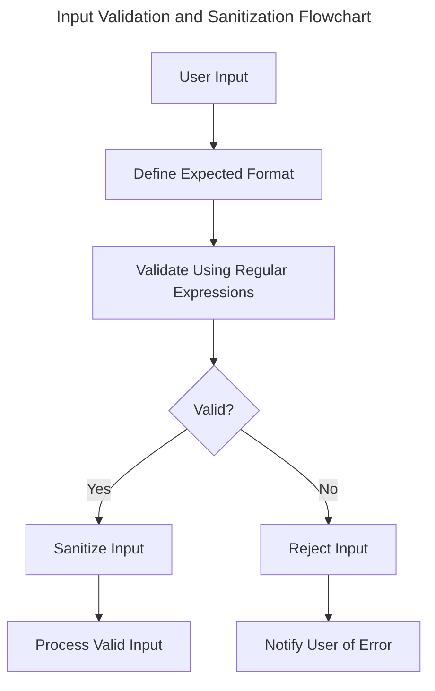
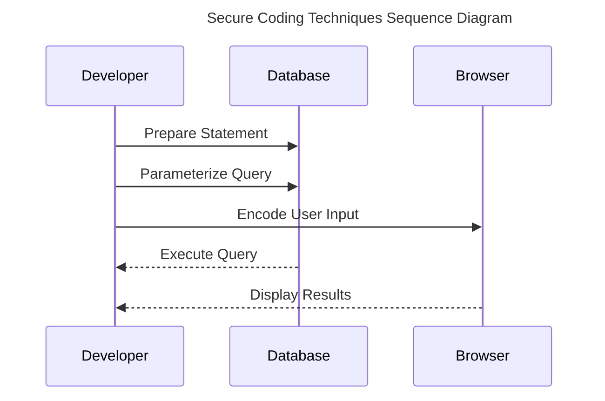

# Session 13: Secure Coding Practices
!!! note
    Secure coding practices are essential for preventing common web application vulnerabilities and maintaining a secure computing environment.

---

# Introduction
In this session, we will explore the importance of secure coding practices in software development. Secure coding involves designing and implementing software that minimizes the risk of security breaches and vulnerabilities. This is achieved by identifying and addressing potential security risks during the software development lifecycle. By following secure coding practices, developers can ensure that their applications are secure, reliable, and maintainable.

---

# Learning Objectives
* Implement input validation and sanitization to prevent SQL injection and cross-site scripting (XSS) attacks
* Use secure coding techniques to prevent common web application vulnerabilities
* Identify and address potential security risks in software development
* Understand the importance of secure coding practices in maintaining a secure computing environment
* Apply secure coding principles to prevent data breaches and maintain system integrity

---

# Section 1: Input Validation and Sanitization
!!! tip
    Input validation and sanitization are critical components of secure coding practices.
Input validation involves checking user input against a set of predetermined rules to ensure it meets the expected format. Sanitization is a process that removes or modifies malicious input to prevent attacks.
## Step-by-Step Procedure
1. Define the expected input format
2. Validate input against predefined rules using regular expressions or input validation libraries
3. Sanitize input to remove malicious characters or patterns
!!! example
    ```python
import re
def validate_input(input_string):
    # Define expected input format
    pattern = r'^[a-zA-Z0-9]+$'
    # Perform input validation using regular expressions
    if re.match(pattern, input_string):
        return True
    else:
        return False
```

---

# Section 2: Secure Coding Techniques
!!! warning
    Failing to follow secure coding techniques can result in devastating security breaches.
Secure coding techniques include the use of:
* Prepared statements to prevent SQL injection attacks
* Parameterized queries to prevent cross-site scripting (XSS) attacks
* Encoding user input to prevent malicious characters from being executed
## Step-by-Step Procedure
1. Use prepared statements to execute database queries
2. Parameterize queries to prevent user input from being executed as code
3. Encode user input to prevent malicious characters from being executed as code
!!! example
    ```sql
-- Using prepared statements to prevent SQL injection attacks
$stmt = $db->prepare("SELECT * FROM table WHERE name = :name");
$stmt->bindParam(':name', $input);
$stmt->execute();
-- Parameterizing queries to prevent cross-site scripting (XSS) attacks
$query = "SELECT * FROM table WHERE username = :username";
$params = array(':username' => $input);
$stmt = $db->prepare($query);
$stmt->bindParam(':username', $params);
$stmt->execute();
```

---

# Section 3: Secure Coding Best Practices
!!! tip
    Follow these best practices to ensure secure coding practices are implemented:
* Use secure coding guidelines to ensure consistency across projects
* Use code analysis tools to identify potential security vulnerabilities
* Follow best practices for secure coding, such as using secure libraries and frameworks
* Implement secure coding principles to prevent data breaches and maintain system integrity
## Step-by-Step Procedure
1. Develop and enforce secure coding guidelines
2. Use code analysis tools to identify potential security vulnerabilities
3. Follow best practices for secure coding
4. Implement secure coding principles to prevent data breaches and maintain system integrity

---

# Diagrams



---

# Key Takeaways
* Input validation and sanitization are critical components of secure coding practices
* Secure coding techniques are essential for preventing common web application vulnerabilities
* Secure coding best practices ensure consistency and maintainability of code
* Secure coding principles prevent data breaches and maintain system integrity

---

# Review Questions
!!! question
    1. What is the purpose of input validation and sanitization in secure coding practices?
    !!! question
    2. How can prepared statements and parameterized queries prevent common web application vulnerabilities?
    !!! question
    3. What are some secure coding best practices that ensure consistency and maintainability of code?

---

# Discussion Points
!!! question
    1. What are some common web application vulnerabilities that can be prevented through secure coding practices?
    !!! question
    2. How can secure coding principles prevent data breaches and maintain system integrity?
    !!! question
    3. What are some code analysis tools that can be used to identify potential security vulnerabilities?

---

