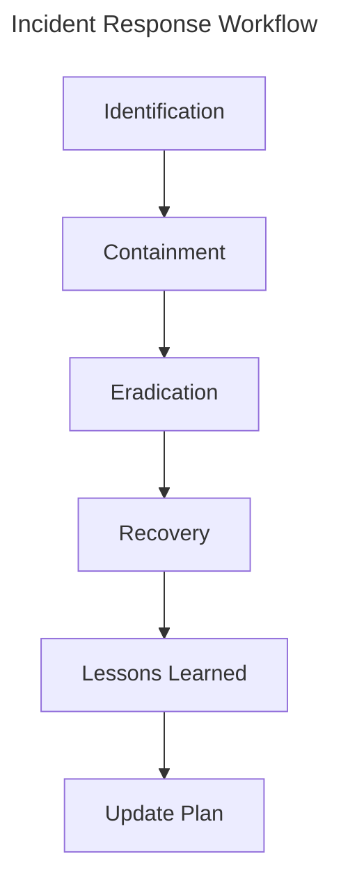
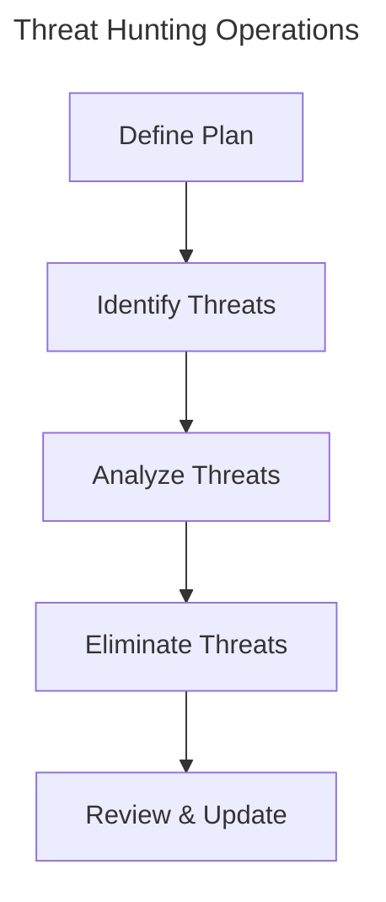

# Advanced Threat Analysis Techniques
======================================
!!! note
    In this session, we will explore advanced threat analysis techniques to enhance your cybersecurity skills and stay ahead of emerging threats.
!!! tip
    A thorough understanding of threat analysis is crucial in cybersecurity, as it enables you to identify potential vulnerabilities and implement effective defensive measures.
!!! success
    By the end of this session, you will be able to apply advanced threat analysis techniques to identify and mitigate emerging threats, thereby strengthening your organization's cybersecurity posture.

---

# Introduction
Threat analysis is a critical component of cybersecurity that involves identifying, assessing, and mitigating potential threats to an organization's IT systems, networks, and data. Advanced threat analysis techniques are essential in today's ever-evolving threat landscape, where new and sophisticated attacks emerge daily.
In this session, we will delve into advanced threat analysis techniques that will empower you to stay ahead of emerging threats and enhance your organization's cybersecurity resilience. We will cover topics such as threat intelligence, incident response, and threat hunting, along with practical examples and case studies.

---

# Learning Objectives
* Identify and assess emerging threats to an organization's IT systems and networks
* Apply threat intelligence to inform cybersecurity decision-making
* Develop effective incident response plans to mitigate potential threats
* Conduct threat hunting operations to identify and eliminate hidden threats
* Analyze and improve cybersecurity policies and procedures to enhance organizational resilience
## Threat Intelligence
---------------------
!!! warning
    Threat intelligence is a powerful tool, but it must be used judiciously to avoid creating unnecessary noise and distractions.
!!! example
    ```python
import requests
def fetch_threat_intelligence():
    url = "https://api.threatintelligence.org/v2/alerts"
    params = {"limit": 10, "offset": 0}
    response = requests.get(url, params=params)
    return response.json()["alerts"]
alerts = fetch_threat_intelligence()
for alert in alerts:
    print(alert["title"])
```
## Incident Response
----------------------
!!! tip
    Effective incident response plans must be tailored to the specific needs and vulnerabilities of an organization.
## Step-by-Step Incident Response Procedure
1. **Identification**: Identify the potential threat and assess its impact
2. **Containment**: Contain the threat to prevent further spread
3. **Eradication**: Eradicate the threat from the affected systems
4. **Recovery**: Recover the affected systems and data
5. **Lessons Learned**: Document lessons learned and improve incident response plans
!!! example
    ```bash
#!/bin/bash
# Define variables
THREAT_ID="12345"
INCIDENT_RESPONSE_PLAN="incident_response_plan.json"
# Contain the threat
echo "Containing the threat..."
# Eradicate the threat
echo "Eradiating the threat..."
# Recover the affected systems
echo "Recovering the affected systems..."
# Document lessons learned
echo "Documenting lessons learned..."
# Update incident response plan
echo "Updating incident response plan..."
```
## Threat Hunting
------------------
!!! danger
    Threat hunting operations can be resource-intensive and require careful planning to avoid disrupting critical systems.
!!! example
    ```sql
-- Define variables
THREAT_HUNTING_PLAN="threat_hunting_plan.sql"
-- Identify potential threats
SELECT * FROM threats WHERE severity > 5;
-- Analyze potential threats
SELECT * FROM threats WHERE type = 'malware';
-- Eliminate identified threats
DELETE FROM threats WHERE id = 12345;
```

---

# Diagrams



---

# Key Takeaways
* Advanced threat analysis techniques are essential in cybersecurity to stay ahead of emerging threats.
* Threat intelligence, incident response, and threat hunting are critical components of advanced threat analysis.
* Effective incident response plans must be tailored to the specific needs and vulnerabilities of an organization.
* Threat hunting operations can be resource-intensive and require careful planning to avoid disrupting critical systems.
* Regularly updating and refining incident response plans and threat intelligence resources is crucial to maintaining organizational resilience.

---

# Review Questions
-------------------
!!! question
    What are the key components of advanced threat analysis techniques?
!!! question
    How do you assess the severity of a threat?
!!! question
    What is the primary purpose of incident response plans?
!!! question
    How do you identify and eliminate potential threats during threat hunting operations?
!!! question
    What benefits do threat intelligence and incident response plans provide to an organization's cybersecurity posture?
!!! question
    How do you document lessons learned and update incident response plans?

---

# Discussion Points
--------------------
!!! question
    What are some best practices for maintaining threat intelligence resources and incident response plans?
!!! question
    How do you balance the need for threat hunting operations with the risk of disrupting critical systems?
!!! question
    What tools and technologies can you use to support threat hunting operations?
!!! question
    How do you measure the effectiveness of incident response plans and threat intelligence resources?
!!! question
    What are some common pitfalls to avoid when developing incident response plans and threat intelligence resources?

---

