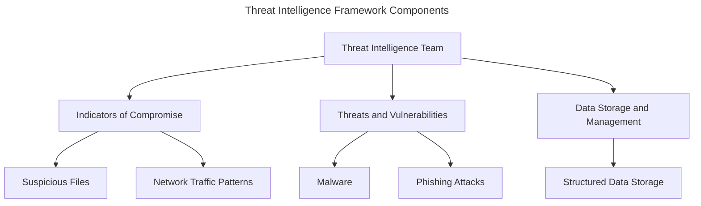
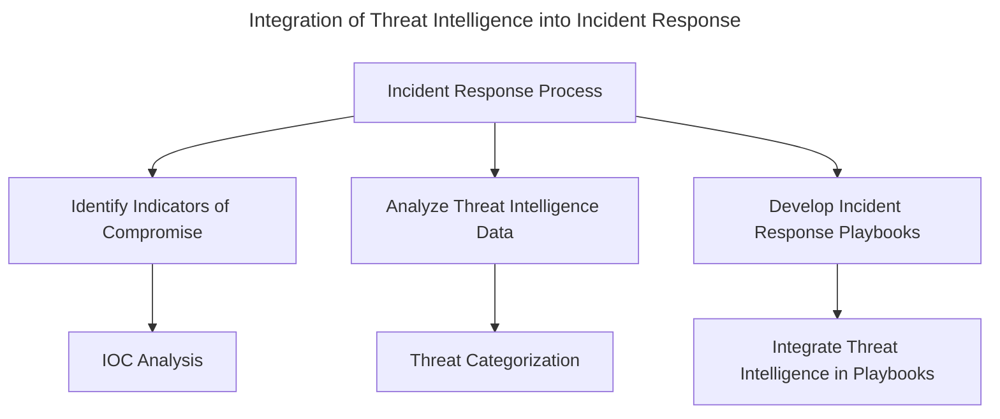

## Session 2: Cybersecurity Threat Intelligence
#### Introduction
Cybersecurity threat intelligence is the process of collecting, analyzing, and disseminating information about potential security threats. This information can help organizations and individuals protect themselves against cyber attacks and improve their overall security posture. In this session, we will explore the critical components of cybersecurity threat intelligence and how it can be used to prevent and respond to cyber threats.
Cybersecurity threat intelligence is not a new concept, but its importance has grown significantly in recent years. As the threat landscape evolves, organizations and individuals must be able to adapt quickly to new threats and vulnerabilities. Cybersecurity threat intelligence provides the necessary information and insights to make informed decisions about security investments, risk management, and incident response.
#### Learning Objectives
* Define cybersecurity threat intelligence and its components
* Identify sources and methods for collecting threat intelligence
* Analyze and interpret threat intelligence data
* Develop a threat intelligence framework for organizations
* Integrate threat intelligence into incident response and risk management processes
#### Threat Intelligence Components
!!! info
    Threat intelligence consists of three main components: indicators of compromise, threats, and vulnerabilities.
!!! warning
    Indicators of compromise (IOCs) are signs that a system or network has been compromised. They can include suspicious files, network traffic patterns, or other indicators that suggest a potential security incident.
!!! example
    ```bash
    # Example IOC: Network traffic pattern
    # Source IP: 192.168.1.100
    # Destination IP: 8.8.8.8
    # Protocol: TCP
    # Port: 22
    ```
* Threats: These are the specific actions or events that pose a threat to an organization's security. Examples of threats include malware, phishing attacks, and denial-of-service (DoS) attacks.
* Vulnerabilities: These are weaknesses in software, hardware, or human behavior that can be exploited by threats. Examples of vulnerabilities include outdated software, weak passwords, and insecure configurations.
!!! tip
    Regularly scan your systems and networks for vulnerabilities and patch them promptly to prevent exploitation by threats.
!!! danger
    Ignoring vulnerabilities can lead to significant security risks and potentially severe consequences.
#### Threat Intelligence Framework
A threat intelligence framework is a structured approach to collecting, analyzing, and disseminating threat intelligence data. A framework should include the following components:
* Threat intelligence team: This team should be responsible for collecting, analyzing, and disseminating threat intelligence data.
* Indicators of compromise: This includes identifying and classifying IOCs, such as suspicious files, network traffic patterns, and other indicators that suggest a potential security incident.
* Threats and vulnerabilities: This includes identifying and categorizing threats and vulnerabilities, such as malware, phishing attacks, and DoS attacks.
* Data storage and management: This includes storing and managing threat intelligence data in a structured and accessible manner.
!!! example
    ```python
    # Example threat intelligence framework
    from threat_intelligence import ThreatIntelligence
    threat_intelligence = ThreatIntelligence()
    # Collect IOCs
    iocs = threat_intelligence.get_ioCs()
    # Analyze IOCs
    for ioc in iocs:
        print(f"IOC: {ioc}")
    # Categorize threats and vulnerabilities
    threats = threat_intelligence.get_threats()
    vulnerabilities = threat_intelligence.get_vulnerabilities()
    # Store and manage data
    threat_intelligence.store_data(threats, vulnerabilities)
    ```
#### Integrating Threat Intelligence into Incident Response
Threat intelligence can be integrated into incident response processes to improve response times and effectiveness. This includes:
* Identifying indicators of compromise and analyzing threat intelligence data to inform incident response efforts.
* Using threat intelligence to identify potential threats and vulnerabilities.
* Developing incident response playbooks that incorporate threat intelligence.
!!! success
    Integrating threat intelligence into incident response processes can lead to faster and more effective incident response and reduced business disruption.
!!! question
    How can threat intelligence be integrated into incident response processes?
#### Key Takeaways
* Cybersecurity threat intelligence is the process of collecting, analyzing, and disseminating information about potential security threats.
* Threat intelligence consists of indicators of compromise, threats, and vulnerabilities.
* A threat intelligence framework is a structured approach to collecting, analyzing, and disseminating threat intelligence data.
* Threat intelligence can be integrated into incident response processes to improve response times and effectiveness.
#### Review Questions
!!! question
    What is cybersecurity threat intelligence and its components?
!!! question
    How can threat intelligence be integrated into incident response processes?
!!! question
    What are indicators of compromise and how can they be analyzed?
!!! question
    What are threats and vulnerabilities and how can they be identified and categorized?
!!! question
    How can a threat intelligence framework be developed and implemented?
#### Discussion Points
!!! question
    What are the benefits and challenges of implementing a threat intelligence program?
!!! question
    How can threat intelligence be used to improve incident response and risk management processes?
!!! question
    What are some best practices for integrating threat intelligence into incident response processes?
!!! question
    How can threat intelligence be used to improve security awareness and training programs?
!!! question
    What are some potential security risks and consequences of ignoring vulnerabilities?

---

# Diagrams



---

