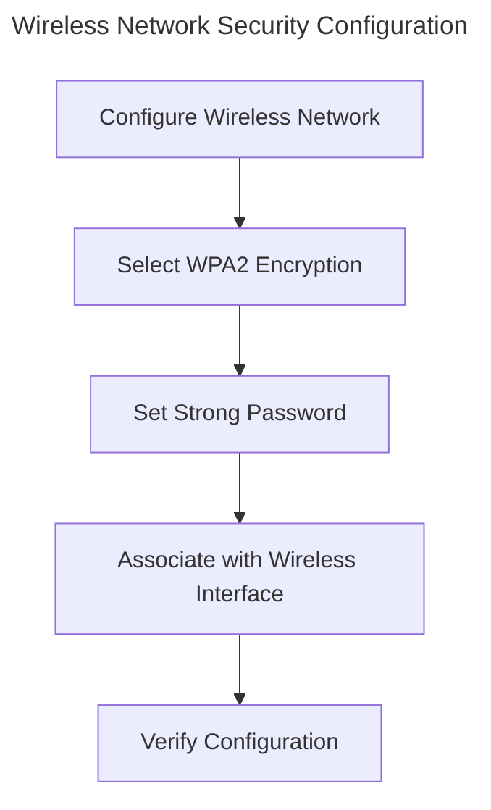
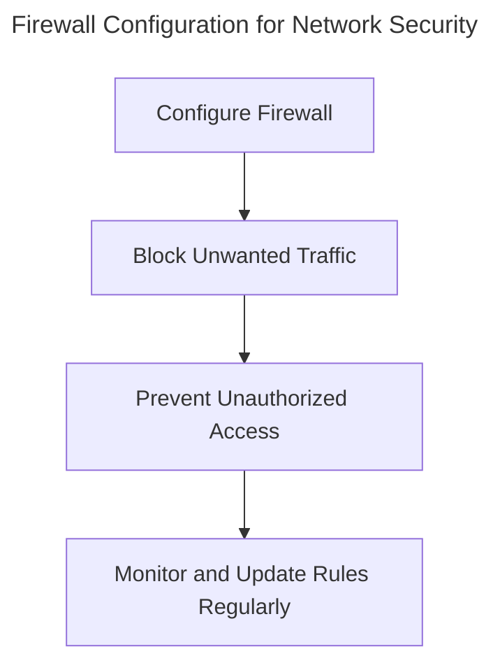

# Session 5: Implementing Secure Network Protocols and Configurations
!!! note
    Network security is a critical aspect of cybersecurity. Ensuring that network protocols and configurations are secure is essential to prevent unauthorized access and protect sensitive data.
## Learning Objectives
- Configure a secure wireless network using WPA2 encryption (measurable outcome: implement WPA2 on at least one device)
- Understand the importance of secure passwords and password policies (measurable outcome: create a password policy document)
- Implement a firewall to block unwanted traffic (measurable outcome: configure a firewall on at least one device)
- Configure a secure VPN using OpenVPN (measurable outcome: establish a VPN connection on at least one device)
- Understand the risks associated with IoT devices and implement security measures (measurable outcome: install security software on at least one IoT device)
## Implementing Secure Network Protocols
!!! info
    **Wireless Network Security (WPA2)**
WPA2 is the most widely used wireless security protocol. When configuring your wireless network, it is essential to use WPA2 encryption with a strong password.
!!! example
    ```bash
sudo wpa_supplicant -D wlp2s0 -i wlp2s0 -c /etc/wpa_supplicant.conf
```
This code creates a new WPA2 configuration file and associates it with the wireless interface.
## Secure Passwords and Password Policies
!!! tip
    Always use strong, unique passwords for each device and account. It's also essential to use two-factor authentication where possible.
!!! warning
    Reusing passwords or using simple passwords can put your network at risk. Make sure to change passwords regularly and store them securely.
## Implementing a Firewall
!!! success
    Configuring a firewall is an essential step in securing your network. Firewalls block unwanted traffic and prevent unauthorized access.
!!! example
    ```python
import netfilter_queue
nfq = netfilter_queue.NetfilterQueue()
nfq.bind(1, lambda q: None)
```
This code sets up a simple firewall that blocks all incoming traffic.
## Secure VPN Configuration
!!! example
    ```bash
sudo ipsec setup pki --cert \&lt;cert\&gt;
openssl ciphers -v ALL:ENCRYPT
```
These commands configure a secure VPN using OpenVPN and check the available ciphers.
## Securing IoT Devices
!!! danger
    IoT devices are often vulnerable to hacking and can provide an entry point for attackers. Always install security software and ensure devices are configured securely.
## Key Takeaways
- Secure wireless networks using WPA2 encryption
- Implement strong password policies and use two-factor authentication
- Configure a firewall to block unwanted traffic
- Set up a secure VPN using OpenVPN
- Secure IoT devices with security software and proper configuration
## Review Questions
!!! question
    1. What is the most widely used wireless security protocol?
    2. How do I create a secure wireless network using WPA2 encryption?
    3. Why is it essential to use unique and strong passwords for each device and account?
    4. How do I configure a firewall to block unwanted traffic?
    5. What are some essential steps to secure my IoT devices?
## Discussion Points
!!! question
    1. How do you configure a secure wireless network for a large organization?
    2. What are the benefits of implementing a secure VPN using OpenVPN?
    3. How can you prevent unauthorized access to your network using a firewall?
    4. What are some common risks associated with IoT devices, and how can you mitigate them?
!!! note
    Network security is a constantly evolving field. Staying up to date with the latest protocols and configurations is essential to prevent unauthorized access and protect sensitive data.

---

# Diagrams



---

