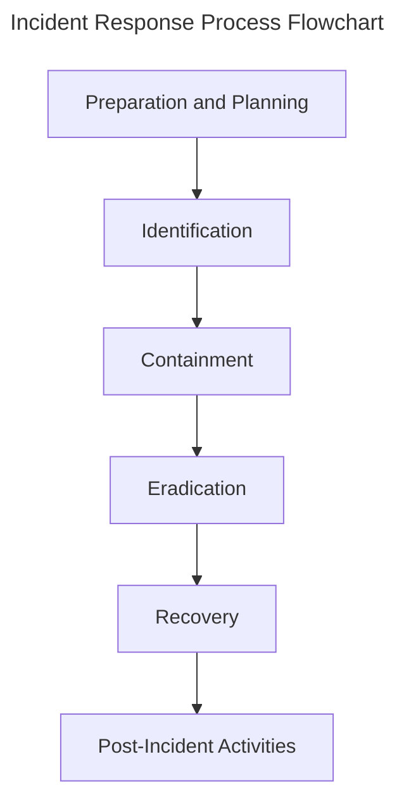
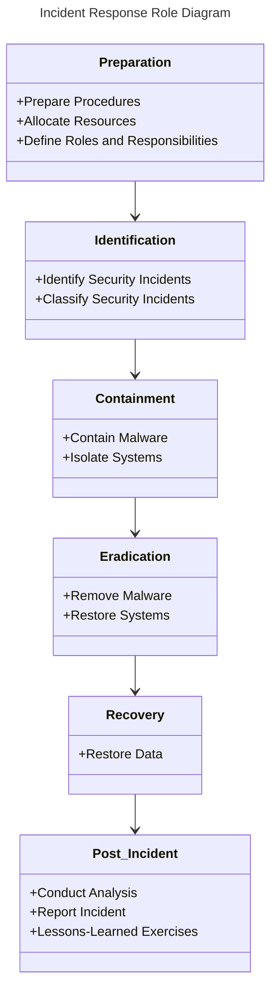

# Session 6: Cybersecurity Incident Response
==============================

---

# Introduction
---------------
In today's rapidly-evolving technological landscape, cybersecurity incidents can have devastating consequences for individuals, businesses, and organizations. Effective incident response requires a structured approach, leveraging industry-standard frameworks and best practices. This session focuses on equipping you with the knowledge and skills necessary to respond to and mitigate cybersecurity incidents.
The cybersecurity landscape is constantly shifting, with new threats emerging daily. It's crucial to stay informed and adapt your response strategies accordingly. As a cybersecurity professional, it's your responsibility to be prepared for potential incidents.
Throughout this session, we'll cover key aspects of incident response, including preparation, identification, containment, eradication, recovery, and post-incident activities. We'll delve into real-world case studies, best practices, and industry-standard frameworks to provide you with a comprehensive understanding of incident response.

---

# Learning Objectives
----------------------
* Identify key stages of the incident response process
* Explain the importance of preparation and planning in incident response
* Describe containment and eradication techniques used to mitigate security incidents
* Discuss the role of recovery and post-incident activities in incident response
* Analyze case studies and best practices in incident response
## Key Takeaways
-------------------
* The incident response process consists of six stages: preparation, identification, containment, eradication, recovery, and post-incident activities
* Preparation and planning are critical components of incident response
* Containment and eradication techniques are used to mitigate security incidents
* Recovery and post-incident activities are essential for restoring systems and preventing future incidents
* Best practices and industry-standard frameworks are essential for effective incident response

---

# Preparation and Planning
---------------------------
!!! note
    Preparation and planning are critical components of incident response.
Preparation involves identifying potential security risks, establishing incident response procedures, and allocating resources for incident response. Planning involves defining roles and responsibilities, establishing communication protocols, and developing incident response strategies.
**Creating an Incident Response Plan**
```python
import os
import logging
def create_incident_response_plan():
    # Define incident response procedures
    incident_response_procedures = ["Containment", "Eradication", "Recovery"]
    # Allocate resources for incident response
    resources = {"Personnel": 5, "Equipment": 10}
    # Define roles and responsibilities
    roles = {"Incident Responder": "John Doe", "Communications Officer": "Jane Doe"}
    # Log incident response plan
    logging.info("Incident Response Plan Created")
create_incident_response_plan()
```
!!! tip
    Regularly review and update your incident response plan to ensure it remains relevant and effective.

---

# Identification and Containment
--------------------------------
!!! note
    Identification involves identifying and classifying security incidents.
Upon identification of a security incident, containment is essential to prevent further damage or exploitation.
**Contained Malware Example**
!!! example
    A compromised system is discovered with malware running in the background.
```bash
sudo ps -ef | grep malware
```
!!! warning
    Be cautious when handling malware as it can cause significant damage to systems and data.
To contain the malware, isolate the system and prevent further exploitation.
**Isolating the System**
```bash
sudo ifconfig eth0 down
```
!!! tip
    Use isolation techniques to prevent further exploitation of compromised systems.

---

# Eradication and Recovery
---------------------------
!!! note
    Eradication involves removing malware and other security threats from systems.
Upon containment, focus on eradicating the security threat and restoring systems to a secure state.
**Removing Malware**
```sql
SELECT * FROM malware WHERE status = 'active';
```
!!! example
    Run the following SQL query to remove all instances of active malware.
```sql
UPDATE malware SET status = 'deleted' WHERE status = 'active';
```
!!! warning
    Be cautious when handling databases as incorrect queries can cause significant damage.
Upon eradicating the security threat, focus on recovering systems and restoring data.
**Restoring Systems**
```bash
sudo system restore
```
!!! tip
    Regularly back up critical data to prevent losses in the event of a security incident.

---

# Post-Incident Activities
---------------------------
!!! note
    Post-incident activities involve conducting incident analysis, reporting, and lessons-learned exercises.
Upon completion of incident response, conduct a thorough analysis to identify root causes and areas for improvement.
**Incident Analysis**
```python
import pandas as pd
def conduct_incident_analysis():
    # Collect data on incident metrics
    metrics = {"Time to Containment": 10, "Time to Eradication": 5}
    # Log incident metrics
    logging.info("Incident Metrics Collected")
conduct_incident_analysis()
```
!!! info
    The incident response process is an ongoing cycle, with lessons learned from each incident informing future response strategies.

---

# Diagrams



---

# Key Takeaways
-------------------
* Preparation and planning are critical components of incident response
* Containment and eradication techniques are used to mitigate security incidents
* Recovery and post-incident activities are essential for restoring systems and preventing future incidents
* Best practices and industry-standard frameworks are essential for effective incident response
* The incident response process is an ongoing cycle
!!! success
    Congratulations! You have completed Session 6: Cybersecurity Incident Response.

---

# Review Questions
---------------------
!!! question
    What are the six stages of the incident response process?
!!! question
    What is the importance of preparation and planning in incident response?
!!! question
    How do you contain a security incident?
!!! question
    What is the role of recovery and post-incident activities in incident response?
!!! question
    How do you conduct incident analysis and lessons-learned exercises?

---

# Discussion Points
---------------------
!!! question
    What are some common challenges in incident response?
!!! question
    How do you balance the need for containment with the need for data preservation?
!!! question
    What are some best practices for incident response planning and preparation?
!!! question
    How do you measure the effectiveness of incident response efforts?
!!! question
    What are some emerging trends and technologies in incident response?
!!! question
    How do you remain updated on the latest threats and security measures in incident response?

---

