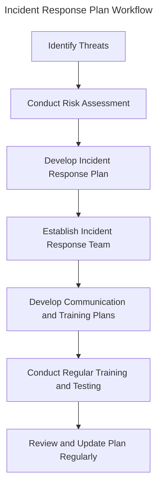
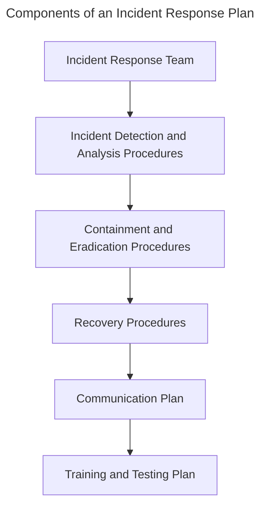

# Session 9: Implementing Incident Response Plans
!!! info
    In this session, you will learn how to implement incident response plans in a cybersecurity context.
Incident response plans are critical to any organization's cybersecurity strategy. The increasing complexity of cyber threats requires organizations to be proactive in identifying and responding to potential security incidents. In this session, we will discuss the importance of incident response plans, their components, and the key steps involved in implementing them.
Incident response plans are designed to help organizations quickly identify, contain, and respond to security incidents. These plans typically include procedures for incident detection, analysis, containment, eradication, and recovery. A well-implemented incident response plan can help organizations minimize the impact of a security incident, protect sensitive data, and prevent future incidents from occurring.
## Learning Objectives
* Understand the importance of incident response plans in a cybersecurity context
* Learn the key components of an incident response plan
* Understand the steps involved in implementing an incident response plan
* Develop skills in designing and implementing incident response plans
* Understand the importance of regular training and testing in incident response planning
## Incident Response Plan Components
!!! note
    Incident response plans typically include the following components:
* Incident response team composition and roles
* Incident detection and analysis procedures
* Containment and eradication procedures
* Recovery procedures
* Communication plan
* Training and testing plan
In this session, we will focus on the key steps involved in implementing an incident response plan.
## Key Steps in Implementing Incident Response Plans
!!! tip
    Regularly review and update incident response plans to ensure they remain relevant and effective.
1. Conduct a risk assessment to identify potential security threats and vulnerabilities
2. Develop a incident response plan that outlines procedures for incident detection, analysis, containment, eradication, and recovery
3. Establish an incident response team and define roles and responsibilities
4. Develop communication and training plans
5. Conduct regular training and testing exercises to ensure the incident response plan is effective
## Steps for Developing an Incident Response Plan
!!! example
    ```python
import incident_response_tools
def create_incident_response_plan():
    # Define incident response plan components
    plan_components = {
        'incident_response_team': ['incident_response_team_members'],
        'incident_detection': {
            'procedures': ['incident_detection_procedures'],
            'tools': ['incident_detection_tools']
        },
        'containment_and_eradication': {
            'procedures': ['containment_procedures'],
            'tools': ['containment_tools']
        },
        'recovery': {
            'procedures': ['recovery_procedures'],
            'tools': ['recovery_tools']
        },
        'communication': {
            'plan': ['communication_plan']
        },
        'training_and_testing': {
            'plan': ['training_plan']
        }
    }
    return plan_components
```
## Example of an Incident Response Plan
!!! example
    | Incident Response Plan Component | Procedure/Tool |
    | --- | --- |
    | Incident Detection | Incident detection tools |
    | Containment | Incident containment tools |
    | Eradication | Incident eradication tools |
    | Recovery | Incident recovery procedures |
    | Communication | Communication plan |
    | Training and Testing | Training plan |
!!! warning
    Regularly review and update incident response plans to ensure they remain relevant and effective.
## Conclusion
In this session, we have discussed the importance of incident response plans in a cybersecurity context, the key components of an incident response plan, and the key steps involved in implementing an incident response plan. Incident response plans are critical to any organization's cybersecurity strategy, and it is essential to regularly review and update them to ensure they remain relevant and effective.
## Key Takeaways
* Incident response plans are critical to any organization's cybersecurity strategy
* Incident response plans should be regularly reviewed and updated to ensure they remain relevant and effective
* Regular training and testing exercises are essential to ensure the incident response plan is effective
* Incident response teams should be composed of skilled and experienced staff
* Incident response plans should include procedures for incident detection, analysis, containment, eradication, and recovery
## Review Questions
!!! question
    What is the purpose of an incident response plan?
!!! question
    What are the key components of an incident response plan?
!!! question
    What are the key steps involved in implementing an incident response plan?
!!! question
    Why is regular training and testing essential in incident response planning?
!!! question
    What is the importance of an incident response team in implementing an incident response plan?
!!! question
    What are the key components of an incident communication plan?
## Discussion Points
!!! question
    How can an organization minimize the impact of a security incident?
!!! question
    What are the key steps involved in incident containment and eradication?
!!! question
    How can regular training and testing exercises improve incident response planning?
!!! question
    What are the key considerations when developing an incident response team?
!!! question
    How can an incident response plan be regularly reviewed and updated to ensure it remains relevant and effective?

---

# Diagrams



---

